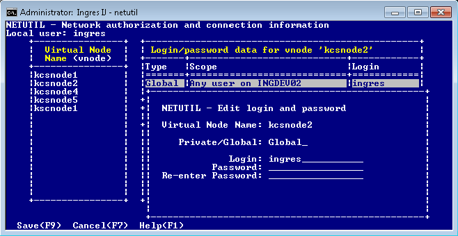
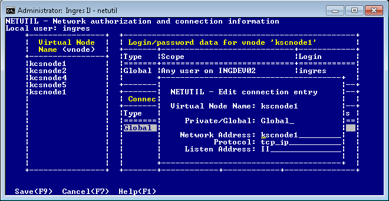
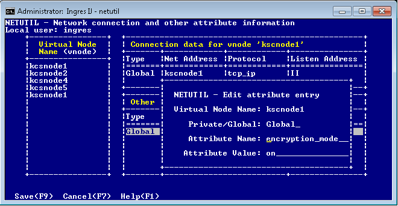

## Change an Entry

To modify a virtual node entry or one of its Connection data entries, remote user authorizations, or attributes, place the cursor on the desired record and select Edit from the menu.

### Modify a Vnode Name

To modify a vnode name

1. Select the desired entry in the Virtual Node Name (vnode) table, and then choose Edit from the menu.

    A pop-up window appears, displaying the following prompt:

```
Enter the new name for [‘vnode name’]New name:
```

2. Enter the new virtual node name and choose OK from the menu.

    The Enter Global/Private Password pop-up window appears and prompts you to re-enter the remote account password or Installation Password associated with this vnode. For security reasons, any time a vnode name is modified, you must re-enter the associated passwords.

3. Enter the password, re-enter the password as prompted, and then choose Save from the menu.

    If there is a second remote user authorization associated with this vnode, a second pop-up window appears. Repeat this step with the password of the second authorization.

    After you have saved all password information, netutil returns to the startup screen. The edited vnode name is displayed in the Virtual Node Name (vnode) table.

#### Edit a Remote User Authorization

To edit a remote user authorization

1. Select the desired entry in the Login/password data table, and choose Edit from the menu.

    The Edit login and password pop-up window appears and prompts you to enter new login and password data.

    

2. Enter the login and password for the remote account; then re-enter the password as prompted.

    - If you are using an Installation Password to authorize access, enter an asterisk (*) in the Login field, and then enter the remote instance’s Installation Password in the Password field.

    - If the user is defined as requiring DBMS authentication, enter the user name and DBMS password, as defined in the user definition.

3. Choose Save from the menu.

    Netutil returns to the startup screen. The edited remote user authorization is displayed in the Login/password data table.

#### Edit a Connection Data Entry

To edit a connection data entry

1. Select the desired entry in the Connection Data table, and choose Edit from the menu.

    The Edit connection entry pop-up window appears, which displays the connection type, network address, protocol, and listen address for the selected entry.

    

2. Tab to the fields to be changed and enter the new values. Choose Save from the menu.

    Netutil returns to the startup screen. The edited connection data entry is displayed in the Connection Data table.

#### Edit Vnode Attribute

To edit attribute data for a particular vnode

1. From the netutil startup screen, select the Attribute menu option from the netutil startup screen.

    The “Network connection and other attribute information screen” appears.

2. Select the desired vnode from the vnode list. Tab to the Other attribute data for vnode table and select the attribute that you want to edit. Choose Edit from the menu.

    The Edit attribute entry pop-up window appears.

    

3. Edit the attribute by typing over the displayed data with the desired changes. For a list of valid attribute names and values, see [Configure Vnode Attributes](../Connectivity/Establish_and_Test_a_Remote_Connection_Using_Net.md). Choose Save from the menu.

    Netutil returns to the startup screen. The attribute you edited is now displayed in the Other attribute data for vnode table.
