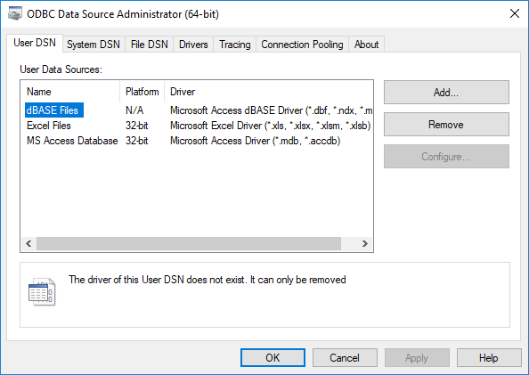
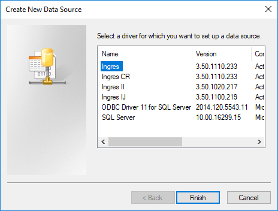

## Configure a Data Source (Windows)

A data source configuration is a collection of information that identifies the database you want to access using the ODBC driver. You can configure as many data sources as you require. Once defined, a data source is available for use by any application that uses ODBC.

ODBC data sources are a convenient way of connecting to a database. You can, however, connect to a database without them by using only a connection string. For details, see [Connection String Keywords](../Connectivity/Connection_String_Keywords.md).

To configure a new data source on Windows

1. Run the ODBC Data Source Administrator provided on Windows.

    - **Windows 10:** Click Start, All apps, Windows Administrative Tools, ODBC Data Sources (64-bit).

    - **Windows 7:**Click Start, Control Panel, System and Security, Administrative Tools, Data Sources (ODBC).

    The ODBC Data Source Administrator is displayed:

    

    You can define one or more data sources for each installed driver. The data source name must provide a unique description of the data; for example, Payroll or Accounts Payable.

    A data source can be defined as system or user, depending on whether it must be visible to all users (and services) or only the current user.

2. Select the User DSN or the System DSN tab, depending on your requirements, and click Add.

!!! note "Note"

    A system DSN pointing to a public server definition is required for Microsoft Internet Information Server (IIS) and Microsoft Transaction Server (MTS).

    The Create New Data Source dialog opens, which lists all the ODBC drivers installed on your system.

!!! note "Note"

    To switch ODBC DSNs defined previously for an older version of the driver to a newer version, select the old driver in the list, and click Remove. Add the DSN again using the new ODBC driver.

3. Select the Ingres CR driver and click Finish.

    The Ingres ODBC Administrator dialog opens.

4. Fill in the necessary fields in the Ingres CR ODBC Administrator. For field descriptions, click the Help button.
