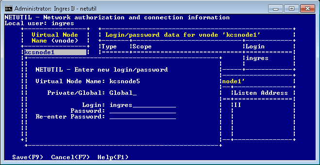
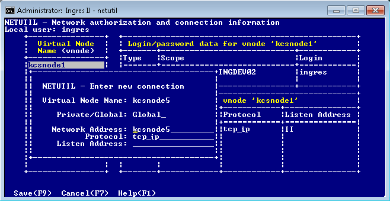
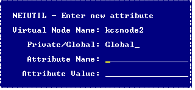

## Establish and Test a Remote Connection Using Netutil

You use netutil to establish and maintain access to remote instances. Defining a virtual node name is the first step in the process of establishing a connection.

To define a virtual node (vnode) and use it to test a connection to a remote instance

1. Enter the following command at the operating system prompt:

```
netutil
```

    The netutil startup screen appears.

2. Make sure that the cursor is in the Virtual Node Name table; then choose Create from the menu.

    A pop-up window appears, displaying the following prompt:

```
Enter new virtual node name.
```

3. Enter a virtual node name of your choosing and select OK from the menu.

    A pop-up window appears, displaying the following prompt:

    Choose type of login to be created

    Global – Any user on [local node]

    Private – User [user name] only

4. Use the arrow keys to highlight Global or Private, then choose Select from the menu.

    The Enter new login/password pop-up appears.



5. Enter the appropriate user name (login) and the password, depending on the type of authentication method used to access the remote instance:

    - OS authentication: Enter the user name and password of the account that is used on the remote node.

    - DBMS authentication: Enter the user name and DBMS password as defined for the user on the remote instance.

    - Installation Password: Enter an asterisk (*) in the Login field, and then enter the remote instance’s Installation Password.

6. Re-enter the password as prompted, and then choose Save from the menu.

    The Enter new connection pop-up appears.



7. Enter the connection data (type over the default values, if necessary), and then choose Save from the menu.

    Netutil returns to the startup screen. The data you entered in this and previous steps is displayed in the Vnode, Login/password data, and Connection data tables.

8. Choose Test from the menu.

    A submenu appears with Connection and Login test options.

9. Choose one of the following from the submenu:

    - Connection – Tests only the connection data against the target server.

    - Login – Prompts for a database name and tests a full connection to the target database, authenticating the user and password. The DBMS does the authentication if the DBMS Authentication feature is turned on; otherwise OS or installation password authentication is done.

    A message is displayed in a pop-up indicating whether the test is successful.

    If the connection is not successful, the error message indicates the nature of the error or where to look for further information.

10. Press Return.

    You are returned to the startup screen.

### Configure Vnode Attributes

In addition to defining login and connection data, you can use netutil to configure vnode attributes. Attributes define additional connection, encryption, and authentication information for the vnode.

To configure one or more attributes for a vnode

1. From the netutil startup screen, select the Attributes menu option.

    Attribute information for the first vnode in the Virtual Node Name table is displayed.

2. Use the arrow keys to select the vnode for which you want to configure an attribute. Tab to the Other attribute data for vnode table and select the Create menu option.

    The Enter new attribute pop-up window appears.

    

3. Enter an attribute name and value (see [Vnode Attribute Names and Values](../Connectivity/Establish_and_Test_a_Remote_Connection_Using_Net.md)).
4. Select the Save menu option.

    Netutil returns to the startup screen. The attribute you configured is now displayed in the Other attribute data for vnode table.

#### Vnode Attribute Names and Values

Valid vnode attribute names and values are as follows:

**connection_type**

:   Abbreviation: conntype

:   Indicates how the connection is to be established. Valid values are:

default

:   Establishes a standard connection. In general, this means the connection is established between the client application process and the remote instance using the Net protocol.

comsvr

:   Establishes the connection using the Communications Server in the local instance, where it is then routed across the network.

direct

:   Establishes a direct connection with the server in the remote instance without using Net. This attribute improves performance because data goes directly from the application process on the client machine to the DBMS process on the server machine, thus bypassing Communications Server processing, except for initial connection setup.

:   For direct access to occur, the following conditions must be met:

        - The client and server machines must be the same platform type (for example, both Windows, or both Solaris, or Windows to Linux on Intel-based machines) and the environment variable II_CHARSET must be identical on both the client and server machines.

        - The same network protocol must be used for the local IPC on the client and server machines.

        - On Windows, the client and server machines must be logged into the same Windows network domain if using (default) named pipes for local IPC.

        - Ingres II 2.5 or higher must be installed on both the client and server machines.

        - On any platform which uses the IPC protocol for local and network connections, the environment variable, II_GC_REMOTE must be set (for the DBMS Server instance) to ON or ENABLED to allow direct connections.

        - Between Windows and Linux, II_GC_PROT is set to tcp_ip on Windows, and the Linux system is running TCP/IP for its local protocol.

        - II_GC_PROT should be changed only when the warehouse (including tools such as IVM) is completely shut down; otherwise, failures may occur for warehouse shutdown, startup, and connection requests.

        - A client installation should not be at a higher major release level than the Actian Data Platform server; otherwise, connection attempts will likely hang. The reverse configuration works: An older release client can directly access a newer release Actian Data Platform server.

**encryption_mode**

:   Abbreviation: emode

:   Specifies the encryption mode for the connection. If set, this value overrides the Communications Server’s ob_encrypt_mode parameter value configured using Configuration Manager or the Configuration-By-Forms utility. The local and remote Communications Servers must be able to negotiate a common mechanism to perform the encryption. Valid values are:

off

:   (Default) No encryption. The connection fails if the remote Communications Server encryption mode is ON.

optional

:   Encryption occurs if the remote Communications Server encryption mode is PREFERRED or ON and a compatible encryption mechanism is available. Abbreviation: opt

preferred

:   Encryption occurs if a compatible encryption mechanism is available unless the remote Communications Server encryption mode is OFF. No warning is given if encryption is not possible. Abbreviation: pre

on

:   Encryption occurs unless no compatible encryption mechanism is available or if the remote Communications Server encryption mode is OFF. Connection fails if encryption is not possible.

**Note:**The ON setting replaces REQUIRED, which is deprecated, but available for backward compatibility.

**encryption_mechanism**

:   Abbreviation: emech

:   Specifies the mechanism to be used to encrypt the remote connection. If set, this value overrides the Communications Server ob_encrypt_mech parameter value configured using Configuration Manager or the Configuration-By-Forms utility. Valid values are:

none

:   Disables encryption

*

:   Allows all encryption mechanisms to be considered during Communications Server negotiations

**mechanism_name**

:   Indicates a specific mechanism to be considered during Communications Server negotiations

**compression_type**

:   Abbreviation: compress

:   Specifies the compression type to be used on the connection. Only a single compression type is supported, so current values simply allow compression to be enabled or disabled. Valid values are:

none or off

:   Disables compression

default or on

:   Enables compression using the default compression type

**authentication_mechanism**

:   Abbreviation: authmech

:   Specifies the mechanism to be used for remote authentication in a distributed security environment. This setting replaces the need for a user ID and password. If set, this value overrides the Communications Server remote_mechanism parameter value configured using Configuration Manager or the Configuration-By-Forms utility. The only valid value is **kerberos**.

**character_set**

:   Abbreviation: charset

:   Specifies the character set used on the remote instance. This attribute is necessary when connecting a UTF8 configured client instance with an older version remote instance that is not configured as UTF8 and the connection cannot be established because a common communication character set cannot be negotiated. Valid values are any character set names that can be used in the II_CHARSET environment variable.

#### Multiple Connection Data Entries

If a remote instance has more than one Communications Server or can be accessed by more than one network protocol, that information can be included in the vnode definition by adding another connection data entry. This lets you distribute the load of communications processing and increase fault tolerance.

!!! note "Note"

    When more than one Communications Server listen address is defined for a given vnode, Ingres Net automatically tries each server in random order until it finds one that is available. Similarly, when a connection fails over one network protocol, Ingres Net automatically attempts the connection over any other protocol that has been defined.

End users can create private connection data for an existing vnode by adding an entry to the Connection Data table. For the user who creates it, a private connection data entry overrides a global connection data entry defined to the same vnode. In other words, Ingres Net uses the private connection data entry whenever the user who created the entry uses the vnode.

You need the following information before adding a connection data entry:

- The network address of the node on which the remote instance resides
- The listen address of the remote instance’s Communications Server.

- The keyword for the network protocol (see [Network Protocol Keywords](../Connectivity/Connection_Data_Table_in_Netutil.md)) that is used to make the connection.

To define an additional connection data entry in netutil

1. Select the desired vnode in the Virtual Node Name table.

    The connection data for the highlighted vnode appears in the Connection Data table.

2. Move the cursor to the Connection Data table, and then choose Create from the menu.

    The Enter new connection pop-up window appears displaying prompts for the connection type (private or global), the network address, the network protocol to be used, and the Listen address of the remote instance. For your convenience, netutil supplies default values for the first three fields; to enter a new value, simply type over the default value.

3. Enter the connection data; then choose Save from the menu.

    Netutil returns to the startup screen. The data you entered is now displayed in the Connection Data table.

#### Additional Remote User Authorization

End users can create a private remote user authorization for an existing vnode.

For the user who creates it, a private authorization overrides a global authorization defined to the same vnode. Ingres Net uses the private authorization whenever that user uses the vnode.

To define and test a new remote user authorization in netutil

1. Select the desired vnode in the Virtual Node Name table.

    The remote user authorization for the highlighted vnode appears in the “Login/password data” table.

2. Move the cursor to the “Login/password data” table, and then choose Create from the menu.

    The Enter New Login/Password pop-up window appears.

3. Enter the login and the password, as described in Step 5 of [Establish and Test a Remote Connection Using Netutil](../Connectivity/Establish_and_Test_a_Remote_Connection_Using_Net.md), and then choose Save from the menu.

    Netutil returns to the startup screen. The data you entered is displayed in the Login/password data table.
