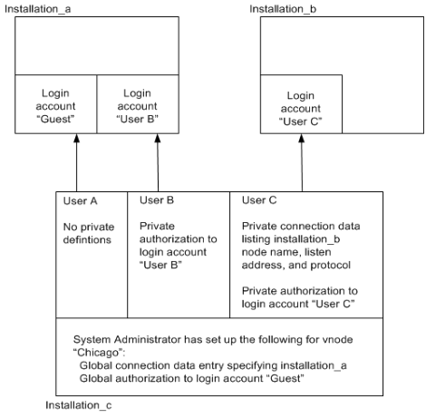

## Global and Private Definitions

Both connection data entries and remote user authorization entries can be defined for vnodes as either global or private. A global entry is available to all users on the local instance. A private entry is available only to the user who creates it.

Each user can create a private entry. Only a user with the GCA privilege NET_ADMIN (typically a system administrator) can create a global entry.

If both a private and a global entry exist for a given vnode, the private entry takes precedence when the user who created the private entry invokes the vnode.

The following figure shows how connections are made when both private and global entries are defined for a given vnode.

On installation_c, the system administrator has created a vnode (“Chicago”) with a global connection data entry specifying installation_a and a global remote user authorization specifying a login account (“Guest”) on that instance. User A has not defined any private definitions for vnode “Chicago” that takes precedence over the global definitions.

When User A invokes vnode “Chicago,” a connection is made to installation_a through login account “Guest.” User B has added a private remote user authorization to vnode “Chicago,” specifying the login account “User B.” When User B invokes vnode “Chicago,” the private authorization takes precedence over the global authorization, and a connection is made to installation_a through the login account “User B.”

User C has added a private connection data entry to vnode “Chicago.” The private connection data entry contains the listen address (port number), node name, and network protocol of installation_b.

User C has also added a private authorization to login account “User C” on installation_b. When User C invokes vnode “Chicago,” the private definitions take precedence over the global definitions, and a connection is made to installation_b through the login account “User C.”
