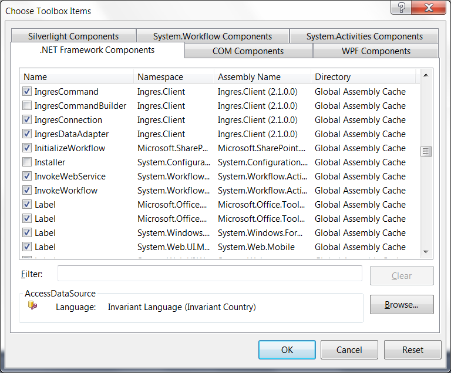
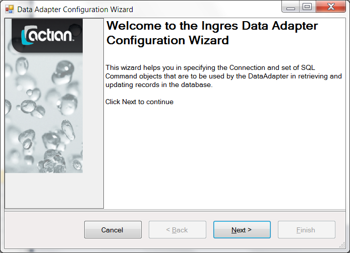
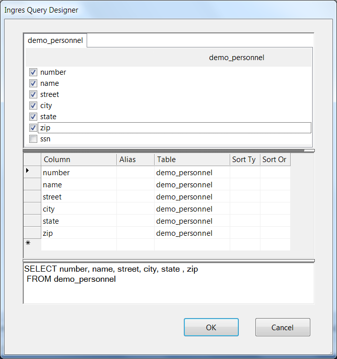
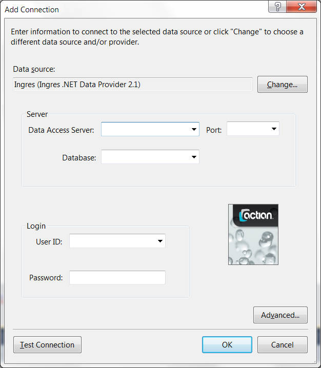
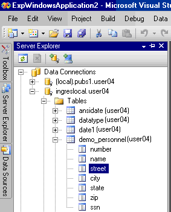

## Integration with Visual Studio

The .NET Data Provider is integrated with Visual Studio. For supported releases, see the Readme.

The .NET Framework has design-time support. .NET objects, derived from certain component objects, can exist within an application runtime environment and in a designer environment such as Microsoft Visual Studio.

Integration with Visual Studio visual tools allows a programmer to drag-and-drop the data provider design component onto a control. Integration also allows the programmer to use wizards and editors to aid application development.

The Visual Studio Toolbox contains a series of tabs (for example, Data, Components, and Window Forms) that list objects for the Visual Studio design environment. These objects can be dragged-and-dropped onto design surfaces such as the Windows Form control (WinForm). This operation can trigger wizards, designers, or simply a paint of a control on the design surface.

## Install the Data Provider into the Toolbox

The .NET Data Provider must be installed into the Visual Studio Toolbox before using it for the first time.

To install the data provider components into the Toolbox

1. Create an empty Winform application.
2. Right-click the Data tab of the toolbox, and select Choose Items.

    The Choose Toolbox Items dialog is displayed.

3. Select the IngresCommand, IngresConnection, and IngresDataAdapter components on the .NET Framework Components tab, and then click OK.

    The .NET Data Provider components are installed in the Toolbox, as shown in this example:

If the IngresCommand, IngresConnection, and IngresDataAdaper components do not appear in the Choose Toolbox Items dialog, you can add them.

**To add the .NET Data Provider components to the Choose Toolbox Items dialog**

1. Click Browse on the Choose Toolbox Items dialog and browse to the directory C:\Program Files\Ingres\Ingres .NET Data Provider\v2.1.
2. Open the Ingres.Client dll.

    The components are added.

## Start the Ingres Data Adapter Configuration Wizard

The Toolbox’s Data tab lists the .NET data provider components that are available during the application's design.

**To start the Ingres Data Adapter Configuration Wizard**

1. Drag the IngresDataAdapter component from the list on the Toolbox's Data tab onto the Windows Form design surface (“Form1”).

    The welcome page of the Data Adapter Configuration Wizard is displayed.

    

    An “ingresDataAdapter1” component and its icon are added to the Visual Studio designer component tray.

2. Click Cancel on the welcome page.

    Only the IngresDataAdapter component is created.

### Configure a Connection

Ingres Data Adapter Configuration Wizard assists you in specifying the design properties of the ingresDataAdapter1 component, including its connection string definition.

A connection string is a collection of information that identifies the target server machine and database to connect to, the permissions of the user who is connecting, and the parameters that define connection pooling and security. You must configure a connection string before connecting to a database using a .NET application.

**To configure a connection string**

1. Click Next in the Data Adapter Configuration Wizard welcome screen.

    The Connection String Editor dialog is displayed.

2. Enter the required information. For details, see [Connection String Editor (Data Adapter Configuration Wizard)](../Connectivity/Integration_with_Visual_Studio.md).
3. Click OK.

    The Connection string is created.

#### Connection String Editor (Data Adapter Configuration Wizard)

The Connection String Editor of the Ingres Data Adapter Configuration Wizard has the following tabs:

**Connection Tab**

Data Access Server

:   Identifies the name of the Data Access Server that services .NET application requests for the target warehouse.

Port

:   Identifies the port number 27839.

Database

:   Specifies the name of the target database, db.

User ID

:   Specifies the name of the authorized user that is connecting to the warehouse.

Password

:   Specifies the password associated with the specified User ID for connecting to the warehouse.

**Advanced Tab**

Timeout

:   Defines the number of seconds after which an attempted connection will abort if it cannot be established.

:   Default: 15

Enable Connection Pooling

:   Enables or disables connection pooling.

:   Default: Connection pooling is enabled

Return password text in Connection.ConnectionString property

:   Determines whether password information from the connection string is returned in a get of the ConnectionString property.

:   Default: Password information is not returned

Role ID

:   Specifies the role identifier that has associated privileges for the role.

Role Password

:   Specifies the password associated with the specified Role ID.

DBMS User

:   Specifies the user name associated with the DBMS session (equivalent to the -u flag).

DBMS Password

:   Specifies the DBMS password of the user (equivalent to the -P flag).

Group ID

:   Specifies the group identifier that has associated privileges for a group of use.

## Design a Query Using the Query Builder

The .NET Data Provider uses SQL statements to retrieve and update data in Ingres databases. In the Data Adapter Configuration Wizard, you can enter your SQL command or use the Query Builder tool to generate the SELECT statement.

**To design a query using the Query Builder**

1. Click Query Builder to develop your SELECT statement.

    The Add Table dialog opens.

2. Click User Tables or All Tables.

    A list of available tables is displayed.

3. Choose your table from the list, and then click Add, Close.

    Ingres Query Designer opens.

    The Query Designer has three horizontal panels:

The top panel

:   Consists of tab pages, one for each table reference in the FROM clause of the query. Each tab page contains a list of check boxes for each column defined in the table. The columns are listed as they are written in the table's catalog definition.

:   Check or uncheck each column to add or remove the column reference from the SELECT statement.

The middle panel

:   Is a grid that lists the column names and or expressions in the SELECT statement’s column reference list. It provides a convenient tabular format for entering the column references.

The bottom panel

:   Displays the query text as it is being built. The query text can be directly edited and is automatically formatted for readability.

4. Enter column references you want to add to your query into any one of the three panels.

    The other two panels are automatically updated.

5. Click OK.

    The query builder returns to the Ingres Data Adapter Wizard and displays the generated SELECT statement.

6. Click Finish.

    The Data Adapter Wizard is closed.

## Server Explorer Integration

The .NET Data Provider is integrated with the Visual Studio Server Explorer and Data Sources tabs.

A Data Connection definition for Actian Data Platform can be defined in the Server Explorer. This Data Connection definition can subsequently be used by other wizards and designers in Visual Studio.

The Data Connection definition can also be used to examine the metadata information of tables and views in the Actian Data Platform connection.

!!! note "Note"

    The Visual Studio integration does not currently support database procedures.
