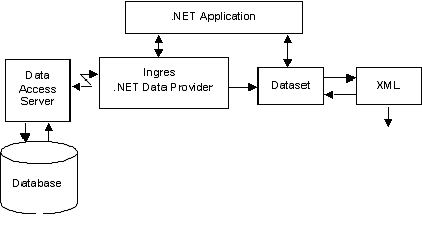

## .NET Data Provider Architecture

The .NET Data Provider offers a series of .NET types to describe the user’s data, .NET provider classes to manipulate the data, and connection pooling to efficiently manage data connections.

The design and naming conventions of the .NET Data Provider’s data types, classes, properties, and methods follow the same pattern as the Microsoft .NET Data Providers. Consequently, developers who are familiar with the Microsoft providers can easily develop or convert existing code from Microsoft databases to Ingres or Actian Data Platform databases.

All .NET Data Provider modules are written in C#, a managed .NET language with full access to every .NET Framework capability. Even though the data provider is written in C#, any managed language such as VB.NET or J# can use the data provider because of .NET’s language interoperability feature.

## Data Provider Data Flow

A data provider in the Microsoft .NET Framework enables a connection to a data source to retrieve and modify data from that data source. Data coming out of a .NET data provider can be used directly by an application or it can be redirected into an ADO.NET DataSet where it can be processed by other application methods such as XML processing.

The following figure shows the flow of data in and out of the data provider.



As shown in this figure, the .NET Data Provider uses an intermediate server called the Data Access Server to access Ingres databases.

!!! note "Note"

    The .NET Data Provider does not require Ingres Net for database connectivity. For best performance, the data provider directly communicates with the wire.

## Data Provider Assembly

The .NET Data Provider includes the Ingres.Client.dll, which contains the Ingres.Client assembly. The Ingres.Client assembly contains the base runtime support.

This assembly is installed as part of the Actian Client Runtime Package installation, which automatically registers it in the Global Assembly Cache (GAC). The Ingres.Client.dll that contains the Ingres.Client assembly is also installed, by default, into the directory C:\Program Files\Ingres\Ingres .NET Data Provider\v2.1. This is only true when the Windows platform is used for client installation.

## Data Provider Namespace

When developing .NET applications, programmers use the data types, components, and other classes in the data provider by referencing each name as defined in the namespace for the classes. The namespace for the .NET Data Provider is:

```
Ingres.Client
```

## Data Retrieval Strategies

The .NET Data Provider provides ADO.NET programmers with two access strategies for retrieving data:

- **DataReader** – This program retrieves the data for read-only, forward-only access. The program opens the connection, executes the command, processes the rows in from the reader, closes the reader, and closes the connection. Resources on the database server are held until the connection is closed. For additional information, see [IngresDataReader Class](../Connectivity/NET_Data_Provider_Classes.md).
- **DataAdapter** – This program opens the connection, fills a DataSet, closes the connection, processes the DataSet, opens the connection, updates the database, and closes the connection. Resources on the database server are not held during the processing of the DataSet. Using connection pooling, usually only one physical connection is used. For additional information, see [IngresDataAdapter Class](../Connectivity/NET_Data_Provider_Classes.md).

In addition to the low-level DataReader and DataAdapter access strategies, the data provider works with Visual Studio to support TableAdapter, DataConnection, and DataSource components. The data provider uses standard base classes, interfaces, and metadata methods to support higher level data-bound .NET Framework controls. .NET Framework and Visual Studio work with the .NET Data Provider to offer more rapid application development and high quality code.

## Connection Pooling

Connection pooling significantly enhances the performance and scalability of some applications. Physical connections are kept in a pool after they are no longer needed by one application and are dispensed later to the same or another application (as needed) to avoid the cost of connections. All connections in a pool have identical connection strings. A new pool is created for each connection that has a different connection string from all other pools.

When an application attempts to connect to a database, the Open method of the IngresConnection object uses the connection pool to search for a physical connection that specifies the same ConnectionString parameters. If no match is found, a new physical connection is made to the database. If a match is found, a connection is returned to the application from the pool.

After the application has completed its work, committed its changes, freed its database locks and resources, and closed the connection, the physical connection is retained by the .NET data provider and placed back in the connection pool instead of being physically disconnected.

This connection is available to the same application later in the application's life span or to other applications in the same process with the same connection parameters. This avoids the overhead and delay of opening a new physical connection. An application can choose to disable connection pooling by specifying “Pooling=no” in its connection string.

The application is unaware of the connection reuse. If the connection is not reused within sixty seconds, the connection is physically closed to release system resources.

However, if the number of connections in the pool falls below the minimum number of connections specified by the application in the “Min Pool Size=n” value in the connection string, the connection is not physically closed and is retained in the pool for later use. For additional information on connection pooling, see [IngresConnection Class](../Connectivity/NET_Data_Provider_Classes.md).
