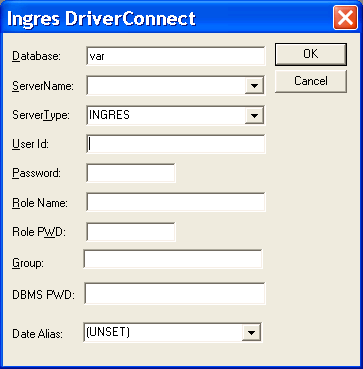
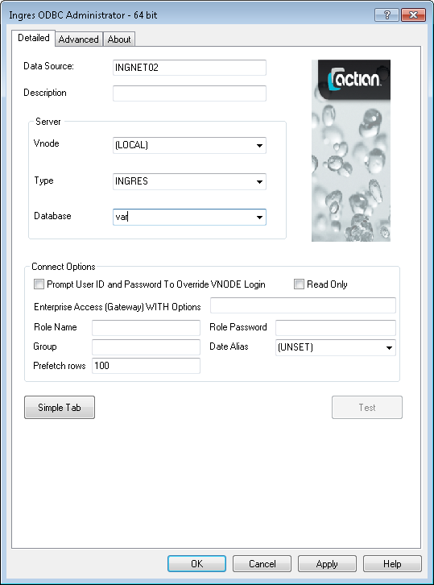

## ODBC Programming

If you are proficient in the C programming language, you can call ODBC routines directly. The ODBC Driver supports all platforms (operating systems) that Ingres supports, so this is an option if you want to run your ODBC application on more than one platform.

Low-level ODBC applications can be more efficient than higher-level applications, since the layers of software between your application and the data are reduced. The disadvantage of low-level ODBC applications is that less of the work is automated, and the interface is less intuitive than a higher-level application interface such as ADO or the .NET Data Provider for ODBC.

The following functional overview examines some of the ODBC function calls and discusses issues specific to the Ingres environment.

## ODBC Handles

ODBC handles store the environment of ODBC execution components. The components that the handles describe are not visible to the ODBC application, but they are visible internally in the ODBC driver.

Here are the following types of ODBC handles:

- Environment handles describe the general ODBC runtime environment.
- Connection handles describe the ODBC environment specific to individual connections.

- Statement (query) handles describe the ODBC environment for queries.
- Descriptor handles describe metadata information related to result sets.

SQLAllocHandle() allocates ODBC driver resources for these four types of handles. The format of SQLAllocHandle() is:

```
SQLAllocHandle( HandleType, ParentHandle, Handle)
```

**HandleType**

:   Specifies the type of handle to be allocated.

**ParentHandle**

:   Specifies the handle with which the allocated handle is associated.

**Handle**

:   Identifies the handle itself.

## How ODBC Applications Connect to a Database

ODBC applications are never linked directly against the ODBC driver DLL or shared library. Instead, the applications are linked against the ODBC Driver Manager, which can be the Microsoft ODBC Driver Manager, the unixODBC Driver Manager, or the ODBC CLI.

The ODBC application has no knowledge of the driver until a connection is made. During a successful connection, the ODBC Driver is dynamically loaded into the program image. After loading, the functions called in the ODBC application are passed down to the driver implementation of the function. In this way, the same ODBC application can be used with different ODBC drivers, and thus can be used with a variety of different databases. This portability is a principal aim of ODBC.

The ODBC Driver is designed to work from a driver manager such as unixODBC or the ODBC CLI. Applications link with the driver manager. The ODBC driver is loaded into the driver manager when the first connection is made to a database. One can theoretically link directly with the ODBC driver, leaving out the driver manager, but this is not supported and may yield unpredictable results.

The ODBC Driver, the ODBC CLI, and the unixODBC Driver Manager are implemented as shared libraries, but the names vary according to platform conventions. For example, on Linux, for 32-bit Ingres: the ODBC Driver is implemented as $II_SYSTEM/ingres/lib/libiiodbcdriver.1.so and libiiodbcdriverro.1.so, and the ODBC CLI is implemented as libiiodbc.1.so.

## SQLConnect()--Connect Using a Data Source Name

SQLConnect() allows you to connect to the database using connection attributes stored in the ODBC Data Source Name (DSN) definition. For information about creating an ODBC DSN definition, see [Configure a Data Source (Windows)](../Connectivity/Configure_a_Data_Source_(Windows).md) and [Configure a Data Source (Linux)](../Connectivity/Configure_a_Data_Source_(Linux).md).

The following program is the minimum code required for:

- Initializing ODBC driver
- Setting the ODBC version to version 3

- Connecting to the database
- Disconnecting from the database

- Cleaning up and exiting

**Example: SQLConnect() Function**

```
# ifdef _WIN32
```

```
# include <windows.h>
```

```
# else
```

```
# include <stdio.h>
```

```
# include <stdlib.h>
```

```
# endif
```

```
# include <sql.h>
```

```
# include <sqlext.h>
```

```

```

```
main( )
```

```
{
```

```
    HENV henv = NULL;
```

```
    HDBC hdbc = NULL;
```

```

```

```
    /* Initialize the ODBC environment handle. */
```

```
    SQLAllocHandle( SQL_HANDLE_ENV, NULL, &henv );
```

```

```

```
    /* Set the ODBC version to version 3 (the highest version) */
```

```
    SQLSetEnvAttr( henv, SQL_ATTR_ODBC_VERSION,
```

```
        (void *)SQL_OV_ODBC3, 0 );
```

```

```

```
    /* Allocate the connection handle. */
```

```
    SQLAllocHandle( SQL_HANDLE_DBC, henv, &hdbc );
```

```

```

```
    /* Connect to the database using the ODBC DSN definition. */
```

```
    SQLConnect( hdbc,          /* Connection handle */
```

```
        (SQLCHAR *)"myDSN",    /* The ODBC DSN definition */
```

```
        SQL_NTS,               /* This is a null-terminated string */
```

```
        (SQLCHAR *)NULL,       /* No username required */
```

```
        SQL_NTS,               /* This is a null-terminated string */
```

```
        (SQLCHAR *)NULL,       /* No password required */
```

```
        SQL_NTS );             /* This is a null-terminated string */
```

```

```

```
    /* Disconnect from the database. */
```

```
    SQLDisconnect( hdbc );
```

```

```

```
    /* Free the connection handle. */
```

```
    SQLFreeHandle( SQL_HANDLE_DBC, hdbc );
```

```

```

```
    /* Free the environment handle. */
```

```
    SQLFreeHandle( SQL_HANDLE_ENV, henv );
```

```

```

```
    /* Exit this program. */
```

```
    return( 0 );
```

```
}
```

If your login name is a valid Actian Data Platform user for a local database, the above code is all you need to connect through SQLConnect(). See the ODBC User Authorization section for a discussion on authorizing yourself as another user.

Other details of the connection, such as the database name and type of database, are pre-defined in the ODBC DSN definition referenced by the string “myDSN”.

Note that SQLAllocHandle() was invoked to initialize the environment handle and that SQLSetEnvAttr() sets the ODBC version to SQL_OV_ODBC3. These two calls are necessary to initialize your ODBC application as an ODBC level 3 driver. The default is ODBC level 2. We recommend initializing as version 3 because some ODBC level 3 functions, such as the treatment of date and time values, depend on the ODBC version being set at level 3.

## SQLDriverConnect()--Connect without Using a Data Source Name

You can bypass ODBC DSN information completely if you use the SQLDriverConnect() function instead of SQLConnect(). SQLDriverConnect() uses a connection string instead of an ODBC DSN definition; the odbc.ini file is not used unless the DSN connection string attribute is specified in the connection string.

Connection strings are typically used in higher-level languages that use ODBC, such as:

- Microsoft ADO
- Microsoft OLE DB Provider for ODBC

- Microsoft .NET Data Provider for ODBC
- PHP ODBC interface

- Python DBI driver
- JDBC/ODBC Bridge

An ODBC connection string is structured as a set of “attribute, value” pairs in the following abstract:

```
connectStr = attribute=value[;attribute=value[;...]]
```

Each set of “attribute, value” pairs is separated by a semicolon (“;”). No spaces or other separators, such as <TAB>, are allowed between semicolons and the next attribute pair.

The attribute pair “DSN=myDSN” causes SQLDriverConnect() to search for an ODBC DSN specification just as in SQLConnect(). However, other connection attributes specified in the connection string override any similar specification in the ODBC DSN definition.

SQLDriverConnect() requires you to provide the following minimum connection attributes:

- Database
- Type of driver

- Type of database (Ingres, SQLServer, Oracle, and so on)
- Server. The server is the name of a vnode (server connection) definition in ingnet. If you are connecting locally, the default string name “(local)” indicates a local connection.

The following program using SQLDriverConnect() performs exactly the same function as the previous code example.

**Example: SQLDriverConnect() Function**

```
# ifdef _WIN32
```

```
# include <windows.h>
```

```
# else
```

```
# include <stdio.h>
```

```
# include <stdlib.h>
```

```
# endif
```

```
# include <sql.h>
```

```
# include <sqlext.h>
```

```

```

```
main()
```

```
{
```

```
    HENV henv=NULL;
```

```
    HDBC hdbc=NULL;
```

```
    SQLCHAR connectString[256];
```

```

```

```
    /* Initialize the ODBC environment handle. */
```

```
    SQLAllocHandle( SQL_HANDLE_ENV, NULL, &henv );
```

```

```

```
    /* Set the ODBC version to version 3 (the highest version) */
```

```
    SQLSetEnvAttr( henv, SQL_ATTR_ODBC_VERSION,
```

```
        (void *)SQL_OV_ODBC3, 0 );
```

```

```

```
    /* Allocate the connection handle. */
```

```
    SQLAllocHandle( SQL_HANDLE_DBC, henv, &hdbc );
```

```

```

```
    /*
```

```
    ** Fill the connection string with the minimum
```

```
    ** connection information.
```

```
    */
```

```
    strcpy( connectString, "driver={Ingres};servertype=Ingres;" \
```

```
        "server=(local);database=myDB" );
```

```

```

```
    /* Connect to the database using the connection string. */
```

```
    SQLDriverConnect( hdbc,    /* Connection  handle */
```

```
        0,                     /* Window handle */
```

```
        connectString,         /* Connection string */
```

```
        SQL_NTS,               /* This is a null-terminated string */
```

```
        (SQLCHAR *)NULL,       /* Output (result) connection string */
```

```
        SQL_NTS,               /* This is a null-terminated string */
```

```
        0,                     /* Length of output connect string */
```

```
        SQL_DRIVER_NOPROMPT ); /* Don’t display a prompt window */
```

```

```

```
    /* Disconnect from the database. */
```

```
    SQLDisconnect( hdbc );
```

```

```

```
    /* Free the connection handle. */
```

```
    SQLFreeHandle( SQL_HANDLE_DBC, hdbc );
```

```

```

```
    /* Free the environment handle. */
```

```
    SQLFreeHandle( SQL_HANDLE_ENV, henv );
```

```

```

```
    /* Exit this program. */
```

```
    return(0);
```

```
}
```

The previous example applies to Windows programs. On Linux, if you are using the Ingres ODBC CLI, only the database name is required as the minimum connection attribute:

```
strcpy( connectString, "database=myDB" );
```

The Ingres ODBC CLI assumes that the driver type is “Ingres”, the server type is “Ingres”, and that the server is “(local)” if you do not so specify.

A list of ODBC connection attributes and values is available in [Connection String Keywords](../Connectivity/Connection_String_Keywords.md).

## Connect Using Dynamic Vnode Definitions

Vnode definitions allow applications to connect to databases over the network. The “server” connection string attribute equates to the vnode name.

Normally, you use ingnet to define the vnode name and network connections, similar to ODBC DSN definitions. However, both DSN and vnode definitions can be bypassed as shown in the following example code snippet:

```
strcpy( connectString, "driver=Ingres;servertype=ingres;" \
```

```
    "server=@myHostname.myDomain.com,tcp_ip,II;" \
```

```
    "uid=myUserName;pwd=myPassword;database=myDatabase" );
```

The above connection string is an example of dynamic vnode definitions discussed in [Using Net](../Connectivity/Using_Net.md). The example shows that the ODBC can connect to a database without pre-defining any connection information.

!!! note "Note"

    When you use dynamic vnode definitions in your connection string, you must specify the “uid” (user name) and “pwd” (password) connection attributes.

## ODBC User Authentication

There are several methods for authorizing users from within ODBC applications.

### User Name and Password

SQLConnect() and SQLDriverConnect() allow your application to specify a user (login) name and password. For example:

```
SQLConnect(hdbc,                /* Connection handle */
```

```
       (SQLCHAR *)"myDSN",      /* The ODBC DSN definition */
```

```
        SQL_NTS,                /* This is a null-terminated string */
```

```
       (SQLCHAR *)"myUserName", /* Local user name */
```

```
        SQL_NTS,                /* This is a null-terminated string */
```

```
       (SQLCHAR *)"myPassword,  /* Local password */
```

```
        SQL_NTS);               /* This is a null-terminated string */
```

In SQLDriverConnect(), the "uid" and "pwd" attributes specify the local user name and local password, respectively.

Specification of the user name and password authorizes the ODBC application to act as it were logged in to the local machine as that user. This is true even if the ODBC DSN definition specifies a network connection to another machine. If you specify an invalid user name or password, the connection fails regardless of whether the connection target is local or over the network.

### Ingres Super Users

An Ingres user with security administrator privileges can assume the identity of other users without having to provide a password. Such users are called Ingres “super” users, as in Linux notation. An example in SQLConnect() follows:

```
SQLConnect( hdbc,                   /* Connection handle */
```

```
       (SQLCHAR *)"myDSN",       /* The ODBC DSN definition */
```

```
        SQL_NTS,                 /* This is a null-terminated string */
```

```
       (SQLCHAR *)"altUserName", /* Alternate username */
```

```
        SQL_NTS,                 /* This is a null-terminated string */
```

```
       (SQLCHAR *)NULL,          /* No password required */
```

```
        SQL_NTS );               /* This is a null-terminated string */
```

The example code allows the ODBC application to authorize as “altUserName” without a password. In functional terms, this is the equivalent to the -u flag in the SQL CLI.

!!! note "Note"

    The local user name must be an Ingres super user when connecting locally. If connecting remotely, the user name defined for the target vnode must be an Ingres super user.

### DBMS Passwords

If the target installation is not configured for DBMS authentication, DBMS passwords are extra passwords defined for Ingres users and maintained in the Ingres database. When an Ingres user account is associated with a DBMS password, the correct DBMS password must be supplied as a connection parameter, otherwise the connection attempt will be rejected.

DBMS passwords in the DSN definition in odbc.ini are not supported. The ODBC Driver supports DBMS passwords only through SQLDriverConnect(), as shown in the following example:

```
/*
```

```
** The "dbms_pwd" connection attribute specifies the DBMS password.
```

```
*/
```

```
strcpy( connectString, "driver={Ingres};servertype=Ingres;" \
```

```
        "server=(local);database=myDB;uid=myUserName; \
```

```
        "pwd=myPassword;dbms_pwd=myDBMS_password );
```

```

```

```
SQLDriverConnect( hdbc,        /* Connection  handle */
```

```
        0,                     /* Window handle */
```

```
        connectString,         /* Connection string */
```

```
        SQL_NTS,               /* Nll-terminated string */
```

```
        (SQLCHAR *)NULL,       /* Output connection string */
```

```
        SQL_NTS,               /* N=ull-terminated string */
```

```
        0,                     /* Length of output connect string */
```

```
        SQL_DRIVER_NOPROMPT ); /* No prompt window */
```

If the target installation is configured for DBMS authentication, user names and passwords are defined in the warehouse. In such cases, DBMS passwords are ignored, because they are not “extra” authentication. Rather, DBMS passwords are effectively the same as OS passwords in environments that do not support DBMS authentication.

The code in the previous example would still work, provided that “myPassword” was defined in the DBMS. For DBMS authentication, only the definition in the warehouse matters, not whether the DBMS name and password are also defined by the operating system.

### Dynamic (Run-Time) Authentication (Windows Only)

Some ODBC applications require that the user name and password are not hard-coded in the code. To address these requirements, ODBC applications can prompt the user for more information.

When prompted for connection information, the ODBC Driver displays the following input page:



Users can then enter the missing login information in the prompt window, and the application will attempt to connect using the supplied information.

#### Connection Prompt Window--Using SQLDriverConnect()

The ODBC Driver supports the DriverCompletion argument in SQLDriverConnect(). The DriverCompletion argument is the eighth and last argument in SQLDriverConnect(). The value SQL_DRIVER_PROMPT directs the driver to display a prompt window. The value SQL_DRIVER_NOPROMPT directs the driver to not display a prompt window.

Example: DriverCompletion Argument

```
/*
```

```
** Fill the connection string with the minimum
```

```
** connection information.
```

```
*/
```

```
strcpy( connectString, "driver={Ingres};servertype=Ingres;" \
```

```
    "server=(local);database=myDB" );
```

```

```

```
/* Connect to the database using the ODBC DSN definition. */
```

```
SQLDriverConnect( hdbc,     /* Connection  handle */
```

```
    winHandle,              /* Window handle */
```

```
    connectString,          /* Connection string */
```

```
    SQL_NTS,                /* This is a null-terminated string */
```

```
   (SQLCHAR *)NULL,         /* Output (result) connection string */
```

```
    SQL_NTS,                /* This is a null-terminated string */
```

```
    0,                      /* Length of output connect string */
```

```
    SQL_DRIVER_PROMPT );    /* Display a prompt window */
```

The example above displays a prompt window in a program that has a valid handle to a Windows application. Windows-sensitive applications such as ADO or the .NET Data Provider for ODBC are usually able to display prompts.

!!! note "Note"

    ODBC programs that make no calls to the Windows API cannot display connection prompt windows. ADO programs executed as ASP pages from IIS cannot display prompt windows.

#### Connection Prompt Window--Using DSN Definition

SQLDriverConnect() is not visible in Windows applications such as ADO or the .NET Data Provider for ODBC. It is not possible to modify the DriverCompletion argument in these cases. Ingres or Actian Data Platform ODBC DSN definition pages include a Prompt User ID and Password check box that forces the application to prompt for more information, as in the following example:



If the application references the ODBC DSN definition at connect time, the prompt window is displayed.

!!! note "Note"

    IIS applications, such as ASP pages, will not display prompt windows.

### Specification of User Names and Passwords in ODBC

For remote connections, the specification of user names and passwords overrides the user names or passwords in the vnode definition.

For local connections, the specification of user names and passwords causes the ODBC application to behave as if it was logged in as the alternate user. This behavior is true regardless of whether or not the current login is an Ingres “super” user.

It does not matter if user names and passwords are provided interactively or are hard-coded.

#### SQLBrowseConnect()--Prompt for Connection Information

SQLBrowseConnect() is another function that can be used to prompt for connection information. SQLBrowseConnect() returns missing connection information in a formatted output string that is used as a guide in the next connection attempt. When SQLBrowseConnect() receives the minimum connection information, a connection is made to the database.

## Query Execution

This section explores methods for executing queries in ODBC applications.

### SQLExecDirect()--Execute Queries Directly

SQLExecDirect() is commonly used for executing queries. The following code snippet creates a table and inserts a row of data.

Example: SQLExecDirect() Function

```
/* Allocate a statement handle. */
```

```
SQLAllocHandle( SQL_HANDLE_STMT, hdbc, &hstmt );
```

```

```

```
/* Execute a "create table" query. */
```

```
SQLExecDirect(hstmt, "create table cars( model varchar(20) )",
```

```
    SQL_NTS);
```

```

```

```
/* Insert one row of data. */
```

```
SQLExecDirect(hstmt, "insert into cars ( model ) values
```

```
    ( 'Hummer' )", SQL_NTS);
```

### SQLPrepare() and SQLExecute()--Prepare and Execute Queries

For queries that are executed multiple times, preparing the queries before execution may improve performance because the DBMS stores the query plan of prepared queries. Rather than calculating a query plan each time a query is executed, the DBMS references the query plan for all subsequent iterations of the query.

SQLPrepare() and SQLExecute() perform the prepare and execute functions, respectively.

Unless the ODBC application explicitly prepares a query through SQLPrepare(), the ODBC always executes queries directly; there is no provision for automatically preparing queries in Ingres.

The following code snippet is the equivalent of the SQLExecDirect() code example in the Execute Queries Directly section.

Example: SQLPrepare() and SQLExecute() Functions

```
/* Prepare a "create table" query. */
```

```
SQLPrepare( hstmt, "create table cars( model varchar(20) )",
```

```
    SQL_NTS );
```

```

```

```
/* Execute the prepared query */
```

```
SQLExecute(hstmt);
```

Prepared queries persist in the default autocommit state. However, if you turn off autocommit via SQLSetConnectAttr(), the query plan associated with a prepared query is destroyed whenever the query is rolled back or committed. You must then re-prepare the query via SQLPrepare().

### Queries with Dynamic Parameters

ODBC applications frequently require data to be sent to the database dynamically. Such data cannot be hard-coded in the query itself.

For comparison, the following set of queries inserts three rows with hard-coded parameters:

```
insert into cars( model ) values( 'Hummer' );
```

```
insert into cars( model ) values( 'Mustang' );
```

```
insert into cars( model ) values( 'Camray' );
```

The above set of queries would be adequate if it was known in advance that the target table would always receive this data. Often this is not the case, so the data must be sent dynamically. The ODBC uses question marks ("?") as placeholders for dynamic queries:

```
insert into cars( model ) values ( ? );
```

A character string can be defined and bound to the query. Binding a parameter to a query means that the data is sent as a parameter along with the query. The DBMS reconstructs the parameter data with the query as if the data were hard-coded in the original query.

To send data to the DBMS, the ODBC must tell the DBMS what the data looks like. The ODBC function SQLBindParameter() serves that purpose. The following example allows an ODBC application to send one row of data dynamically to a table consisting of an integer and a varchar of length 20:

```
SQLCHAR model[21] = "Mustang ";
```

```
int lotNbr = 124;
```

```
SQLINTEGER orind1 = 0, orind2 = SQL_NTS;
```

```

```

```
[ Allocate handles and connect. ]
```

```

```

```
SQLExecDirect( hstmt, "insert into cars( model ) values( ? )", SQL_NTS );
```

```

```

```
SQLBindParameter( hstmt, /* Statement handle */
```

```
    1,                   /* Column number 1 */
```

```
    SQL_PARAM_INPUT,     /* This is an input parameter */
```

```
    SQL_C_LONG,          /* This is an integer in C */
```

```
    SQL_INTEGER,         /* Destination column is varchar */
```

```
    strlen( model ),     /* Length of the parameter */
```

```
    0,                   /* No scale specifier */
```

```
    model,               /* The data itself */
```

```
    0,                   /* Maximum length (default 0) */
```

```
    &orind1 );           /* Null-terminated string */
```

```

```

```
SQLBindParameter( hstmt, /* Statement handle */
```

```
    2,                   /* Column number 1 */
```

```
    SQL_PARAM_INPUT,     /* This is an input parameter */
```

```
    SQL_C_CHAR,          /* This is a string in C */
```

```
    SQL_VARCHAR,         /* Destination column is varchar */
```

```
    strlen( model[i] ),  /* Length of the parameter */
```

```
    0,                   /* No scale specifier */
```

```
    model,               /* The data itself */
```

```
    0,                   /* Maximum length (default 0) */
```

```
    &orind2 );           /* Null-terminated string */
```

Dynamic parameters can be used in WHERE clauses. The following example selects from the cars table, using a dynamic parameter. This query is known as a searched query:

```
SQLCHAR model[21] = "Hummer";
```

```
int i;
```

```
SQLINTEGER orind = SQL_NTS;
```

```

```

```
[ Allocate handles and connect. ]
```

```

```

```
SQLExecDirect( hstmt, "select model from cars where model =
```

```
    ( ? )", SQL_NTS );
```

```

```

```
SQLBindParameter( hstmt,  /* Statement handle */
```

```
    1,                    /* Column number 1 */
```

```
    SQL_PARAM_INPUT,      /* This is an input parameter */
```

```
    SQL_C_CHAR,           /* This is a string in C */
```

```
    SQL_VARCHAR,          /* Destination column is varchar */
```

```
    strlen( model ),      /* Length of the parameter */
```

```
    0,                    /* No precision specifier */
```

```
    model,                /* The data itself */
```

```
    0,                    /* Maximum length (default 0) */
```

```
    &orind );             /* Null-terminated string */
```

Faster inserts also can be achieved if the following conditions are met:

- Inserts must be into a base table (not a view or index).
- The table must not have any rules or integrities defined on it.

- The table must not be a gateway table (for example, an IMA table, security audit log file, or an Enterprise Access table).

## Database Procedure Execution

If the database procedure has no parameters, the procedure can be executed in a straightforward manner using SQLExecDirect():

```
SQLExecDirect( hstmt, "execute procedure myDbProc", SQL_NTS );
```

If the database procedure requires parameters, ODBC “escape sequence” syntax must be used. The ODBC uses escape sequence syntax to signify to the ODBC Driver Manager that implementation of the syntax in question is to be performed in a way that is specific to the driver.

The general form of escape syntax for database procedures is:

```
{ retcode = call dbproc [ ( ? ) [ , ( ? ) ... ] }
```

The ODBC Driver supports the following Ingres database procedures:

- Input parameters
- BYREF parameters

- Returned rows
- Procedure return values

### Database Procedures that Return Values

SQLBindParameter() binds parameters for database procedures, just as for other types of queries. The following example executes a procedure that has no input parameters and returns an integer value:

```
SQLINTEGER retval = 500;
```

```
SQLINTEGER orind = 0;
```

```

```

```
SQLBindParameter( hstmt,  /* Statement handle */
```

```
    1,                    /* Parameter number */
```

```
    SQL_PARAM_OUTPUT,     /* It's an output parameter */
```

```
    SQL_C_LONG,           /* Source data is an integer */
```

```
    SQL_INTEGER,          /* Target column is an integer */
```

```
    0,                    /* Length not required */
```

```
    0,                    /* Precision not required */
```

```
    &retval,              /* The data itself */
```

```
    0,                    /* Max length not required */
```

```
    &orind1);             /* Indicator can be zero */
```

```

```

```
SQLExecDirect( hstmt, "{ ? = call myDbProc () }", SQL_NTS );
```

The value returned from the procedure “myDbProc” is returned in the integer “retval” after the procedure is executed. Note that the third argument, ParameterType, is designated as SQL_PARAM_OUTPUT.

### Database Procedures with Input Parameters

Input parameters are sent to the database procedure but not returned to the application. The following example shows how input parameters are used:

```
SQLINTEGER retval = 500;
```

```
SQLINTEGER orind = 0;
```

```

```

```
SQLBindParameter( hstmt,  /* Statement handle */
```

```
    1,                    /* Parameter number */
```

```
    SQL_PARAM_INPUT,      /* It's an input parameter */
```

```
    SQL_C_LONG,           /* Source data is an integer */
```

```
    SQL_INTEGER,          /* Target column is an integer */
```

```
    0,                    /* Length not required */
```

```
    0,                    /* Precision not required */
```

```
    &inputVal,            /* The data itself */
```

```
    0,                    /* Max length not required */
```

```
    &orind1);             /* Indicator can be zero */
```

```

```

```
SQLExecDirect( hstmt, "{ call myDbProc ( ? ) }", SQL_NTS );
```

Note that the ParameterType argument for “inputVal” is now SQL_PARAM_INPUT. The parameter marker “?” is now designated as an input parameter to myDbProc by placing it within the parentheses after myDbProc.

### Database Procedures with BYREF Parameters

BYREF parameters can be used for both input and output. The following example is almost the same as the Input Parameters example, but with one exception:

```
SQLBindParameter( hstmt,    /* Statement handle */
```

```
    1,                      /* Parameter number */
```

```
    SQL_PARAM_INPUT_OUTPUT, /* It is a BYREF parameter */
```

```
    SQL_C_LONG,             /* Source data is an integer */
```

```
    SQL_INTEGER,            /* Target column is an integer */
```

```
    0,                      /* Length not required */
```

```
    0,                      /* Precision not required */
```

```
    &byRefval,              /* The data itself */
```

```
    0,                      /* Max length not required */
```

```
    &orind1);               /* Indicator can be zero */
```

```

```

```
SQLExecDirect( hstmt, "{ call myDbProc ( ? ) }", SQL_NTS );
```

Since this procedure handles BYREF parameters, the call to SQLExecDirect() can begin with a value of 500 for the “byRef” variable, but return with any valid integer value, such as -1.

### Database Procedures that Return Rows

No special parameter treatment is required for database procedures that return rows. SQLBindParameter() can be used for return values, input parameters, and BYREF parameters as before, regardless of whether rows are to be returned.

The following example shows a procedure that returns rows but has no input parameters:

```
/* Create the row-returning procedure. */
```

```
SQLExecDirect( hstmt, "create procedure retRow result row " \
```

```
    "( varchar(20) ) as declare pmodel = varchar(20) not null; " \
```

```
    "begin for select model into pmodel from cars do " \
```

```
    "return row( pmodel ); endfor; end" ), SQL_NTS );
```

```

```

```
/* Execute the procedure. */
```

```
SQLExecDirect( hstmt, "{ call retRow () }", SQL_NTS );
```

```

```

```
/* Fetch the result data. */
```

```
SQLFetch( hstmt );
```

### Batch Execution

Database procedures execute a set of queries on the database server. This is server-based batch execution. The ODBC Driver allows sets of queries to be defined and executed in an application; this is client-based batch execution.

### Explicit Batch Execution

Explicit batch execution can be considered an alternative to database procedures. In explicit batch execution, a set of CREATE, DELETE, UPDATE, or EXECUTE PROCEDURE queries are chained together in a single SQLExecDirect() statement:

```
[ Allocate handles and connect. ]
```

```

```

```
SQLExecDirect(hstmt, "insert into cars( model ) values( 'Hummer' ); " \
```

```
    "update cars set model = 'Altima' where model = 'Mustang' ); " \
```

```
    "insert into cars( model ) values( 'Camray' ", SQL_NTS;
```

Explicit batch execution supports dynamic parameters. The parameters are bound with the column number 1 to N as if the batch were a single statement:

```
SQLCHAR model[3][21] = { "Hummer", "Mustang ", "Camray " };
```

```
int i;
```

```
SQLINTEGER orind = SQL_NTS;
```

```

```

```
[ Allocate handles and connect. ]
```

```
SQLExecDirect(hstmt, "insert into cars( model ) values( ? ); " \
```

```
    "update cars set model = 'Altima' where model = ?; " \
```

```
    "delete from cars where model = ? ", SQL_NTS;
```

```

```

```
/*
```

```
** Note that the column number increments from 1 to 3.
```

```
*/
```

```
for ( i = 0; i < 3; i++ )
```

```
{
```

```
    SQLBindParameter( hstmt,  /* Statement handle */
```

```
    i+1,                      /* Column number 1 */
```

```
    SQL_PARAM_INPUT,          /* This is an input parameter */
```

```
    SQL_C_CHAR,               /* This is a string in C */
```

```
    SQL_VARCHAR,              /* Destination column is varchar */
```

```
    strlen( model[i] ),       /* Length of the parameter */
```

```
    0,                        /* No scale specifier */
```

```
    model[i],                 /* The data itself */
```

```
    0,                        /* Maximum length (default 0) */
```

```
    &orind );                 /* Null-terminated string */
```

```
}
```

#### Limitation of Explicit Batch Queries

Since Ingres and Actian Data Platform do not support multiple result sets, select queries are not allowed in explicit batches. Likewise, row-returning database procedures are not supported. Database procedures that include BYREF or output parameters are not supported in explicit batch.

#### Batch Execution using Parameter Arrays

A single statement that uses dynamic parameters can be effectively executed multiple times using parameter arrays. An ODBC application can bind rows of data or columns of data, called row-wise and column-wise binding, respectively. The following example uses column-wise binding:

```
SQLSetStmtAttr(hstmt, SQL_ATTR_PARAM_BIND_TYPE, SQL_PARAM_BIND_BY_COLUMN, 0);
```

```
SQLSetStmtAttr(hstmt, SQL_ATTR_PARAMSET_SIZE, (SQLPOINTER)nbrInserts, 0);
```

```

```

```
SQLExecDirect(hstmt, "insert into cars( model ) values( ? ); ", SQL_NTS;
```

```

```

```
/*
```

```
** Note that the column number is numbered 1 through n.
```

```
*/
```

```
for ( i = 0; i < 3; i++ )
```

```
{
```

```
    SQLBindParameter( hstmt,  /* Statement handle */
```

```
    1,                        /* Column number 1 */
```

```
    SQL_PARAM_INPUT,          /* This is an input parameter */
```

```
    SQL_C_CHAR,               /* This is a string in C */
```

```
    SQL_VARCHAR,              /* Destination column is varchar */
```

```
    strlen( model[i] ),       /* Length of the parameter */
```

```
    0,                        /* No precision specifier */
```

```
    model[i],                 /* The data itself */
```

```
    0,                        /* Maximum length (default 0) */
```

```
    &orind );                 /* Null-terminated string */
```

```
}
```

We strongly recommend the use of parameter arrays, which can result in dramatically improved performance if the database server is Ingres 10.0 or later or Vector 2.0 or later.

## Fetched Data

As with dynamic parameters, ODBC applications must bind the fetched data to variables in the ODBC application. Data can be fetched one row at a time, or the application can declare an array to serve as a record set.

It is not necessary for the type of variable to be similar to the type of column in the DBMS. For instance, one can read a table containing an integer and bind it to a character string. The ODBC performs the conversion internally.

### SQLFetch()--Fetch Single Rows

SQLFetch() fetches a single row of data after a select query has been executed. As with all ODBC functions, SQLFetch() returns a status that can be analyzed to determine whether the end of the result set has been reached.

The following example shows how SQLFetch() is used:

```
RETCODE rc = SQL_SUCCESS;
```

```

```

```
SQLExecDirect( hstmt, "select models from cars", SQL_NTS );
```

```

```

```
while ( TRUE )
```

```
{
```

```
    rc = SQLFetch( hstmt );
```

```
    if (rc == SQL_NO_DATA_FOUND)
```

```
    {
```

```
        printf("End of data.\n" );
```

```
        break;
```

```
    }
```

```
    if ( !SQL_SUCCEEDED( rc ) )
```

```
    {
```

```
        printf("Error! status is %d\n", rc );
```

```
        break;
```

```
    }
```

```
}
```

### SQLGetData() and SQLBindCol()--Bind Fetched Data

The previous SQLFetch() example fetches rows from the database, but does not make the data available to the application. The functions SQLGetData() and SQLBindCol() bind the fetched data to variables in the application. SQLGetData() binds the variables after the fetch; SQLBindCol() binds the variables before the fetch. SQLGetData() and SQLBindCol() can be used separately or together, although it is somewhat redundant to do both.

The following example expands the SQLFetch() example to show the use of SQLGetData() and SQLBindCol():

```
RETCODE rc = SQL_SUCCESS;
```

```
SQLCHAR model[21] = "\0";
```

```
SQLINTEGER orind = SQL_NTS;
```

```
SQLINTEGER orind1 = SQL_NTS;
```

```

```

```
/*
```

```
** Execute the select query.
```

```
*/
```

```
SQLExecDirect( hstmt, "select model from cars", SQL_NTS );
```

```

```

```
/*
```

```
** Bind the column to be fetched.
```

```
*/
```

```
SQLBindCol( hstmt,   /* Statement handle */
```

```
    1,               /* Column Number */
```

```
    SQL_C_CHAR,      /* C type of variable */
```

```
    model,           /* The fetched data */
```

```
    20,              /* Maximum length */
```

```
    &orind );        /* Status or length indicator */
```

```

```

```
/*
```

```
** Fetch the data in a loop.
```

```
*/
```

```
while ( TRUE )
```

```
{
```

```
    rc = SQLFetch( hstmt );
```

```

```

```
    /*
```

```
    ** Break out of the loop if end-of-data is reached.
```

```
    */
```

```
    if (rc == SQL_NO_DATA_FOUND)
```

```
    {
```

```
        printf("End of data.\n" );
```

```
        break;
```

```
    }
```

```
    /*
```

```
    ** Break out of the loop if an error is found.
```

```
    */
```

```
    if ( !SQL_SUCCEEDED( rc ) )
```

```
    {
```

```
        printf("Error! status is %d\n", rc );
```

```
        break;
```

```
    }
```

```
    /*
```

```
    ** Re-bind the data to be fetched (redundant in this
```

```
    ** case).
```

```
    */
```

```
    SQLGetData( hstmt,  /* Statement handle */
```

```
        1,              /* Column number */
```

```
        SQL_C_CHAR,     /* C type of variable */
```

```
        model,          /* The fetched data */
```

```
        20,             /* Maximum length */
```

```
        &orind1 );      /* Status or length indicator */
```

```

```

```
    printf("model of car: %s\n", model );
```

```
}
```

The above example works, but would work just as well if only SQLBindCol() or SQLGetData() were called. Both are included in the example to show how they are used. Note that SQLBindCol() is called only once and serves to bind data for all successive fetches. SQLGetData() is called after every fetch. SQLGetData() is called in this way to fetch variable-length data, such as large objects.

### SQLFetchScroll()--Fetch Record Sets

SQLFetchScroll() returns record sets, or blocks of data. By itself, SQLFetchScroll() does not provide enough information to describe the characteristics of the record set; instead, a series of calls to SQLSetStmtAttr (set query attributes) define the record set characteristics.

The following example shows how the cars table is fetched into a record set containing five rows:

```
#define ROWS 5
```

```
#define MODEL_LEN 21
```

```

```

```
SQLCHAR        model[ROWS][MODEL_LEN]; /* Record set */
```

```
SQLINTEGER     orind[ROWS];            /* Len or status ind */
```

```
SQLUSMALLINT   rowStatus[ROWS];        /* Status of each row */
```

```
RETCODE        rc=SQL_SUCCESS;         /* Status return code */
```

```
int i;                                 /* Loop counter */
```

```
SQLHSTMT       hstmt;                  /* Statement handle */
```

```
SQLUINTEGER    numRowsFetched;         /* Number of rows fetched */
```

```

```

```
/*
```

```
** Declare that the record set is organized according to columns.
```

```
*/
```

```
SQLSetStmtAttr( hstmt, SQL_ATTR_ROW_BIND_TYPE,
```

```
    SQL_BIND_BY_COLUMN, 0 );
```

```
/*
```

```
** Declare that the record set has five rows.
```

```
*/
```

```
SQLSetStmtAttr( hstmt, SQL_ATTR_ROW_ARRAY_SIZE,
```

```
    (SQLPOINTER)ROWS, 0 );
```

```
/*
```

```
** Bind an array of status pointers to report on the status of
```

```
** each row fetched.
```

```
*/
```

```
SQLSetStmtAttr( hstmt, SQL_ATTR_ROW_STATUS_PTR,
```

```
    (SQLPOINTER)rowStatus, 0 );
```

```
/*
```

```
** Bind an integer that reports the number of rows fetched.
```

```
*/
```

```
SQLSetStmtAttr( hstmt, SQL_ATTR_ROWS_FETCHED_PTR,
```

```
    (SQLPOINTER)&numRowsFetched, 0 );
```

```
/*
```

```
** Bind the array describing the column fetched.
```

```
*/
```

```
SQLBindCol( hstmt,    /* Statement handle */
```

```
    1,                /* Column number */
```

```
    SQL_C_CHAR,       /* Bind to a C string */
```

```
    model,            /* The data to be fetched */
```

```
    MODEL_LEN,        /* Maximum length of the data */
```

```
    orind );          /* Status or length indicator */
```

```
/*
```

```
** Execute the select query.
```

```
*/
```

```
SQLExecDirect(hstmt, "SELECT model from cars", SQL_NTS);
```

```
/*
```

```
** Fetch the data in a loop.
```

```
*/
```

```
while ( TRUE )
```

```
{
```

```
    rc = SQLFetchScroll( hstmt, SQL_FETCH_NEXT, 0 ) );
```

```
    /*
```

```
    ** Break out of the loop at end of data.
```

```
    */
```

```
    if (rc == SQL_NO_DATA_FOUND)
```

```
    {
```

```
        printf("End of record set\n" );
```

```
        break;
```

```
    }
```

```
    /*
```

```
    ** Break out of the loop if an error is found.
```

```
    */
```

```
    if ( !SQL_SUCCEEDED( rc ) )
```

```
    {
```

```
        printf( "Error on SQLFetchScroll(), status is %d\n", rc );
```

```
        break;
```

```
    }
```

```
    /*
```

```
    ** Display the result set.
```

```
    */
```

```
    for (i = 0; i < numrowsfetched; i++)
```

```
    {
```

```
        printf("Model: %s\n", model[i]);
```

```
    }
```

```
} /* end while */
```

### Column-wise versus Row-wise Binding

The previous SQLFetchScroll() example depicts column-wise binding, which is the default. In column-wise binding, the variable arrays describe the columns of data to be fetched.

It is also possible to set up structures in your program that describe the rows to be fetched, rather than the columns. This is called row-wise binding.

The following program excerpt fetches exactly the same data as the SQLFetchScroll() example, but uses row-wise binding instead of column-wise binding. The structure typedef MODEL_ROW can be considered a snapshot of information about each row. Each column in the row structure consists of the data to be fetched and a row status indicator.

```
#define ROWS 5
```

```
#define MODEL_LEN 21
```

```

```

```
/*
```

```
** Describe a row in the result set.
```

```
*/
```

```
typedef struct
```

```
{
```

```
    SQLCHAR       model[MODEL_LEN];  /* The data to be fetched */
```

```
    SQLINTEGER    orind;             /* Len or status indicator */
```

```
} MODEL_ROW;
```

```

```

```
MODEL_ROW      model_row[ROWS];   /* The record set */
```

```
SQLUSMALLINT   rowStatus[ROWS];   /* Status of each row */
```

```
SQLHSTMT       hstmt;             /* Statement handle */
```

```
RETCODE        rc=SQL_SUCCESS;    /* Return status */
```

```
int            i;                 /* Loop counter */
```

```
SQLUINTEGER    numRowsFetched;    /* Number of rows fetched */
```

```

```

```
/*
```

```
** Declare that the record set is organized according to rows.
```

```
*/
```

```
SQLSetStmtAttr( hstmt, SQL_ATTR_ROW_BIND_TYPE,
```

```
    (SQLPOINTER)sizeof( MODEL_ROW ), 0 );
```

```
/*
```

```
** Declare the number of rows in the result set.
```

```
*/
```

```
SQLSetStmtAttr( hstmt, SQL_ATTR_ROW_ARRAY_SIZE,
```

```
    (SQLPOINTER)ROWS, 0 );
```

```
/*
```

```
** Bind to a status array reporting on each row fetched.
```

```
*/
```

```
SQLSetStmtAttr( hstmt, SQL_ATTR_ROW_STATUS_PTR,
```

```
    (SQLPOINTER)rowStatus, 0 );
```

```
/*
```

```
** Bind to an integer reporting on the number of rows fetched.
```

```
*/
```

```
SQLSetStmtAttr( hstmt, SQL_ATTR_ROWS_FETCHED_PTR,
```

```
    (SQLPOINTER)&numRowsFetched, 0 );
```

```
/*
```

```
** Execute the select statement.
```

```
*/
```

```
SQLExecDirect( hstmt, "SELECT model from cars", SQL_NTS );
```

```

```

```
/*
```

```
** Bind each column in the record set structure.
```

```
*/
```

```
SQLBindCol( hstmt,                  /* Statement handle */
```

```
    1,                              /* Column number */
```

```
    SQL_C_CHAR,                     /* Bind to C string */
```

```
    &model_row[0].model,            /* Column to fetch */
```

```
    sizeof( model_row[0].model ),   /* Length of data */
```

```
    &model_row[0].orind );          /* Len or status indicator */
```

```
/*
```

```
** Fetch the data in a loop.
```

```
*/
```

```
while ( TRUE )
```

```
{
```

```
    rc = SQLFetchScroll( hstmt, SQL_FETCH_NEXT, 0 ) )
```

```
    /*
```

```
    ** Break out of the loop at end-of-data.
```

```
    */
```

```
    if ( rc == SQL_NO_DATA_FOUND )
```

```
        break;
```

```

```

```
    /*
```

```
    ** Break out of the loop if an error is found.
```

```
    */
```

```
    if ( !SQL_SUCCEEDED( rc ) )
```

```
    {
```

```
        printf( "Error on SQLFetchScroll(), status is %d\n", rc );
```

```
        break;
```

```
    }
```

```
    /*
```

```
    ** Display the result set.
```

```
    */
```

```
    for (i = 0; i < numRowsFetched; i++)
```

```
    {
```

```
        printf("Model: %s\n", model_row[i].model);
```

```
    }
```

```
} /* end while */
```

### SQLSetCursorName()--Declare Cursor

The term cursor is an acronym for CURrent Set Of Records. A database cursor is similar to the cursor on your computer screen. However, instead of pointing at something on your screen, a database cursor points to a data row set.

Some database vendors make a distinction between client and server-side cursors. However, a cursor declared in an Ingres ODBC program is always a server-side cursor. This means that the properties of the cursor are applied only on the warehouse of the target database.

An ODBC application can name a cursor directly via a call to SQLSetCursorName():

```
SQLSetCursorName( hstmt,  /* Statement handle */
```

```
    "C1",                 /* Cursor Name */
```

```
    SQL_NTS );            /* This is a null-terminated string */
```

The above code creates a cursor named C1, which is also visible to the DBMS as C1.

### Updatable Cursors

For a cursor to be made updatable, the ODBC Driver imposes a set of syntax rules:

- The cursor must be explicitly named via SQLSetCursorName().
- SQLSetStmtAttr() must be invoked with SQL_ATTR_CONCURRENCY specified as SQL_CONCUR_VALUES.

- The update statement must include the “where current of” clause and refer to the cursor name declared in SQLSetCursorName().

The following code highlights the minimum code required to declare an updatable cursor:

```
SQLSetCursorName( hstmtS, /* Select statement handle */
```

```
    "C1",                 /* Cursor Name */
```

```
    SQL_NTS );            /* This is a null-terminated string */
```

```

```

```
SQLSetStmtAttr( hstmtS, SQL_ATTR_CONCURRENCY,
```

```
    (SQLPOINTER)SQL_CONCUR_VALUES, 0 );
```

```

```

```
SQLExecDirect ( hstmtS,
```

```
    "select model from cars where model = 'Hummer '",
```

```
    SQL_NTS );
```

```

```

```
SQLExecDirect( hstmtU,
```

```
    "UPDATE cars SET model = 'HummV ' WHERE CURRENT OF C1",
```

```
    SQL_NTS );
```

### Cursors versus Select Loops

A loop is an iterative set of fetches. Thus, a cursor loop is a set of fetches using cursors. Select loops are a set of fetches without a cursor defined. The ODBC uses select loops by default. This is true whether or not an ODBC DSN definition is specified.

Declaration of a cursor name is the same as a cursor loop in this discussion.

Select loops fetch multiple sets of rows from the DBMS. This is sometimes referred to as block fetching. A single fetch may appear to return only one row, but often the ODBC driver has already fetched many more rows that are cached in the driver.

Cursor loops must be specified if the cursor is scrollable or updatable.

!!! note "Note"

    Cursors loops may need to be specified for Windows applications such as Microsoft Access or Microsoft ADO. If you are see an error message such as “API function cannot be called in the current state,” and are satisfied that your application is coded correctly, try using cursor loops.

Cursor loops may offer better performance for Windows applications, because the ODBC driver returns information that it supports unlimited active statements. This signifies, for example, that ADO applications can re-use existing connections for internal procedures.

Outside of Windows applications, the performance of cursor loops is often comparable to select loops, because the ODBC driver prefetches rows in blocks of 100 when cursors are used. The term prefetch means that multiple rows are fetched and cached in the ODBC driver before they are presented to the application.

If a cursor is declared as updatable, prefetching does not occur in order to preserve the current position for the update. Thus, updatable cursors may be slower that read-only cursors or select loops.

Only one select loop can be active at a time. As a result, select loops cannot be nested. For example, in ADO, multiple recordset objects cannot be retrieved within [Connection].BeginTrans and [Connection].CommitTrans methods. In direct ODBC code, SQLFreeStmt() must be called with the argument SQL_CLOSE before executing another select loop. By contrast, cursors place no limits on the number of active result sets. Cursor loops can be nested.

### SQLFreeStmt()--Close Fetch Loop

After the ODBC application has finished fetching, the cursor associated with the statement handle must be closed. If a cursor was not declared, the ODBC application still must tell the DBMS it has completed fetching.

A cursor is closed, or a select loop completes processing, via the SQLFreeStmt() function, as shown in this example:

```
/* Stop fetching data */
```

```
SQLFreeStmt( hstmt, SQL_CLOSE );
```

SQLFreeStmt() can be called at any time during a fetch operation. When the SQL_CLOSE argument is specified, all resources associated with the fetch are released. The statement handle can be re-used for other types of queries without having to call SQLAllocStmt() or SQLAllocHandle().

## Scrollable Cursors

The ODBC driver supports scrollable cursors through SQLFetchScroll() and SQLSetPos().

The driver supports static (read-only) and keyset-driven (updatable) cursor types. These cursor types allow the cursor to be positioned in any direction within a result set.

Static and keyset-driven cursors support the position directives described in [SQLFetchScroll()--Fetch from a Scrollable Cursor](../Connectivity/ODBC_Programming.md). In contrast, forward-only cursors support only SQL_FETCH_NEXT.

!!! note "Note"

    Static and keyset-driven cursors can be used only if the target database is Ingres 9.2 and later. For Ingres databases prior to 9.2, the Cursor Library can be used to simulate these types of cursors.

### Static Scrollable Cursors

Static cursors fetch rows as they are materialized from the current transaction isolation level. The result set is not updated if other sessions change data that applies to the result set. Static cursors are read-only.

### Keyset-driven Scrollable Cursors

Keyset-driven cursors allow updates to selected records in the result set. Keyset-driven cursors require the target tables to include unique primary keys. If an attempt is made to update or delete records in a result set, and the corresponding records in the target table have been deleted, an error may be returned, depending on the transaction isolation level.

Keyset-driven cursors can be used within a read-only context, but do not perform as well as static cursors.

### Scrollable Cursor Programming Considerations

The ODBC DSN definition or connection string must specify cursor loops, or name a cursor using the SQLSetCursorName() function. Select loops cannot be used with static or keyset-driven cursors.

Keyset-driven cursors require the cursor to be named. The cursor name must be included in the WHERE CURRENT OF clause in the update or delete query.

The SQLFetchScroll() function fetches records in the result set according to the directive specified in the FetchOrientation argument.

Cursor types can be specified in the SQLSetStmtAttr() function and queried by the SQLGetStmtAttr() function.

Use the SQLSetConnectvAttr() function to specify that the ODBC Driver is to be used for scrollable cursor functions.

### SQLFetchScroll()--Fetch from a Scrollable Cursor

SQLFetchScroll() positions the cursor according to the specified fetch orientation and then retrieves data.

SQLFetchScroll has the following syntax:

```
SQLFetchScroll( StatementHandle, FetchOrientation, FetchOffset )
```

where:

**FetchOrientation**

:   Specifies the fetch orientation as one of the following:

SQL_FETCH_NEXT

:   Fetch the next record in the result set

SQL_FETCH_FIRST

:   Fetch the first record in the result set

SQL_FETCH_LAST

:   Fetch the last record in the result set

SQL_FETCH_PRIOR

:   Fetch the previous record in the result set

SQL_FETCH_ABSOLUTE

:   Fetch a record based on the position in the result set

SQL_FETCH_RELATIVE

:   Fetch relative to n rows from the current position in the result set

### SQLSetPos()--Scroll Cursor to Absolute Position

SQLSetPos() allows the ODBC application to scroll the cursor to an absolute position within the result set and perform updates or deletes on the selected record.

!!! note "Note"

    The SQLSetPos() function works for keyset-driven (updatable) cursors only.

SQLSetPos() has the following syntax:

```
SQLSetPos( StatementHandle, RowNumber, Operation, LockType )
```

where:

**StatementHandle**

:   Specifies the statement handle.

**RowNumber**

:   Specifies the position of the record in the result set.

**Operation**

:   Specifies the operation to perform: SQL_POSITION, SQL_UPDATE, or SQL_DELETE.
SQL_REFRESH is not supported.

**LockType**

:   (Not supported) Specifies the type of table lock. SQLSetPos() ignores all settings for the LockType argument.

### Static Scrollable Cursor Example

The following code demonstrates the use of static scrollable cursors:

```
/*
```

```
** Specify that the Ingres ODBC Driver is used.
```

```
*/
```

```
SQLSetConnectAttr(hdbc, SQL_ATTR_ODBC_CURSORS,
```

```
    SQL_CUR_USE_DRIVER,SQL_IS_INTEGER );
```

```

```

```
/* Set the cursor name. */
```

```
SQLSetCursorName(hstmt, "C1", SQL_NTS);
```

```

```

```
/* Set the number of rows in the rowset */
```

```
SQLSetStmtAttr( hstmt,
```

```
    SQL_ATTR_ROW_ARRAY_SIZE,
```

```
    (SQLPOINTER) ROWSET_SIZE,
```

```
    0);
```

```

```

```
/* Set the cursor type */
```

```
SQLSetStmtAttr( hstmt,
```

```
    SQL_ATTR_CURSOR_TYPE,
```

```
    (SQLPOINTER) SQL_CURSOR_STATIC,
```

```
    0);
```

```

```

```
/* Set the pointer to the variable numrowsfetched: */
```

```
SQLSetStmtAttr( hstmt,
```

```
    SQL_ATTR_ROWS_FETCHED_PTR,
```

```
    &numrowsfetched,
```

```
    0);
```

```

```

```
/* Set pointer to the row status array */
```

```
SQLSetStmtAttr( hstmt,
```

```
    SQL_ATTR_ROW_STATUS_PTR,
```

```
    (SQLPOINTER) rowStatus,
```

```
    0);
```

```
/* Execute the select query. */
```

```
strcpy((char *)sqlstmt,"SELECT y,x FROM myTable");
```

```
SQLExecDirect(hstmt,sqlstmt,SQL_NTS);
```

```

```

```
/* Fetch last full result set. */
```

```
SQLFetchScroll(hstmt, SQL_FETCH_LAST, 0);
```

```

```

```
/* Fetch first result set. */
```

```
SQLFetchScroll(hstmt, SQL_FETCH_FIRST, 0);
```

```

```

```
/* Fetch next row. */
```

```
SQLFetchScroll(hstmt, SQL_FETCH_NEXT, 0);
```

```

```

```
/* Fetch the result set starting from the third row. */
```

```
SQLFetchScroll(hstmt, SQL_FETCH_ABSOLUTE, 3);
```

```

```

```
/* Fetch the result set starting after moving up one row */
```

```
SQLFetchScroll(hstmt, SQL_FETCH_RELATIVE, -1);
```

### Keyset-driven Scrollable Cursor Example

The following code demonstrates keyset-driven cursors:

```
/* Set the cursor name. */
```

```
SQLSetCursorName(hstmt, "CUPD1", SQL_NTS);
```

```

```

```
/* Set the cursor type */
```

```
SQLSetStmtAttr( hstmt,
```

```
    SQL_ATTR_CURSOR_TYPE,
```

```
    (SQLPOINTER) SQL_CURSOR_KEYSET,
```

```
    0);
```

```
/* Execute select query */
```

```
SQLExecDirect(hstmtS, "SELECT x, y FROM keyset_cursor", SQL_NTS);
```

```

```

```
/* Fetch scrollable cursor */
```

```
SQLFetchScroll(hstmtS, SQL_FETCH_NEXT, 0)) != SQL_ERROR)
```

```

```

```
/* Move cursor to record 4 */
```

```
SQLSetPos(hstmtS, 4, SQL_POSITION, SQL_LOCK_NO_CHANGE);
```

```

```

```
/* Bind a string parameter */
```

```
rc = SQLBindParameter(hstmtU, 1, SQL_PARAM_INPUT,
```

```
    SQL_C_CHAR, SQL_CHAR,
```

```
    TXT_LEN, 0, x[irow-1], 0, NULL);
```

```

```

```
/* Update the record */
```

```
SQLExecDirect(hstmtU,
```

```
    "UPDATE keyset_cursor SET x=? WHERE CURRENT OF CUPD", SQL_NTS);
```

## Transactions Handling

This section explores how the ODBC Driver and Ingres DBMS handle transactions, and describes ODBC support for data types.

### SQLSetConnectAttr()--Enable Autocommit

The Ingres DBMS supports standard transaction sessions. Standard transaction sessions begin a transaction when the first query is issued, and end when a commit or rollback command is executed. By contrast, autocommit sessions commit each insert, delete or update query in the DBMS. Standard transaction sessions delete prepared statements and cursor declarations after a commit or rollback; autocommit sessions retain prepared statements and cursor declarations.

The SQLSetConnectAttr() function enables or disables autocommit. The ODBC driver default is to enable autocommit. The following example disables autocommit and manages the transaction manually.

Example: SQLSetConnectAttr() Function

```
SQLHDBC hdbc;              /* Connection handle */
```

```

```

```
/*
```

```
** Turn off autocommit.
```

```
*/
```

```
SQLSetConnectAttr( hdbc,   /* Connection Handle */
```

```
    SQL_ATTR_AUTOCOMMIT,   /* Autocommit attribute */
```

```
    SQL_AUTOCOMMIT_OFF,    /* Autocommit disabled */
```

```
    0 );                   /* String length (n/a) */
```

```

```

The function SQLEndTran() commits or rolls back the transaction:

```
/*
```

```
** Roll back the current transaction.
```

```
*/
```

```
SQLEndTran(SQL_HANDLE_DBC,   /* Handle type */
```

```
    hdbc,                    /* Connection handle */
```

```
    SQL_ROLLBACK);           /* Roll back the transaction */
```

### Simulated Autocommit for Cursors

The Ingres DBMS places a restriction on cursor declarations during autocommit in that multiple cursors cannot be declared. However, multiple cursors can be declared for standard transaction sessions.

The Ingres restriction has ramifications on the ODBC. The ODBC specification allows multiple cursor declarations regardless of whether autocommit is enabled or not.

For the ODBC Driver to support multiple cursors during autocommit, the driver internally reverts to a state named simulated autocommit. During simulated autocommit, when the ODBC driver detects that a cursor is opened, and an update, insert or delete query is to be executed, the ODBC driver internally disables autocommit. Commits are issued internally from the ODBC driver when:

- The statement or connection handle is freed.
- A cursor is closed, and no other cursors are open.

When all cursors are closed, the ODBC driver changes back to autocommit mode.

Simulated autocommit is not used if no cursors are open or if the only DBMS queries are fetch queries.

### SQLSetStmtAttr()--Set Transaction Isolation Level

The ODBC Driver supports all transaction isolation levels available in the ODBC specification, including:

- Serializable
- Read committed

- Read uncommitted
- Repeatable read

The above isolation levels are specified by the ODBC attributes SQL_ATTR_TXN_SERIALIZABLE, SQL_ATTR_TXN_READ_COMMITTED, SQL_TXN, READ_UNCOMMITTED, and SQL_TXN_REPEATABLE_READ, respectively. Transaction isolation is specified by SQLSetStmtAttr() function via the SQL_ATTR_TXN_ISOLATION connection attribute. The SQLGetStmtAttr() function returns the current isolation level when the SQL_ATTR_TXN_ISOLATION option is specified.

Other types of transaction isolation supported by Ingres, such as system, are not available in SQLSetStmtAttr(). Use SQLExecDirect() to execute the SET command directly in such cases. This is also the case when locking is specified with the SET LOCKMODE command, such as for row-level locking.

### Distributed (XA) Transactions

The ODBC driver supports distributed (XA) transactions in the Windows environment using the Microsoft Distributed Transaction Coordinator. See Ingres ODBC and Distributed Transactions (Windows) in this guide for more information.

### Supported Data Types

The ODBC Driver supports all ODBC data types except:

- SQL_GUID and SQL_C_GUID
- SQL_BOOKMARK and SQL_C_BOOKMARK

- SQL_VARBOOKMARK and SQL_C_VARBOOKMARK

The ODBC function SQLBindParameter() allows coercion from “C” data types to SQL data types. Outside of the above exceptions, the ODBC supports all ODBC data type coercions as described in the “Converting Data from SQL to C Data Types” and “Converting Data from C to SQL Data Types” tables in the Microsoft ODBC Programmer's Reference. The following table summarizes the coercions available:

| Data Type | SQL Type |
| --- | --- |
| String | All types |
| Binary | All types |
| Numeric | All numeric |
| Timestamp, date and time | Timestamp, date and time |
| Interval | Interval |

## Datetime Columns and Values

The Actian Data Platform supports ISO datetime data types, including:

- Time with local time zone
- Time with time zone

- Time without time zone
- Timestamp with local time zone

- Timestamp with time zone
- Timestamp without time zone

- Ansidate (also known as "ISO" date)
- Ingresdate (formerly known as "date")

- Year to month interval
- Day to second interval

Support exists for SQL_C_INTERVAL_YEAR_TO_MONTH SQL_INTERVAL_YEAR_TO_MONTH, SQL_C_INTERVAL_DAY_TO_SECOND, SQL_INTERVAL_DAY_TO_SECOND.

The "precision" argument for SQLBindParameter() is supported for SQL_C_TYPE_TIMESTAMP since ISO timestamps can be declared with a precision for fractions of a second.

If a datetime column is bound to a string type such as SQL_C_CHAR or SQL_C_WCHAR, rules regarding II_DATE_FORMAT apply, just as if the dates were handled from the SQL CLI (see the SQL Language Guide).

### ODBC Support for ANSI Syntax

The ODBC Driver supports ISO 8601 syntax in drivers released with Ingres 9.1 and later. ISO syntax is commonly referred to as ANSI syntax.

ANSI syntax is enforced as follows:

- The ODBC timestamp escape sequence { ts 'YYYY-MM-DD HH:MM:SS.[FFFFFFFFF]' } is converted to the ANSI string "TIMESTAMP 'YYYY-MM-DD HH:MM:SS.[FFFFFFFFF]'".
- The ODBC date escape sequence { d 'YYYY-MM-DD' } is converted to the ANSI string "DATE 'YYYY-MM-DD'".

- The ODBC time escape sequence { t 'HH:MM:SS' } is converted to the ANSI string "TIME 'HH:MM:SS'".
- The ODBC escape sequence { interval 'YY-MM' } is converted to the ANSI string "INTERVAL 'YY-MM' year to month", where YY represents the number of years.

- The ODBC escape sequence { interval 'DD HH:MM:SS.[FFFFFFFF]' } is converted to the ANSI string "INTERVAL 'DD HH:MM:SS.[FFFFFFFFF]' day to second", where DD represents the number of days.

### Support for Ingres Date Syntax

The Ingres syntax for datetime data types supports many of the format rules in ISO 8601, but extends or departs from the standard in several ways. The INGRESDATE data type is overloaded to represent dates, timestamps, times, and intervals in one type.

The INGRESDATE syntax is enforced as follows:

- The ODBC timestamp escape sequence { ts 'YYYY-MM-DD HH:MM:SS' } is converted to the INGRESDATE string TIMESTAMP 'YYYY_MM_DD HH:MM:SS'. Fractions of a second are ignored.
- The ODBC date escape sequence { d 'YYYY-MM-DD' } is converted to the INGRESDATE string 'YYYY_MM_DD 00:00:00'.

- The ODBC time escape sequence { t 'HH:MM:SS' } is converted to the INGRESDATE string 'YYYY_MM_DD HH:MM:SS', where YYYY_MM_DD is filled with the current date when inserted into a database, and represents the insertion date when fetched from the database.
- The ODBC Driver supports no Ingres equivalent of interval escape sequences.

The special Ingres syntax for dates is: YYYY_MM_DD.

### Special Date Values Meaning "TBD"

**Null Dates**

:   Databases need to recognize a date value that corresponds to “TBD” or “Unknown.” Null dates are suitable for this purpose. Ingres supports null dates for both ANSI datetime types and INGRESDATE types. The treatment in ODBC is the same as for other null data components.

**Empty Dates**

:   Ingres supports a specific type of date value that is called an “empty” date. An empty date is similar to an empty string: the contents of an empty date are non-null, but have no data. In practice, empty dates can perform the same function as null dates. Both indicate the absence of a valid date.

**Magic Dates**

:   A magic date is a specific date that represents a different value than the date itself. The ODBC uses the magic date 9999-12-31 to represent empty dates, and 9999-12-31 23:59:59 to represent empty timestamps. If Ingres syntax is in effect, any date or timestamp parameter containing the date 9999-12-31 is converted to an empty date. Similarly, if fetching an empty date into SQL_C_TIMESTAMP or SQL_C_DATE, the result is converted to the magic date.

### Default Treatment of Datetime Syntax

If the ODBC driver is connected to a pre-Ingres 9.1 database, including gateways and EDBC, Ingres syntax is applied for date and time values.

If the ODBC driver is connected to an Ingres 9.1 or later database, ANSI syntax is applied for date and time values.

If both connection attributes DateAlias and SendDateTimeAsIngresDate are left unspecified, the default behavior of the driver may change. The following table shows how DateAlias and SendDateTimeAsIngresDate interact for undefined attributes:

| DATEALIAS | SENDDATETIMEASINGRESDATE | Resulting Values |
| --- | --- | --- |
| ansidate | undefined | ansidate, false |
| ingresdate | undefined | ingresdate, true |
| undefined | Y | ingresdate, true |
| undefined | N | ansidate, false |
| undefined | undefined | ingresdate, true |

#### “False” Magic Dates

ODBC does not know whether a given column is an ANSI datetime type or an Ingresdate type. This ambiguity can cause problems.

For example, 9999-12-31 is a valid ANSI date. Therefore, if the ODBC driver and the Ingres database support ANSI syntax, applications that insert dates of 9999-12-31 into ingresdate fields will retrieve 9999-12-31, but the result is not an empty date. Instead, this is the actual date 9999-12-31. This is a “false” empty date.

!!! note "Note"

    If your application uses INGRESDATEs, the default ANSI syntax can cause corrupt data, or cause search queries to fail. Specify the Ingres ODBC configuration attribute "Send Date/Time as Ingres Date" or connection string attribute “SendDateTimeAsIngresDate=y” to force the ODBC Driver to use INGRESDATE syntax.

## Boolean Columns

The ODBC Driver supports SQL_C_BIT and SQL_BIT for BOOLEAN data types. Use unsigned char (UCHAR) to define Boolean fields. Also acceptable are char, CHAR, or SCHAR.

## National Character Set (Unicode) Columns

The ODBC Driver supports SQL_C_WCHAR, SQL_WCHAR, SQL_WVARCHAR and SQL_WLONGVARCHAR data types for the following Ingres data types:

- nchar
- nvarchar

- long nvarchar

For databases that do not support Unicode, the ODBC treats Unicode characters as multi-byte (also known as double-byte) for:

- char
- varchar

- long varchar
- long byte

## Metadata (Catalog) Queries

Sometimes an ODBC application needs to know information about items in the database, such as tables, permissions, primary keys, and so on. The ODBC Driver supports all ODBC functions pertaining to this information. The following table summarizes the functions available:

| Function | Description |
| --- | --- |
| SQLColumns | Column names in tables |
| SQLColumnPrivileges | Privileges of columns in tables |
| SQLForeignKeys | Foreign keys for a table |
| SQLPrimaryKeys | Column names of primary keys in a table |
| SQLTables | Table names in a database |
| SQLTablePrivileges | Privileges of tables in a database |
| SQLProcedures | Procedure names in a database |
| SQLProcedureColumns | Input and output names of a database procedure |
| SQLSpecialColumns | Columns that uniquely identify a row |
| SQLStatistics | Statistics and indexes associates with a table |

### Error Reporting

All ODBC functions return an error code. Both the ODBC Driver and the Driver Manager cache a list of any errors encountered. The list of errors is deleted when the next ODBC function is called.

A return of SQL_SUCCESS means that the function completed successfully. A return of SQL_ERROR means that an error occurred. A return of SQL_SUCCESS_WITH_INFO can be considered a warning or informational status code. SQL_INVALID_HANDLE means that the handle passed to the function was invalid.

More information on a status of SQL_ERROR or SQL_SUCCESS_WITH_INFO can be retrieved from the SQLGetDiagRec() function. The following example code snippet returns error information on a call to SQLConnect().

Example: SQLGetDiagRec() Function

```
RETCODE     rc = SQL_SUCCESS;
```

```
SQLHDBC     hdbc;
```

```
SQLCHAR     buffer[SQL_MAX_MESSAGE_LENGTH + 1 ];
```

```
SQLCHAR     sqlstate[SQL_SQLSTATE_SIZE + 1 ];
```

```
SQLINTEGER  sqlcode;
```

```
SQLSMALLINT length;
```

```
SQLSMALLINT i;
```

```

```

```
rc = SQLConnect(hdbc,
```

```
    "myDSN",
```

```
    SQL_NTS,
```

```
    "ingres",
```

```
    SQL_NTS,
```

```
    "ingPWD",
```

```
    SQL_NTS );
```

```

```

```
if (rc == SQL_ERROR)
```

```
{
```

```
    i = 1;
```

```
    while ( SQLGetDiagRec( htype,
```

```
                           hndl,
```

```
                           i,
```

```
                           sqlstate,
```

```
                           &sqlcode,
```

```
                           buffer,
```

```
                           SQL_MAX_MESSAGE_LENGTH + 1,
```

```
                           &length ) == SQL_SUCCESS )
```

```
    {
```

```
        printf( "SQLSTATE: %s\n", sqlstate ) ;
```

```
        printf( "Native Error Code: %ld\n", sqlcode ) ;
```

```
        printf( "buffer: %s \n", buffer ) ;
```

```
        i++ ;
```

```
    }
```

If ingPWD was an invalid password, the following errors would be displayed from the above code:

```
SQLSTATE: 08004
```

```
Native Error Code: 786443
```

```
buffer: [Ingres][Ingres 2006 ODBC Driver][Ingres 2006]Login failure: invalid username/password.
```

```
SQLSTATE: 08S01
```

```
Native Error Code: 13172737
```

```
buffer: [Ingres][Ingres 2006 ODBC Driver][Ingres 2006]The connection to the server has been aborted.
```

The SQLSTATE reference is specific to ODBC and does not correlate to SQLSTATE in Ingres. The Native Error Code is an Ingres error code, viewable from the errhelp utility:

```
> %II_SYSTEM%\ingres\sig\errhelp\errhelp 786443
```

```
(786443)
```

```
<12>000b Login failure: invalid username/password.
```

## Termination and Clean-up

An ODBC application can simply terminate after executing its queries, but this is considered poor programming practice. The warehouse cannot distinguish between a program that exited without cleaning up and a program that aborted due to a serious error. As a result, spurious errors are reported in the error log.

To disconnect gracefully from the database, call SQLDisconnect():

```
rc = SQLDisconnect( hdbc );  /* Disconnect */
```

The ODBC function SQLFreeStmt() is used to close a cursor or free all resources associated with a statement handle:

```
rc = SQLFreeStmt( hstmt, SQL_CLOSE );  /* Close a cursor or query */
```

```
rc = SQLFreeStmt( hstmt, SQL_DROP );   /* Free all resources */
```

A call to SQLFreeStmt() with an argument of SQL_DROP implicitly closes the cursor before freeing resources.

The generic SQLFreeHandle() function can be used with all types of handles:

```
rc = SQLFreeHandle ( SQL_HANDLE_STMT, hstmt );
```

```
rc = SQLFreeHandle ( SQL_HANDLE_DBC, hdbc );
```

```
rc = SQLFreeEnv ( SQL_HANDLE_ENV, henv );
```

A call to SQLFreeHandle() with a handle type argument of SQL_HANDLE_STMT is the equivalent of calling SQLFreeStmt() with an argument of SQL_DROP.

Once a handle has been freed, the corresponding allocate function must be re-invoked to initialize resources associated with the handle.

## ODBC CLI Connection Pooling

ODBC connection pooling is a method of sharing active database connections with similar or identical connection characteristics. When a connection is released through a call to SQLDisconnect(), the connection is left open and added to a pool of active connections.

When an ODBC application opens a new connection, the application searches the pool for a connection with matching connection characteristics. If a match is found, the connection from the pool is used “under the covers” instead of creating a new connection. If a match is not found, a new connection is opened.

ODBC connection pooling can improve performance significantly because an ODBC application can take a long time to connect relative to the time it takes to process data.

ODBC pooled connections can be shared with single or multi-threaded ODBC applications, but are not shared between separate ODBC applications.

!!! note "Note"

    In Windows environments, connection pooling is provided by the Windows Driver Manager rather than the Ingres ODBC CLI.

### ODBC Connection Pools: Per Driver and Per Environment

ODBC connection pooling is activated by invoking SQLSetEnvAttr() with the attribute SQL_ATTR_CONNECTION_POOLING, and with the directives SQL_CP_ONE_PER_DRIVER or SQL_CP_ONE_PER_HENV.

Example: SQL_ATTR_CONNECTION_POOLING Attribute

```
rc = SQLSetEnvAttr( NULL, SQL_ATTR_CONNECTION_POOLING,")(SQLPOINTER)SQL_CP_ONE_PER_DRIVER, SQL_IS_INTEGER);
```

SQL_CP_ONE_PER_DRIVER means that there is only one connection pool for the entire ODBC application, regardless of the number of connections. If only one environment handle is allocated, SQL_CP_ONE_PER_DRIVER is essentially the same as SQL_CP_ONE_PER_HENV.

If multiple environment handles are allocated, it may make more sense to specify SQL_CP_ONE_PER_HENV, especially if the connections associated with each environment have similar characteristics. This directive will create multiple pools, each with a smaller number of connections to search through.

### ODBC Connection Pool Match Criteria: Strict and Relaxed

The SQLSetEnvAttr() function allows the ODBC application to specify match criteria for objects in the connection pool.

Connection objects with “strict” criteria must have identical connection specifiers for connection attributes specified in the connection string from SQLDriverConnect(). “Strict” is the only option supported, and other specifications are ignored.

Example: Strict Match Criterion

```
rc = SQLSetEnvAttr(henv, SQL_ATTR_CP_MATCH, (SQLPOINTER)SQL_CP_STRICT_MATCH, SQL_IS_INTEGER);
```

"Relaxed" match criteria do not apply to SQLDriverConnect() in the Ingres ODBC CLI. If a relaxed match criterion is specified, only key connection attributes must match. For the ODBC CLI, the following minimum attributes must match, if specified:

- DATABASE
- SERVER_TYPE

- SERVER
- DRIVER

- GROUP
- ROLENAME

- ROLEPWD
- DBMS_PWD

The following connection string attributes are ignored for relaxed match criteria:

- BLANKDATE
- DATE1582

- CATCONNECT
- SELECTLOOPS

- NUMERIC_OVERFLOW
- CATSCHEMANULL

### ODBC Connection Pool Timeout

ODBC pooled connections can be configured to time out to prevent an unmanageable number of connections in the pool.

By default, the Ingres ODBC CLI allows connections to remain in the pool as long as the ODBC application is active. You can override the default connection pool timeout value using the Ingres ODBC Administrator (iiodbcadmin) on Linux.

To change the connection pool timeout value on Linux

1. Start the Ingres ODBC Administrator by issuing the **iiodbcadmin**command.
2. At the utility menu, choose Drivers, Configuration Options.

    The Configuration screen appears.

3. Enter a value in the edit box from 1 to 2,147,483,647, which represents the number of seconds that unused connections remain in the pool.

    The default value is -1, which means that pooled connection objects never time out. When a connection object times out, it is disconnected from the database and deleted from the pool.

!!! note "Note"

    A thread in the ODBC CLI manages connection pool timeouts. If the time out value is left at -1, the thread is never started. For performance reasons, it is better to leave the timeout value at -1 rather than specifying a large value.
