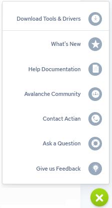

## Access Documentation and Help

After logging in, you can display the Actian Data Platform online documentation or jump to the Actian Community for help using the following links, available from the Help menu (green question mark) in the lower right corner of the console window:

**Help from the Actian Community**

:   The Actian Community is a 24x7 online support application for Actian Community users. Community users can search the Actian Knowledge Base and forums to obtain help. You also may participate in our community and recommend improvements to our software through the Idea Center. Access the online system at [https://communities.actian.com](https://communities.actian.com).

**Other Helpful Resources**

    - SQL Language Guide

    - Data Loading Guide

    - Security Guide

    - [Community Forums](https://communities.actian.com)

    - Sales Inquiries: sales@actian.com
