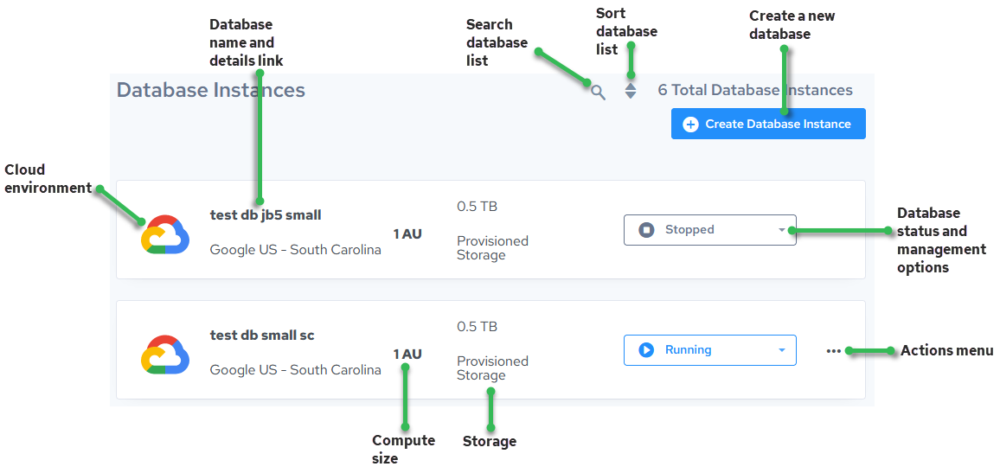

## Actian Data Platform Database Instances Console

Here are the primary features of the Database Instances page of the Actian Data Platform console.

Related topics:

- To set your storage account connection, see Set Up Access Credentials for Cloud Storage Accounts and Grant Access to Warehouse or Database for External Tables Access.
- To create, update, or disable public RSA keys for DBA access, see [Manage Public RSA Keys for Database Administrator Access](../DBaaS_User/Manage_Public_RSA_Keys_for_Database_Administrato.md).

- To manage databases, see [Warehouse and Database Management](../DBaaS_User/Part_WarehouseManagement.md).
- To add or remove IP addresses that can access the database, see Update Allow List IP Addresses.

- To start or stop databases and learn more about automatic idle warehouse stop, see [Stop and Start Databases](../DBaaS_User/Stop_and_Start_Databases.md).
- To monitor your database, see [Monitor Databases](../DBaaS_User/Monitor_Databases.md).

- To learn more about Query Editor, see [Overview of the Query Editor](../DBaaS_User/Overview_of_the_Query_Editor.md).
