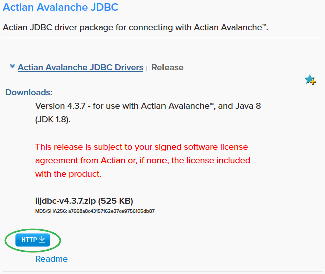

## Actian JDBC Driver

Some tools require the installation of the Actian JDBC Driver. You may download this from Actian’s Electronic Software Distribution.

To download and install the JDBC package from ESD

1. Go to [https://esd.actian.com/product/Actian/JDBC/java/Actian_Actian_JDBC_Drivers](https://esd.actian.com/product/Avalanche/JDBC/java/Actian_Avalanche_JDBC_Drivers).
2. Scroll down to the Actian Actian JDBC Drivers section and expand it, if necessary.

3. Click the HTTP button to download the driver. For example:

4. Save the Zip file to a location on your local machine.
5. Read the readme file that is posted with the package.

6. Follow the installation considerations in the readme.

### Video: How to Connect to an Actian Warehouse Using the JDBC Driver

A video explaining how to connect to an Actian warehouse is available for viewing at [Actian Actian JDBC Data Driver](https://vimeo.com/actian/review/403625269/1de2e2b67c).
