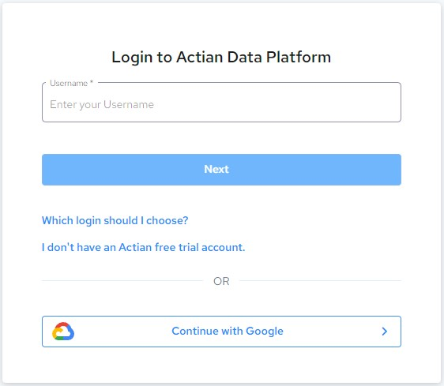
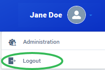
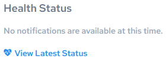

## Common Tasks

You access the Actian console through a web browser. Supported browsers include Edge, Internet Explorer, Firefox, Chrome, and Safari.

This section details how to log in, log out, and check Actian Data Platform health status.

## Generating Your Actian Data Platform Login Credentials

When your company subscribes to the Actian Data Platform service, Actian Corporation emails the contact at your company who was identified as the Technical Administrator of your Actian Data Platform account.

This email contains an activation link that initiates the registration process for your Actian Data Platform account.

- The first person to use this activation link becomes the administrator of your Actian Data Platform account. (This could be the Technical Administrator or someone the Technical Administrator assigns.)
- The Technical Administrator may forward the activation link to other users at your company so that they can register.

- Subsequent registrants become “normal” (non-administrative) Actian Data PlatformActian Data Platform users; however, the administrator must assign administrative access to these users after they have registered.

The result of the registration process is that each registrant can now use their email address and password they provided during registration to log in to the Actian Data Platform console (see [Log In](../DBaaS_User/Common_Tasks.md)).

## Log In

There are three ways to log in to Actian Data Platform:

| This login option… | Provides access to… |
| --- | --- |
| Actian Community | • Google Cloud, AWS, and Azure data warehouses • Integrations |
| Actian Platform User | • Google Cloud data sources • Integrations |
| Google Cloud | • Google Cloud data sources • Integrations |

All three options require that a user has been provisioned. There are three ways to provision a user:

- Signing up for Actian Data Platform on the GCP marketplace
- Establishing a proof of concept or Enterprise setup (manually by Actian Corporation)

- Being provided access by an existing Account Administrator, who provides platform user credentials (see [User Roles](../DBaaS_User/User_Roles.md))

The capabilities provided by your corporate account determines how you should log in and what Actian Data Platform features you will be able to access.

To log in to Actian

1. Point your browser to the following address:

    [https://console.actiandataplatform.com](https://console.actiandataplatform.com)

2. Log in by clicking one of these options:

    - Continue with Actian Community – Opens a page where you can enter your Actian Community credentials (username and password) and click Log in.

    - Continue with Actian Platform User – Displays username and password fields. Enter your platform credentials and click Continue (or press Enter).

    - Continue with Google Cloud – The Google Sign in page is displayed.

3. The Login to Actian Data Platform page displays.

    

4. Choose the appropriate login credentials and click Next.!

    The Actian Data Platform displays.

## Log Out

To log out of Actian

1. Click your username in the upper right corner of the console window:

    

2. Select Logout.

    The Actian login page is redisplayed (see [Log In](../DBaaS_User/Common_Tasks.md)).

## Check Actian Data Platform Health Status

The Current Status Actian Data PlatformActian Data Platform page displays website availability and performance status in real time. The page and its links show if Actian Data Platform sites are down or have performance issues, and provides uptime and performance history.

You may check the status of Actian Data Platform resources including current and historical performance of the Actian Data Platform Console, the Actian Data Platform Management Service, and the Actian Data Platform Provisioning Service.

To check Actian Data Platform health status

1. In the upper right corner of the Actian Data Platform console window, click the user menu and select Administration:

    

    The Administration interface opens in a new browser tab.

2. In the menu pane on the left, click Service Request.

    The Service Request panel is displayed, showing any health status notifications:

    

3. Click View Latest Status.

    The Current Status Actian Actian Data Platform page is displayed.

4. Click any of the links to display detailed performance and availability information.

## Monitor AU Usage

!!! note "Note"

    This section is for users with Account Administrator access to an Actian Data Platform account. For more information, see [User Roles](../DBaaS_User/User_Roles.md).

Account administrators may monitor AU usage using the Administration interface.

For more information about AUs, see [Actian Units](../DBaaS_User/Concepts_to_Understand.md) and [Database Cost and Actian Units](../DBaaS_User/Concepts_to_Understand.md).

To monitor AU usage

1. In the upper right corner of the Actian Data Platform console window, click the user menu and select Administration:

    

    The Administration interface opens in a new browser tab.

2. In the menu pane on the left, click Usage.

    The Usage panel is displayed, showing a three-column graph of AU hours:

    - Total AU hours available to your account (what your company has paid for up front)

    - AU hours consumed so far

    - AU hours remaining in total

If you need to add more AU hours to your account, contact Actian Sales at sales@actian.com.
