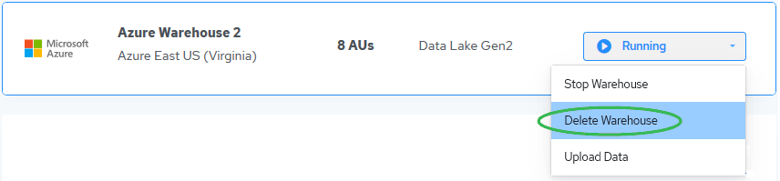

# Delete Databases

Deleting a database removes it from your Actian Data Platform account. After you delete a database, you are no longer charged for it.

!!! warning "Important"

    **IMPORTANT!**All data stored in the database is erased. Therefore you must confirm deletion.

To delete an Actian database

1. On the Database Instances page, click the management dropdown for the database you want to delete and select Delete Database:

    

    The Delete Database dialog appears.

2. Type DELETE (all caps) to confirm deletion.
3. Click Delete to delete the database.

!!! note "Note"

    For Google Cloud and AWS AV-2, it takes a few seconds.

    The database is removed from the Database Instances page.
