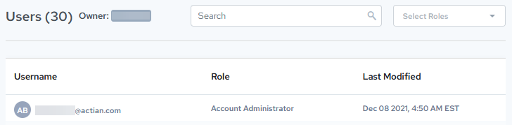

## Display Users from the Warehouse Details or Database Instances Page

Any Actian user may display a list of users who have access to a particular warehouse/databse. From the Warehouse Details or [Database Instance Details](../DBaaS_User/Database_Instance_Details.md) page, you can display the Users page:

The Users page displays the following information:

| Field or Control | Description and Use |
| --- | --- |
| Users (##) | Displays the number of users that can access the selected warehouse/database |
| Owner | Displays the name of the warehouse/database owner |
| Search | Lets you narrow the displayed list of users to the search criteria you specify. You may search for information such as:•Any part of a username•Any word in a role (but see Select Roles)•Any part of the Last Modified date and timeDelete your entry in the Search field to cancel the search and display the full list of users. |
| Select Roles | Lets you select a user role to narrow the list.Click the X in the dropdown to clear the search. |
| Username | Displays the username of each user who has access to this warehouse |
| Role | Displays the role of the user. For more information, see [User Roles](../DBaaS_User/User_Roles.md). |
| Last Modified | Displays the date the user was last modified. |
