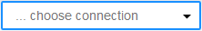
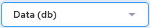

## Examine the Database Schema

When a database schema is displayed in the schema pane on the left side of the editor (see [Query Editor Diagram](../DBaaS_User/Query_Editor_Diagram.md)), you may examine the tables and columns by clicking them. Columns and their data types are displayed.

To choose a database connection

Click the database connection dropdown at the top of the schema pane:

Select one of the following databases to connect to:

- Data (db)
- User Management (iidbdb)

- Monitoring (imadb) – see [Working with Monitoring (imadb) Tables](../DBaaS_User/Working_with_Monitoring_(imadb)_Tables.md)

AWS AV-1 and Azure:To display or hide the schema

Click the Toggle Schema icon:

The schema is displayed or hidden from Query Editor.

Google Cloud and AWS AV-2:To examine table properties

1. Click a table in the schema pane.

    Table information is displayed on the PROPERTIES tab of the bottom pane.

2. To preview the data in the table, click the Preview Table link on the right of the bottom pane.

    The table data is displayed on the RESULTS tab.

3. To enlarge the results, click the Expand Results.

    The table is displayed in a new browser tab or window.

For more information, see [Export Query Results to a File](../DBaaS_User/Export_Query_Results_to_a_File.md).

To search the schema

Enter text in the search field above the schema pane.

Whole or partial results are displayed in the schema pane.
