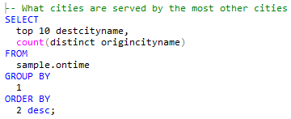

## Format Query Text Automatically

You can format query text with line breaks and indentations.

To format a displayed query with line breaks and indentations

1. Display the query in the query pane (see [Open a Saved Query](../DBaaS_User/Open_a_Saved_Query.md)).
2. Click the Format Query icon on the toolbar:

    

    The query is formatted. For example:

!!! note "Note"

    Once you format a query, it cannot be unformatted.

3. Click the Save icon to save the formatted version, if desired.
