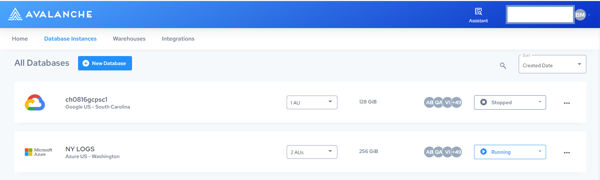

# Getting Started with Actian Database as a Service

This topic introduces the Database Instances console, describes key concepts, and explains the general workflow to create a database, load data, and use the Actian Database Rbash Shell to connect applications and conduct functional or performance tests.

The Actian Data Platform uses the Database Instances console to create databases, show database status, and related database information. You can create a new database instance and define details of your database.

