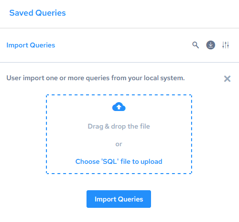

## Import Queries

You may import one or more queries from an external .sql (text) file on your local system.

To import a query

1. In the navigation panel on the left, click Saved Queries.

    The Saved Queries dialog opens.

2. Click the Import Queries link.

    The dialog expands:

    

3. Either drag and drop one or more.sql files onto the box, or click “Choose ‘SQL’ file to browse files to add.

    The file or files are listed below the box.

4. Repeat the previous step to add more files until you are finished.
5. Click Import Queries.

    The queries are imported and displayed in query tabs.
