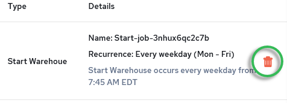

## Schedule a Database

After creating a database, you may schedule when it starts, stops, or scales to economize on AU costs (see [Database Cost and Actian Units](../DBaaS_User/Concepts_to_Understand.md)).

You may create one or multiple schedule events to stop, start, or scale a database using these elements:

| Action | Recurrence | Time Increment |
| --- | --- | --- |
| • Start Database • Stop Database | • Interval – event duration, from 0 hours, 15 minutes to 23 hours, 45 minutes • Schedule Once – date and time to run an event • Daily – every day of the week • Every weekday (Mon–Fri) • Weekly – particular weekdays • Monthly – month 1–12 on a particular day of the month • Custom (quartz cron expression—see [Cron Expressions](../DBaaS_User/Cron_Expressions.md)) | Fifteen-minute increments,  12:00 AM – 11:45 PM |

To create or delete a schedule event, follow the appropriate procedure:

- [To create a start/stop schedule event](../DBaaS_User/Schedule_a_Database.md)
- - [To delete a schedule event](../DBaaS_User/Schedule_a_Database.md)

To create a start/stop schedule event

1. In the Actian Database Instances console, click the database name to display its [Database Instance Details](../DBaaS_User/Database_Instance_Details.md) page.
2. In the Schedule row, click the Create Schedule icon:

    

    The Schedule Database Action dialog opens.

3. Select an Action for the event:

    - Start Database

    - Stop Database

4. Choose a Recurrence interval:

    - Interval

    - Schedule Once

    - Daily

    - Every weekday (Mon–Fri)

    - Weekly

    - Monthly

    - Custom

5. Select a Start time for the action:

| Recurrence | Setting |
| --- | --- |
| • Interval – event duration | Select an interval from 0 hours, 15 minutes to 23 hours, 45 minutes |
| • Schedule Once – trigger a one-time event | Select a day of the month and an execution time from 12:00 AM – 11:45 PM. |
| • Daily – every day of the week • Every weekday (Mon–Fri) | Select a start time from 12:00 AM – 11:45 PM. |
| • Weekly – particular weekdays | 1.Select one or more weekdays for the action.2.Select a start time from 12:00 AM – 11:45 PM. |
| • Monthly – month 1–12 on a particular day of the month | 1.Select a month for the action.2.Select a month day for the action.3.Select a start time from 12:00 AM – 11:45 PM. |
| • Custom | Enter a custom cron expression in the field. See [Cron Expressions](../DBaaS_User/Cron_Expressions.md). |

6. Click the Schedule button to create the action.

    The schedule action is added to the list at the bottom of the dialogue.

7. Click the Add Schedule button to add another schedule event and repeat steps 3–6.

To delete a schedule event

1. In the Database Instances console, click the database name to display its [Database Instance Details](../DBaaS_User/Database_Instance_Details.md) page.
2. In the Schedule row, click the Create Schedule icon:

    

    The Schedule Database Action dialog opens.

3. Scroll down to the list of schedule events.
4. To search for a particular event by action or recurrence, enter text in the search field: 

5. When the schedule event is shown in the list, click the delete icon on its right:

    

6. Confirm the deletion.

    The schedule event is removed from the events list.
