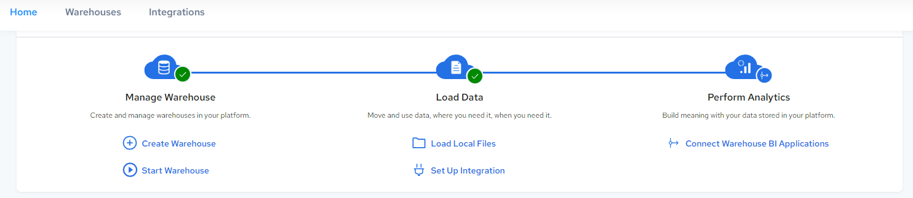
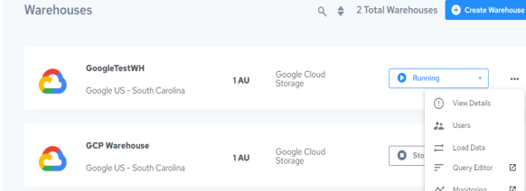

## Use Data Load to Load Delimited Text Files

You can access Data Load in the following ways:

- From the Integrations menu:

- From the Warehouse page, status dropdown menu for the warehouse:

To use the Data Load to load data into an Azure warehouse

1. Click Integrations, Load Files.

    The File Upload Setup to an Actian Warehouse dialog is displayed.

2. Select the Azure or Google Cloud warehouse that you want to load the data into.

!!! note "Note"

    The warehouse must be running to receive the uploaded data. See [Restart a Warehouse](../User/Restart_a_Warehouse.md).

3. Enter the database user’s username and password to provide access to the warehouse. The default user is dbuser.

    If you have not yet set a dbuser connection password, see [Set the dbuser Connection Password](../User/Set_the_dbuser_Connection_Password.md).

4. Enter the name of the table in the Actian warehouse where the uploaded data will be written.

    This can be an existing table or a new table. If it is a new table, you must set the next field to Append, which will create the table in the warehouse.

5. Specify the output mode of how the data should be inserted into the table:

    - Append – Inserts the records at the end of an existing table or creates the table if it does not yet exist

    - Replace – Drops and recreates the table

    - Truncate and Append – Truncates the table before inserting the uploaded data

6. By default, access to new tables is given to the dbadmin group in Query Editor. If you want to deny this access, uncheck the Provide table access in Actian Data Platform Query Editor option. For more information, see [User Groups](../User/User_Groups.md) in the User Guide.
7. If you have a prewritten CREATE TABLE statement that you want to use to create the table, check the Specify Table Creation File option and then click Choose Table Creation Query File to select the input file to use.

8. Drag and drop your data file or files onto the Delimited Files box, or click Browse File to add the delimited text data file(s) to create the table.

!!! note "Note"

    If you add multiple files, they must all be based on the same schema. Files are limited to 50 MB each in size.

    - To remove added files, click the X button next to the file name.

    - To upload more files, click the Upload Files link and repeat this step.

9. Specify whether your table data includes a header row.
10. Choose the field separator, record separator, and quote character or let the Actian Data Platform automatically detect the characters.

11. Click the Upload Data button.

    The Platform-Desktop-Upload-Config configuration is created or reused to:

    - Upload the data files

    - Create, replace, or add to the table in the selected warehouse

    The Jobs tab of the Configurations Details page is displayed for the Platform-Desktop-Upload-Config configuration, listing the job that has been started. For more information, see [Display Job Details in the Job Log](../DataLoading/BatchDataLoad.md).
