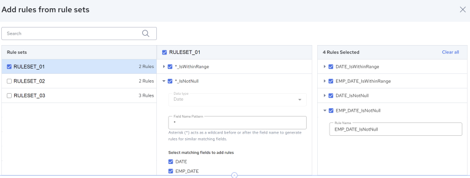
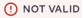

## Add Rule from Rule Set

!!! note "Note"

    Before reading this topic, ensure that you have read [Creating a Data Profile](../DataQuality/Creating_a_Data_Profile.md).

This option allows you to select, add, and configure profile rules from [Rule Sets](../DataQuality/Rule_Sets.md).

A rule set is a method that allows managing data profiling rules by saving and reusing them. It is essentially a collection of rules which can be applied to fields of a specified data type with names that match a specified named pattern.

It allows users to add rules to their profile from an existing collection within the rule set ([Add Rule from Rule Set](../DataQuality/Add_Rule_from_Rule_Set.md)) and also to save rules from a profile back into a rule set, making them available for future use across different profiles (see [Save Profile Rules as Rule Set](../DataQuality/Save_Profile_Rules_as_Rule_Set.md)). When you add rules from a rule set to a profile, a copy of the rule is created and added to the profile. This enables you to modify the rules within the profile without affecting the original rule in the rule set.

When adding profile rules to a profile from a Rule Set, the profile engine analyzes the data types and field names in the source data set to identify matches with the data types and field name patterns from the selected Rule Set rules. This matching process ensures that only valid rules are applied to the corresponding fields in the source data set. For instance, a rule designed for date data types is restricted from being applied to numeric fields.

When editing an existing profile, the profile engine examines the existing rules against the schema of the source data set. If the schema has been altered and either the data type or field name from an existing profile rule cannot be resolved, an error will be displayed next to the rule. You will be prompted to either edit or remove the rule.

To add rules from rule set

1. On the Rules page, under Add your Rules here, click Add Rule from Rule Set.

    The Add rules from rule sets page is displayed. The top half of the page is used to display rule sets and add rules from these rule sets. The bottom half of the page displays the source data.

    

    

    You can perform the following actions with the source dataset:

| Options | Description |
| --- | --- |
|  | Click this icon to search for a particular value. Contents will be filtered based on the search string. Click  to close the search box. |
|  | Click this icon to select the fields you wish to see in the table. This feature is useful when working with data sets with a large number of fields. |

2. Search and select your rule set.

    Rule collections defined within the selected rule set are displayed.

    

    When you select a rule set from the left pane, the profiler evaluates the rules in the rule set to determine if they can be applied to the source dataset. This evaluation is based on the field names and data types specified in the rule set and those in the source file.

    If no match is found, a NOT VALID message () will appear next to the rule, and the rule will remain disabled.

    If a match is found, a list will be generated under select matching fields to add rules, allowing the user to review and select the fields to which they’d like to apply the rules.

    If there are multiple matching fields (as shown in the screenshot above), the user can apply the same rule to multiple fields.

3. Review the existing rules in the rule set to identify which ones might be useful.
4. Click the  icon next to a data set rule to view and edit the Field Name Pattern. You cannot edit the Data Type.

!!! note "Note"

    The Field Name Pattern is case insensitive.

5. Select one or more data set rule and then select the matching fields to add rules. You can add rules from multiple rule sets.

    All added rules are displayed in the rightmost pane. The rule name is automatically generated based on the selected Field Name and Rule Name, following the format <FieldName>_<RuleName>.

6. If required, specify the parameters for the rules you add. See [Rule and Parameter Reference](../DataQuality/Rule_and_Parameter_Reference.md).
7. Click Add Rules.

    The rules you define are added to your profile and focus is returned to the Rules page of the editor.

    A copy of the selected rules is generated and applied to the profile. This allows you to modify the added rules without affecting the original rules in the rule set.

!!! note "Note"

    If the Source schema updated popup dialog opens, click Remove to delete the no longer valid rules and go to the Rules page (the Invalid rules removed popup confirms the number of rules removed). Or click Review to go to the Review and update invalid rules page. The NOT VALID message () appears next to each no longer valid rule. Click delete to remove a rule. Or select a rule, edit the Field, Rule Type, Parameters and Field Value as needed, click Update (the Rules updated popup confirms the number of rules updated), then click Continue.
