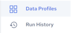

## Data Profiles Page

The figure below illustrates the Data Profiles page, which opens by default in the Design environment. Use this page to create, edit, execute and manage data profiles. You can also view profile execution results (see [Run History for all Profiles](../DataQuality/Run_History_for_all_Profiles.md), and [View Profile Details](../DataQuality/View_Profile_Details.md)).

All your Data Profiles are displayed on the Data Profiles page.

Click a Profile to [View Profile Details](../DataQuality/View_Profile_Details.md), execute, edit and delete the profile.

Alternatively, select a check box next to a Profile to perform the following actions from the toolbar which displays on the top right of the page:

| Actions | Description |
| --- | --- |
|  | Run the selected Data Profile. See [Run a Profile Manually](../DataQuality/Run_a_Profile_Manually.md). |
|  | Make a copy of the selected Data Profile. See [Duplicate a Profile](../DataQuality/Duplicate_a_Profile.md). |
|  | Edit the selected Data Profile. See [Edit a Profile](../DataQuality/Edit_a_Profile.md). |
|  | Delete the selected Data Profile. See [Delete a Profile](../DataQuality/Delete_a_Profile.md). |

Data Profiles page options and actions:

| Options | Description |
| --- | --- |
|  | Click this icon to search for specific text within the profiles listing. Contents will be filtered based on the search string.Click  to clear the search box. |
|  | Click this icon and select a connector to filter the list of Data Profiles by connector.Click  to clear the filter. |
|  | Click this icon and select Name, Date or Created By to sort the list of Data Profiles by one of those fields.Click  to clear the filter. |
|  | Click this icon to view the Data Profiles in a grid view (the default view). |
|  | Click this icon to view the Data Profiles in a list view. |
|  | Create a profile. See [Creating a Data Profile](../DataQuality/Creating_a_Data_Profile.md). |
|  | • Data Profiles - Displays the Data Profiles page. • Run History - Displays the Run History page. See [Run History](../DataQuality/Run_History.md). |
