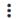

## Define Rules and Analyze Results

!!! note "Note"

    Before reading this topic, ensure that you have read [Creating a Data Profile](../DataQuality/Creating_a_Data_Profile.md).

On the Rules page, you can select, configure, and apply profile rules. Once executed, profile rules will help identify anomalies and issues within specific data patterns, formats, and values. For more information about Profiler Rules, see [Rule and Parameter Reference](../DataQuality/Rule_and_Parameter_Reference.md).

The following are the high level steps to define rules and analyze results:

1. Configure the source data sample size that is displayed on the page using the following information:

| Options | Description |
| --- | --- |
| Sample Size | Select how much of the source dataset to load. This option is useful if your source dataset is very large. Working with a smaller sample size rather than the entire dataset avoids latency issues while designing and testing profile rules. The default setting is 5,000 records, which can be changed to either 10,000 records or All records (which loads the entire dataset).**Note:**Selecting All records opens the Changing the sample size dialog (regardless of the dataset size). Click Change to apply the All records setting. Click Cancel to revert the sample size to 5,000. |
| Run profile after every rule update | When this is enabled, the profile will automatically execute whenever a rule is added, removed, or edited. Once execution is complete, the profile metrics (summary and individual rules) will be updated based on the latest results. This feature can help speed development as it provides immediate results and insight.You can also click the pass (green) and fail (red) bars that appear over the dataset to view the pass and fail results. This helps you to analyze the output of each rule execution and decide if you want to keep a rule or discard it.**Note:**  - Data is not saved until the targets are defined.  - Once the targets have been defined and the Profile has been executed from the Targets page, all records from the source dataset will be processed and the sample size will be ignored.  - With larger sample sizes, this setting may increase latency when updating the rules in the profile. If you run into this problem, disable this option and choose to run the profile manually to reduce overall lag time. |
| Run Profile | Use this option to run the profile manually. To use this option, you must disable Run profile after every rule update.This option is useful when using a large dataset. In such cases, using the Run profile after every rule updateoption may lead to latency issues, and using this option helps reduce the overall lag time. |
| View Source DataSet | Click this link to open and view your source dataset, in a new browser tab. Referencing source data is extremely helpful when configuring profile rules. |
|  | Click this icon to sort the rules:•Descending by Fail: (Default) Sort the rules in descending order based on failures.•Descending by Pass: Sort the rules in descending order based on success.•Rule name A-Z: Sort the rules in alphabetical order. |
|  | Click this icon to search for a particular value. Contents will be filtered based on the search string. Click  to close the search box. |
|  | Click this icon to select or remove the column names that are displayed for the source data. You can choose to display only those columns that are of interest to you. |

2. Add rules using one or more of the following options:

    - Inspect & Recommend Rules(): Click this option to use internal algorithms which inspect the source data and recommend rules based on knowledge of the source schema and various data pattern matching tests. This method is recommended if you are not familiar with the profiling process, or if you are unfamiliar with the source data. See [Inspect & Recommend Rules](../DataQuality/Inspect___Recommend_Rules.md).

    - Add New Rule: Click this option to add a rule manually. See [Add a New Rule](../DataQuality/Add_a_New_Rule.md).

    - Add Rule from Rule Set: Click this option to add rule from rule set. See [Add Rule from Rule Set](../DataQuality/Add_Rule_from_Rule_Set.md).

!!! note "Note"

    When editing a profile on the Rules page (see [Edit a Profile](../DataQuality/Edit_a_Profile.md)), the following options are available when you click the Add button: New Rule,From recommended, and From rule set.

3. Review and validate the results and finalize your rules.

    Some of the features that are available on this page for review and analysis are:

    - Overall Pass/Fail Summary: The summary is displayed if the Run profile after every rule update option is enabled or you run the profile manually from the Rules page.

    - Interactive Result Bars: The interface includes interactive bars, colored green and red, to visually represent the outcome of rules execution. The green bar indicates the portion of the dataset that passes the rules, signifying compliance with the rules. Conversely, the red bar shows the portion of the dataset that fails the rules, highlighting areas that may require attention or correction.

    - Detailed Analysis of Rule Execution: Clicking on these bars allows users to delve into specific details about which data points passed or failed according to each rule. This granular view is instrumental in understanding the nature of data issues, including inconsistencies, inaccuracies, or other quality concerns that the rules aim to identify.

    - Informed Decision Making: This functionality supports critical decision-making processes about the rules themselves. By analyzing the pass and fail results, users can determine the effectiveness and relevance of each rule to their dataset. If a rule consistently identifies meaningful issues, it proves its value and is likely to be retained. However, if a rule frequently flags false positives or is irrelevant to the dataset’s context, it may be considered for modification or removal.

!!! note "Note"

    If the dataset is large, you may face latency issues with Run profile after every rule update. If you run into this problem, disable this option and choose to run the profile manually to reduce overall lag time.

    You can click the  menu that is displayed for each rule to perform the following actions:

| Options | Description |
| --- | --- |
| Edit | Click this option to open the Update Rules page from where you can edit the rule details. |
| Disable | Click this option to Disable or Enable a rule.When you have multiple rules, it can be helpful to disable a specific rule to see how it impacts the overall Pass/Fail summary. Often a record will pass with one rule and fail with another, so disabling and enabling can help identify conflicts or issues. |
| Remove | Click this option to Delete the rule. |

    You can click the check boxes displayed next to the rules to perform the following actions:

| Options | Description |
| --- | --- |
|  (Save) | Click this option to open the Save as Rule Set page from where you can save the selected profile rules (multiple selection is possible) as a rule set. See [Save Profile Rules as Rule Set](../DataQuality/Save_Profile_Rules_as_Rule_Set.md). |
|  (Disable/Enable) | Click this option to Disable or Enable the selected rules. |
|  (Delete) | Click this option to Delete the selected rules. |

4. Once your profile design is complete, click Continue

    The Targets page is displayed. See [Define Targets](../DataQuality/Define_Targets.md).
