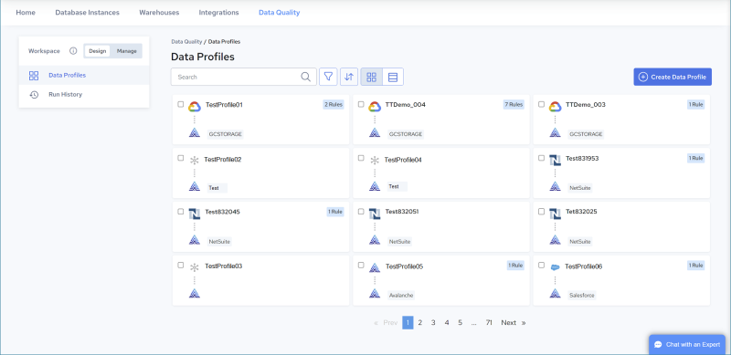

# Getting Started

This topic introduces Data Profiler and describes key data profiling concepts.

Data profiling involves examining a dataset to detect any inconsistencies, anomalies, and invalid entries. A crucial component of this process is the implementation of profiling rules. These rules are designed to define what constitutes valid and invalid values within the data. By establishing these guidelines, users can ensure that the dataset adheres to specific values, standards, or patterns. This structured approach not only aids in maintaining the integrity of the data but also supports adherence to data quality standards.

Data Profiler provides many rules which are designed to identify various data quality issues (see [Rule and Parameter Reference](../DataQuality/Rule_and_Parameter_Reference.md)). Multiple rules can be applied to a single field, allowing the user to check or enforce multiple conditions for a single field.

Profile rules can be configured to enforce specific conditions or values. When a rule is applied to a specific field in a profile, the data in that field is evaluated against the condition or value within the rule. After processing is complete, each value from the source field is categorized as either valid or invalid. Valid data is written to the Pass target, while invalid data is written to the Fail target. Data in the Pass target can be processed or used immediately, while the data in the Fail target can be routed for remediation (see [Define Targets](../DataQuality/Define_Targets.md) and [Results](../DataQuality/Results.md)).

Data is evaluated based on the conformance to the conditions or values defined within the profile rules. The rules specify characteristics such as accuracy, completeness, consistency, timeliness, validity, and uniqueness. Once data has been profiled, multiple views are provided which help identify data quality issues and trends (see [Run History](../DataQuality/Run_History_2.md)).

Data Profiler has two main environments: [Design](../DataQuality/Design.md) and [Manage](../DataQuality/Manage.md). Typically, you create, test, refine, and schedule data profiles in the Design environment. Then execute, monitor, and manage job execution results in the Manage environment.

The following figure illustrates the Data Quality console pages that open by default in each environment.

| [Design](../DataQuality/Design.md) Environment |  | [Manage](../DataQuality/Manage.md) Environment |
| --- | --- | --- |
|  |  |  |
| Data Profiles PageCreate, Edit, Test & Schedule Profiles |  | Overview PageMonitor Job ResultsEdit & Manage Configurations |

Use the [Design](../DataQuality/Design.md) environment to establish a connection (see [Source and Target Connections](../DataQuality/Source_and_Target_Connections.md)). Then use it to create a data profile by defining a source (see [Define Source](../DataQuality/Define_Source.md)), creating data quality rules (see [Define Rules and Analyze Results](../DataQuality/Define_Rules_and_Analyze_Results.md)), and defining a target (see [Define Targets](../DataQuality/Define_Targets.md)). Data isn’t persisted until the targets are configured within the profile.

Data profiles can be executed manually (see [Run a Profile Manually](../DataQuality/Run_a_Profile_Manually.md)) or scheduled to execute (see [Edit Profile Schedule](../DataQuality/Edit_Profile_Schedule.md)). To gain insight into overall execution results, see [Run History for all Profiles](../DataQuality/Run_History_for_all_Profiles.md). To investigate results per profile, see [View Profile Details](../DataQuality/View_Profile_Details.md).

For a list of available sources, see [Source and Target Connections](../DataQuality/Source_and_Target_Connections.md). Actian Warehouse can be used as the target.

Use the [Manage](../DataQuality/Manage.md) environment to schedule and execute profiles using the associated configuration (see [Managing Configurations](../DataQuality/Managing_Configurations.md)), gain insight into overall execution results (see [Run History](../DataQuality/Run_History_2.md)), investigate results per profile and rule (see [Run History for a Single Configuration](../DataQuality/Run_History_for_all_Configurations.md)), and monitor overall execution results in the [Manage, Overview Page](../DataQuality/Manage__Overview_Page.md).
