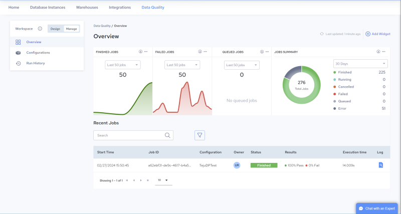

## Manage, Overview Page

The figure below illustrates the Overview page, which opens by default in the Manage environment. Use this page to monitor execution results for configurations as a whole over time, and then to drill down and investigate execution results per configuration, job, rule, and field.

In the upper portion of the page, trend graphs trace overall job results for all configurations. View aggregated metrics for the past 50, 100 or 200 jobs, andfor all jobs over the past 30, 60, or 90 Days(see [Widgets](../DataQuality/Manage__Overview_Page.md)). Mouse over a chart to see more detail. Drag and drop charts to reorder. Settings are persisted the next time you log in.

In the lower portion of the page, the [Recent Jobs](../DataQuality/Manage__Overview_Page.md) table lists details about recently executed jobs (such as Pass/Fail results and job status), and provides access to job log files. Click a configuration to [View Configuration Details](../DataQuality/View_Configuration_Details.md), then click Run History to view the [Run History for a Single Configuration](../DataQuality/Run_History_for_all_Configurations.md) with execution results per job, rule and field.

Widgets

The following widgets are displayed in the upper portion of the page:

| Name | Description |
| --- | --- |
| FINISHED JOBS | This chart traces the number of jobs that finished executing for the selected number of jobs (Last 50 jobs, Last 100 jobs or Last 200 jobs). |
| FAILED JOBS | This chart traces the number of jobs that failed for the selected number of jobs (Last 50 jobs, Last 100 jobs or Last 200 jobs). |
| QUEUED JOBS | This chart traces the number of jobs that are currently queued for the selected number of jobs (Last 50 jobs, Last 100 jobs or Last 200 jobs). |
| TOTAL FINISHED JOBS | This chart traces the total number of jobs that finished executing during the selected number of days (30 Days, 60 Daysor 90 Days). |
| TOTAL FAILED JOBS | This chart traces the total number of jobs that failed to finish executing during the selected number of days (30 Days, 60 Daysor 90 Days). |
| JOBS SUMMARY | This chart presents run results for jobs executed during the selected time period (30 Days, 60 Daysor 90 Days).Sync result status can be:Finished: Jobs successfully completed. A log file is available (or soon will be).Running: Jobs currently executing on a worker.Canceled: Jobs canceled prior to being acquired by a worker (during the Waiting or Queued state). No log file will be produced.Error: Jobs that encountered an exception during execution. Depending on configuration and artifact design, the job may or may not have completed. A log file is available (or soon will be).Queued: Jobs queued for execution by the next available worker.Failed: Jobs that failed, or were manually stopped by user command or by an exception during initialization or execution. A log file may or may not be available. |

You can perform the following actions on widgets:

| Option | Description |
| --- | --- |
|  | Click this icon to add a widget. |
|  | Click this icon to download the chart in SVG or PNG format, or download the data in CSV format (which you can open in Excel). |
|  | Click this icon to add, reorder or remove widgets. |

Recent Jobs

The Recent Jobs table displays the following job information:

| Column Name | Description |
| --- | --- |
|  | Enter a string to search for a particular value. Contents will be filtered based on the search string. Click  to clear the search box. |
|  | Click this icon to filter by one of the following: Failed, Finished, Queued, Error, Running, Canceled, Deleted, or Sequenced. |
| Start Time | The date and time the job started. The time displayed is specific to your time zone. |
| Job ID | A unique identifier for the job. |
| Configuration | The name of the configuration associated with the job. Click to view or edit configuration details in the Configuration Detailspage. See [Edit a Configuration](../DataQuality/Edit_a_Configuration.md).**Note:**A configuration is only created when a profile is scheduled to execute. If a profile is executed on demand - without being scheduled - this value displays the profile name. |
| Owner | Displays the initials of the job owner. Click to view the email address of the owner. |
| Status | Status of the job:•Waiting – Job was created but needs additional information or a trigger event prior to being queued for execution.•Queued – Job is queued for execution by the next available worker.•Canceled – Job was canceled prior to being acquired by a worker (during the Waiting or Queued state). No log file will be produced.•Initializing – Job has been acquired by a worker and is being prepared for execution.•Running – Job is currently executing on a worker.•Finished – Job successfully completed. A log file is available (or soon will be).•Error – Job encountered an exception during execution. Depending on configuration and artifact design, the job may or may not have completed. A log file is available (or soon will be).•Failed – Job failed or was manually stopped by user command, or an exception occurred during initialization or execution. A log file may or may not be available. |
| Results | Displays the data quality rule Pass/Fail results, in percent (%). |
| Execution Time | The amount of time for the job to execute. |
| Log | Click the log file icon to view and download the log file for the job. |
