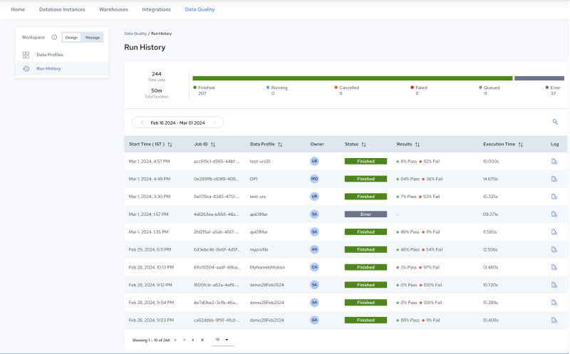
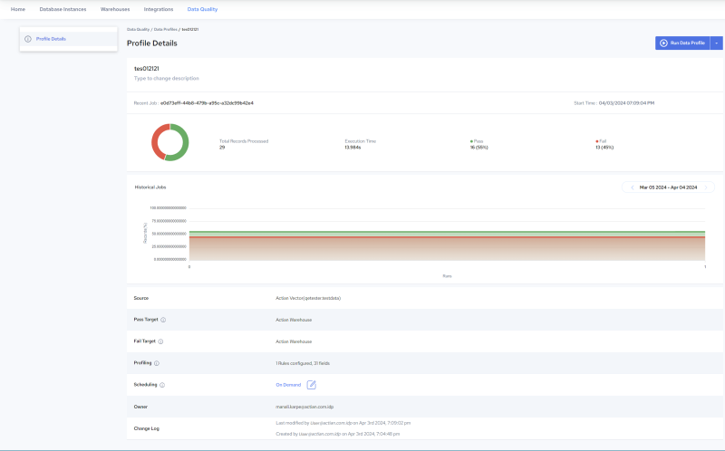
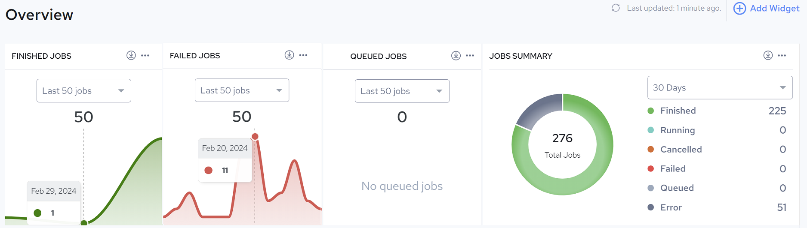

## Overview of Data Profiler

Data Profiler analyzes dataset attributes and provides insights into their quality and structure without requiring manual examination of each element. Data profiling plays a crucial role in data management and analytics, offering a comprehensive view of data's characteristics, which is essential for understanding and optimizing data for consumption.

Here's an overview of the main functionalities and benefits of Data Profiler.

## Key Functionality

- Pattern Recognition: Profile rules help identify common patterns within data, and flag data that deviates from these patterns or conditions. This process highlights potential errors or outliers (see [Rule and Parameter Reference](../DataQuality/Rule_and_Parameter_Reference.md)).
- Inspect & Recommend: During design, relevant Profile rules can be quickly identified for a dataset using internal algorithms that inspect the source data. This is helpful when it is not clear what data quality issues are present (see [Inspect & Recommend Rules](../DataQuality/Inspect___Recommend_Rules.md)).

- Data Reference: Referencing the source data is key to configuring Profile Rules. Profiler provides constant access to the source dataset in a separate browser tab. This view can be customized by selecting a sub-set of fields if desired or by searching for a specific value. These features are also available when viewing results on the Rules page (see [Define Rules and Analyze Results](../DataQuality/Define_Rules_and_Analyze_Results.md)).
- Statistical Summary: When applied to a source field, profile rules generate statistical summaries and drill down charts that help identify and isolate data quality issues. Multiple views are provided, enabling further insight and analysis. For example, users can click a Profile in the Design, [Run History](../DataQuality/Run_History_2.md) page (see image, below left), to drill down to [View Profile Details](../DataQuality/View_Profile_Details.md) (see image, below right):

| Run History Page |  | Profile Details Page |
| --- | --- | --- |
|  |  |  |

- Execution Options: During design, a Profile can be configured to run automatically after any rule-based change (add, remove, edit), providing real time updates and insight. When working with larger datasets, Profiles can be executed manually, allowing multiple actions between executions (see [Define Rules and Analyze Results](../DataQuality/Define_Rules_and_Analyze_Results.md)).
- Data Isolation: During Profile execution, valid data is written to the Pass target, while invalid data is written to the Fail target. Once execution is complete, the data in the Pass target can be processed or used immediately, while the data in the Fail target can be routed for remediation (see [Define Targets](../DataQuality/Define_Targets.md) and [Results](../DataQuality/Results.md)).

- Trends: Historical trends are captured for each profile. Detailed charts illustrate how data quality has evolved over time. Separate views are provided to inspect trends for a specific rule or field within a given Profile. The following figure illustrates the [Manage, Overview Page](../DataQuality/Manage__Overview_Page.md) page, which provides a series of trend graphs which trace execution results.

## Benefits

- Efficiency: Data Profiler automates the tedious and time-consuming task of manually reviewing data, significantly speeding up the data analysis process.
- Accuracy: By providing detailed and accurate information about data, Data Profiler helps reduce errors in data analysis and decision-making processes.

- Insightful: Data Profiler delivers profound insights into the quality and structure of data, enabling the enhancement of practices and actions for better data management.
- Cost-effective: Improving the efficiency and accuracy of data analysis processes leads to cost savings by reducing the negative impact associated with poor data quality.
