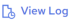

## Results

!!! note "Note"

    Before reading this topic, ensure that you have read [Creating a Data Profile](../DataQuality/Creating_a_Data_Profile.md).

The Results page displays a summary of the overall Pass and Fail data, a summary of each Rule execution, and the corresponding target dataset. The details that are available on the Results page are:

- Overall Pass/Fail Summary: The following information is displayed in this section:

| Options | Description |
| --- | --- |
| Donut Chart | The Donut Chart displays the data in a series of two segments of a circle. The entire circle represents the sum of all source data records. The green segment indicates the portion of the dataset that passes the rules and the red segment indicates the portion of the dataset that fails the rules.Hovering over the green segment shows the total number of passed records and clicking it updates the Results dataset to show the passed records. Hovering over the red segment shows the total number of failed records and clicking it updates the Results dataset to show the failed records. |
| Total Records Processed | The count of all records that were profiled. |
| Execution Time | The execution time in seconds spent for profiling the source dataset. |
| Pass | The count and percentage of records that passed the rules. |
| Fail | The count and percentage of records that failed the rules. |

- Rule Summary: This section includes interactive bars, colored green and red, to visually represent the outcome of each rule execution. The green bar indicates the portion of the dataset that passed a rule, signifying compliance with the rule and the red bar shows the portion of the dataset that failed the rule, highlighting areas that may require attention or correction. Clicking these bars allows users to view the specific details about which data points passed or failed according to each rule. This granular view is instrumental in understanding the nature of data issues, including inconsistencies, inaccuracies, or other quality concerns that the rules aim to identify.

The following actions can be performed with the results dataset:

| Options | Description |
| --- | --- |
|  | Click this icon to search for a particular value. Contents will be filtered based on the search string. Click  to close the search box. |
|  | Click this icon to select the fields you wish to see in the table. This feature is useful when working with data sets with a large number of fields. |
|  | Click the down arrow and select how many records to display on the page. |
|  | Use these options to Navigate from one page to another. |

The following actions can be performed from the Results page:

| Options | Description |
| --- | --- |
|  | By analyzing the pass and fail results, you can determine the effectiveness and relevance of each rule to their dataset. If a rule consistently identifies meaningful issues, it proves its value and is likely to be retained. However, if a rule frequently flags false positives or is irrelevant to the dataset’s context, it may be considered for modification or removal. You can edit or remove rules by clicking the Edit Rules button. |
|  | Click this to open the Run History page from where you can view and download the execution logs. |
