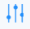
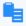

## Run History for all Configurations

The Run History page related to configurations displays both aggregated and detailed job execution results for all configurations executed. This page is useful for monitoring and analyzing execution results in production. Use this page to gain insights into configuration results as a whole, and then to investigate a particular job, configuration, rule or field (see [Run History for a Single Configuration](../DataQuality/Run_History_for_all_Configurations.md)).

For complete details about this page, see [Search Execution Results](../DataQuality/Run_History_for_all_Configurations.md).

To view job execution results for profiles, see [Run History for all Profiles](../DataQuality/Run_History_for_all_Profiles.md).

To view job execution results for a single configuration, see [Run History for a Single Configuration](../DataQuality/Run_History_for_all_Configurations.md).

From this Run History page you can:

- [Search Execution Results](../DataQuality/Run_History_for_all_Configurations.md)
- [View Job Details](../DataQuality/Run_History_for_all_Configurations.md)

- [View Configuration Details](../DataQuality/Run_History_for_all_Configurations.md)
- [Download Log File](../DataQuality/Run_History_for_all_Configurations.md)

- [Review Historical Trends](../DataQuality/Run_History_for_all_Profiles.md)

### Search Execution Results

To search execution results

1. Click Manage, Run History.

    The Run History page is displayed.

    The upper portion of the page features a bar chart which presents the aggregated status of all executed jobs.

    

    The lower portion of the page presents a sortable list of all executed jobs with the following information:

| Column Name | Description |
| --- | --- |
| Start Time | The date and time the job started. The time displayed is specific to your time zone. |
| Job ID | A unique identifier for the job. If the job Status is Finished, click to view execution results for a particular rule in the profile, overall pass/fail results, overall execution time, and the log file (see [View Job Details](../DataQuality/Run_History_for_all_Configurations.md)); and also [Download Log File](../DataQuality/Run_History_for_all_Configurations.md). |
| Configuration | The name of the configuration associated with the job. Click to view or edit configuration details in the Configuration Detailspage. See [Edit a Configuration](../DataQuality/Edit_a_Configuration.md).**Note:**A configuration is only created when a profile is scheduled to execute. If a profile is executed on demand - without being scheduled - this value displays the profile name. |
| Owner | Displays the initials of the job owner. Click to view the email address of the owner. |
| Status | Status of the job: • Waiting – Job was created but needs additional information or a trigger event prior to being queued for execution. • Queued – Job is queued for execution by the next available worker. • Canceled – Job was canceled prior to being acquired by a worker (during the Waiting or Queued state). No log file will be produced. • Initializing – Job has been acquired by a worker and is being prepared for execution. • Running – Job is currently executing on a worker. • Finished – Job successfully completed. A log file is available (or soon will be). • Error – Job encountered an exception during execution. Depending on configuration and artifact design, the job may or may not have completed. A log file is available (or soon will be). • Failed – Job failed or was manually stopped by user command, or an exception occurred during initialization or execution. A log file may or may not be available. |
| Results | Displays the data quality rule Pass/Fail results, in percent (%). |
| Execution Time | The amount of time for the job to execute. |
| Log | Click the log icon to view and download the log file for the job. |

You can perform the following actions on the Run History page:

| Options and Actions | Description |
| --- | --- |
|  | Click to specify start and end dates in a calendar. The maximum number of days that can be specified is 31. This specification populates the bar graph and the table. |
|  | Click this icon and enter a string to locate a particular configuration. |
|  | Click this icon to sort column content in ascending or descending order. |
| Job ID | Click to view job pass/fail results, execution time, and the log file in the Job Details popup. You can also download the log file. If the job Status is Finished, click to view execution details in the Job Details popup (see [View Job Details](../DataQuality/Run_History_for_all_Configurations.md)); and [Download Log File](../DataQuality/Run_History_for_all_Configurations.md). |
| Configuration | Click to view configuration details in the Configuration Details page. See [Edit a Configuration](../DataQuality/Edit_a_Configuration.md). |
| Owner | Click to view the email address of the owner. |
| Log | Click the log file icon to view and/or download the log file from the Log File page. See [Download Log File](../DataQuality/Run_History_for_all_Configurations.md). |
|  | Click the down arrow and select how many records to display on the page. |
|  | Use these options to Navigate from one page to another. |

### View Job Details

You can view execution results for a single job and for each rule executed, and also view the log file for the job in the Job Details popup screen. The job Status must be Finished to view job details.

To view job details

1. Click Manage, Run History.
2. In the table, click the Job ID of interest.

    The Job Details popup screen opens.

- View the Overall Pass & Fail Summary values to see the following job execution results as a whole:

    **Total Records Processed**: The total number of records processed by the job.

    **Execution Time**: The total amount of time for the job to finish executing.

    Pass: The number of records passed/percent (%) of records passed for the job.

    Fail: The number of records failed/percent (%) of records failed for the job.

- View the Rule Summaryvalues to see pass/fail results (count and percent) for each rule.

### View Configuration Details

You can see details about a single configuration in the Configuration Details page, and also edit, delete, and run a configuration.

To view details about a configuration

1. Click Manage, Configuration.
2. In the table, click the configuration of interest.

    The Configuration Details page opens.

For information about configurations, see [Managing Configurations](../DataQuality/Managing_Configurations.md).

### Download Log File

You can download a log file for a job in the Log File page, and view job details in the [Default view](../DataQuality/Run_History_for_all_Configurations.md), [Compact view](../DataQuality/Run_History_for_all_Configurations.md) or In the [Raw view](../DataQuality/Run_History_for_all_Configurations.md), the log file is not displayed in a table, and you can perform the following action:

To download a log file:

1. Click Manage, Run History.

    The Run History page is displayed with a list of all jobs.

2. In the Log column of the table, click the log icon next to the record of interest.

    The log file Run History page opens.

3. Click Download Log File.

The Log File page displays the following information about the job associated with the log file:

| Job Detail | Description |
| --- | --- |
| Job Status | Status of the job: • Sequenced – Job has been sequenced for execution and will be queued in order relative to other jobs for this job configuration. • Queued – Job has been queued for execution by the next available worker. • Canceled – Job was canceled prior to being acquired by a worker (during the Sequenced or Queued state). No log file will be produced. • Initializing – Job has been acquired by a worker and is being prepared for execution. • Running – Job is currently executing on a worker. • Finished – Job has successfully completed. A log file is available (or soon will be). • Error – Job encountered an exception during execution. Depending on configuration and artifact design, the job may or may not have completed. A log file is available (or soon will be). • Failed – Job failed or was manually stopped by user command or exception at some point during initialization or execution. A log file may or may not be available. |
| Started | The date and time the job was started.The time displayed here is specific to your time zone. |
| End | The date and time the job ended. |
| Duration | The amount of time for the job to finish executing. |
| Run by | Displays the initials and user id of the person who executed the job. |

The Log File page has three views which you select from the dropdown menu: [Default view](../DataQuality/Run_History_for_all_Configurations.md), [Compact view](../DataQuality/Run_History_for_all_Configurations.md), or [Raw view](../DataQuality/Run_History_for_all_Configurations.md).

Default view

In the Default view, the log file is displayed in a table with three columns: Start Date & Time, Return Code, and Details. Errors are highlighted in red in the Return Codecolumn.The following information is displayed and actions can be performed:

| Option | Description |
| --- | --- |
| Download Log File | Click this icon to download the log file. |
|  | If an entry spans multiple lines, it is in a collapsed state by default.Click this icon to expand the collapsed lines. |
|  | Click this icon to search for a particular value in the table data. Contents is filtered based on the search string.Click  to close the search box. |
|  | Click this icon to filter the table data. |

Compact view

The Compact view is the same as the Default view except that rows with multiple lines are collapsed into a single line which you can expand.

Raw view

In the Raw view, the log file is not displayed in a table, and you can perform the following action:

| Options and Actions | Description |
| --- | --- |
|  | Click the log file icon to copy the log content to the clipboard. |

### Review Historical Trends

The [Run History](../DataQuality/Run_History_2.md) page related to configurations enables you to see how execution results evolve over time for a single configuration, rule, or field. Use these displays to find out if execution results are improving, worsening, or remaining the same:

- Inspect execution results for a single configuration:

    Navigate to Manage, [Run History](../DataQuality/Run_History_2.md), click the configuration name of interest, then click Run History (in the navigation panel). The [Run History for a Single Configuration](../DataQuality/Run_History_for_all_Configurations.md) opens.

- Inspect execution results for all jobs:

    Navigate to Manage, [Run History](../DataQuality/Run_History_2.md). The [Run History](../DataQuality/Run_History_2.md) page opens.

- Inspect execution results for a particular rule:

    Navigate to Manage, [Run History](../DataQuality/Run_History_2.md), click the job name of interest (in the table). The Job Details popup screen opens. Look at values in Rule Summary.

- Inspect execution results for a single job:

    Navigate to Manage, [Run History](../DataQuality/Run_History_2.md), click the job name of interest. The Job Details popup screen opens. Look at values in Overall Pass & Fail Summary.

Also see:

- The [Manage, Overview Page](../DataQuality/Manage__Overview_Page.md), which provides a monitoring dashboard to track overall performance results of profiles.
- The [Run History for all Profiles](../DataQuality/Run_History_for_all_Profiles.md) page, which shows all jobs executed through a profile during design time.

### Run History for a Single Configuration

The Run History page related to a single configuration displays execution results for a single configuration that was successfully executed. Trend graphs trace profile execution results for the configuration, a selected rule within the configuration, and a selected field within the configuration, over the selected time period. A table lists jobs and job details.

Use this page to evaluate whether results for a single profile, rule, or field are improving, worsening, or remaining the same.

To view job execution results for profiles, see [Run History for all Profiles](../DataQuality/Run_History_for_all_Profiles.md).

To view job execution results for configurations, see [Run History for all Configurations](../DataQuality/Run_History_for_all_Configurations.md).

To open the Run History page

Open this Run History page by clicking Manage, Configurations, click on a configuration name, then click Run History in the left navigation panel.

The green lines in the trend graphs trace successful results, the red lines trace failed results. In each trend graph, check whether the failures are trending downward over time, and successes are trending upward. Mouse over the trend graphs to see Pass/Fail results for each job, open the Job Details page, and view or download the job log file for.

Select the number of days to display from the Show dropdown menu: 20 Days, 40 Days or 60 Days. Then view the following:

- Jobs: Traces Pass/Fail results of all jobs associated with the configuration.
- Rules: Traces Pass/Fail results of a selected rule.

- Fields: Traces Pass/Fail results a selected field.

!!! note "Note"

    More than one rule can be configured against a single field.

The table displays the following job information:

| Column Name | Description |
| --- | --- |
| Start Time | The date and time the job was started.The time displayed here is specific to your time zone. |
| Job ID | A unique identifier for the job. If the job Status is Finished, click to view execution results for a particular rule in the profile, overall pass/fail results, overall execution time, and the log file (see [View Job Details](../DataQuality/Run_History_for_all_Configurations.md)); and also [Download Log File](../DataQuality/Run_History_for_all_Configurations.md). |
| Configuration | The name of the configuration associated with the job. Click to view or edit configuration details in the Configuration Details page. See [Edit a Configuration](../DataQuality/Edit_a_Configuration.md).**Note:**A configuration is only created when a profile is scheduled to execute. If a profile is executed on demand - without being scheduled - this value displays the profile name. |
| Owner | Displays the initials of the job owner. Click to view the email address of the owner. |
| Status | Status of the job: • Waiting – Job was created but needs additional information or a trigger event prior to being queued for execution. • Queued – Job is queued for execution by the next available worker. • Canceled – Job was canceled prior to being acquired by a worker (during the Waiting or Queued state). No log file will be produced. • Initializing – Job has been acquired by a worker and is being prepared for execution. • Running – Job is currently executing on a worker. • Finished – Job successfully completed. A log file is available (or soon will be). • Error – Job encountered an exception during execution. Depending on configuration and artifact design, the job may or may not have completed. A log file is available (or soon will be). • Failed – Job failed or was manually stopped by user command, or an exception occurred during initialization or execution. A log file may or may not be available. |
| Results | Displays the data quality rule Pass/Fail results, in percent (%). |
| Execution Time | The amount of time for the job to execute. |
| Log | Click the log file icon to view and download the log file for the job. |

You can perform the following actions on the Run History page:

| Options and Actions | Description |
| --- | --- |
| Show: | Click this drop down menu to select the time period to trace: 20 Days, 40 Days or 60 Days. |
| Rules | Select the rule for which to trace results. |
| Fields | Select the field for which to trace results. |
|  | Click to specify start and end dates in a calendar. The maximum number of days that can be specified is 31. This specification populates the bar graph and the table. |
|  | Enter a string and click this icon to locate a particular job. |
|  | Click this icon to sort column content in ascending or descending order. |
| Job ID | Click to view job pass/fail results, execution time, and the log file in the Job Details popup. You can also download the log file. If the job Status is Finished, click to view execution details in the Job Details popup (see [View Job Details](../DataQuality/Run_History_for_all_Configurations.md)); and [Download Log File](../DataQuality/Run_History_for_all_Configurations.md). |
| Configuration | Click to view configuration details in the Configuration Details page. See [Edit a Configuration](../DataQuality/Edit_a_Configuration.md). |
| Owner | Click to view the email address of the owner. |
| Log | Click the log file icon to view and/or download the log file from the Log File page. See [Download Log File](../DataQuality/Run_History_for_all_Configurations.md). |
|  | Click the down arrow and select how many records to display on the page. |
|  | Use these options to Navigate from one page to another. |
