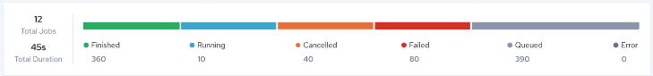
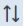
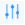
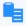

## Run History for all Profiles

The Run History page related to profiles displays both aggregated and detailed job execution results for all profiles executed in the profile editor. This page is useful for monitoring and managing executions from the editor.

For complete details about this page, see [Search Run History](../DataQuality/Run_History_for_all_Profiles.md).

To view job execution results for configurations, see [Run History for all Configurations](../DataQuality/Run_History_for_all_Configurations.md).

From this Run History page you can:

- [Search Run History](../DataQuality/Run_History_for_all_Profiles.md)
- [View Job Details](../DataQuality/Run_History_for_all_Profiles.md)

- [View Profile Details](../DataQuality/Run_History_for_all_Profiles.md)
- [View Log File](../DataQuality/Run_History_for_all_Profiles.md)

- [Review Historical Trends](../DataQuality/Run_History_for_all_Profiles.md)

### Search Run History

To search execution results

1. Click Design, Run History.

    The Run History page is displayed.

2. Click  and enter a profile name to search for.

The upper portion of the page features a bar chart which presents the aggregated status of all executed jobs.

    The lower portion of the page presents a sortable list of all executed jobs with the following information:

| Column Name | Description |
| --- | --- |
| Start Time | The date and time the job started. The time displayed is specific to your time zone. |
| Job ID | A unique identifier for the job. If the job Status is Finished, click to view execution results for a particular rule in the profile (overall pass/fail results, and overall execution time), and download the log file in the Job Detailspage. |
| Profile | The name of the profile associated with the job. Click to view or edit profile details in the Profile Detailspage. See [Edit a Profile](../DataQuality/Edit_a_Profile.md). |
| Owner | Displays the initials of the job owner. Click to view the email address of the owner. |
| Status | Status of the job:•Waiting – Job was created but needs additional information or a trigger event prior to being queued for execution.•Queued – Job is queued for execution by the next available worker.•Canceled – Job was canceled prior to being acquired by a worker (during the Waiting or Queued state). No log file will be produced.•Initializing – Job has been acquired by a worker and is being prepared for execution.•Running – Job is currently executing on a worker.•Finished – Job successfully completed. A log file is available (or soon will be).•Error – Job encountered an exception during execution. Depending on configuration and artifact design, the job may or may not have completed. A log file is available (or soon will be).•Failed – Job failed or was manually stopped by user command, or an exception occurred during initialization or execution. A log file may or may not be available. |
| Results | Displays the data quality rule Pass/Fail results, in percent (%). |
| Execution Time | The amount of time for the job to execute. |
| Log | Click the log icon to view and download the log file for the job. |

You can perform the following actions on the Run History page:

| Options and Actions | Description |
| --- | --- |
|  | Click to specify start and end dates in a calendar. The maximum number of days that can be specified is 31. This specification populates the bar graph and the table. |
|  | Click this icon and enter a string to locate a particular configuration. |
|  | Click this icon to sort column content in ascending or descending order. |
| Job ID | Click to view execution results for a particular rule in the profile (overall pass/fail results, and overall execution time), and download the log file in the Job Detailspage. |
| Profile | Click to view profile details in the Profile Details page. See [Edit a Profile](../DataQuality/Edit_a_Profile.md). |
| Owner | Click to view the email address of the owner. |
| Log | Click the log icon to view and/or download the log file from the Log File page. |
|  | Click the down arrow and select how many records to display on the page. |
|  | Use these options to Navigate from one page to another. |

### View Job Details

You can view execution results for a single profile in the Job Details page.

To view job details

1. Click Design, Run History.
2. In the table, click the Job ID of interest.

    The Job Details popup screen opens.

- View the Overall Pass & Fail Summary values to see the following job execution results as a whole:

    - **Total Records Processed**: The total number of records processed by the job.

    - **Execution Time**: The total amount of time for the job to finish executing.

    - Pass: The number of records passed/percent (%) of records passed for the job.

    - Fail: The number of records failed/percent (%) of records failed for the job.

- View the Rule Summaryvalues to see pass/fail results per rule executed by the job.

### View Profile Details

You can view details about a single profile in the Profile Detailspage. The Profile Details page displays profile configuration information such as the Pass/Fail Targets, the number of rules configured, and the number of fields with rules configured against them.

This page also provides details about the last executed job for the profile, including the Job ID, execution start time, execution time, total records processed, and Pass/Fail results.

You can schedule a profile to execute from this page.

The Profile Details page presents a trend graph which traces job execution results for the selected profile, over time. Use this to evaluate whether results for a profile are improving, worsening, or remaining the same.

For complete details about the Profile Detailspage, see [View Profile Details](../DataQuality/View_Profile_Details.md).

To view details about a profile

1. Click Design, Run History.
2. In the table, click the profile of interest.

    The Profile Details page opens.

For information about profiles, see [Creating a Data Profile](../DataQuality/Creating_a_Data_Profile.md).

### View Log File

You can download a log file for a job in the **Log File******page.

To download a log file:

1. Click Design, Run History.

    The Run History page is displayed with a list of all jobs.

2. In the Log column of the table, click the log icon next to the record of interest.

    The log file Run History page opens.

3. Click Download Log File.

The Log File page displays the following information about the job associated with the log file:

| Job Detail | Description |
| --- | --- |
| Job Status | Status of the job:•Sequenced – Job has been sequenced for execution and will be queued in order relative to other jobs for this job configuration.•Queued – Job has been queued for execution by the next available worker.•Canceled – Job was canceled prior to being acquired by a worker (during the Sequenced or Queued state). No log file will be produced.•Initializing – Job has been acquired by a worker and is being prepared for execution.•Running – Job is currently executing on a worker.•Finished – Job has successfully completed. A log file is available (or soon will be).•Error – Job encountered an exception during execution. Depending on configuration and artifact design, the job may or may not have completed. A log file is available (or soon will be).•Failed – Job failed or was manually stopped by user command or exception at some point during initialization or execution. A log file may or may not be available. |
| Started | The date and time the job was started.The time displayed here is specific to your time zone. |
| End | The date and time the job ended. |
| Duration | Execution time. |
| Run by | Displays the initials and user id of the person who executed the job. |

The Log File page has three views which you select from the dropdown menu: [Default view](../DataQuality/Run_History_for_all_Configurations.md), [Compact view](../DataQuality/Run_History_for_all_Configurations.md), or [Raw view](../DataQuality/Run_History_for_all_Configurations.md).

Default view

In the Default view, the log file is displayed in a table with three columns: Start Date & Time, Return Code, and Details. Errors are highlighted in red in the Return Codecolumn.The following information is displayed and actions can be performed:

| Option | Description |
| --- | --- |
| Download Log File | Click this icon to download the log file. |
|  | If an entry spans multiple lines, it is in a collapsed state by default.Click this icon to expand the collapsed lines. |
|  | Click this icon to search for a particular value in the table data. Contents is filtered based on the search string.Click  to close the search box. |
|  | Click this icon to filter the table data. |

Compact view

The Compact view is the same as the Default view except that rows with multiple lines are collapsed into a single line which you can expand.

Raw view

In the Raw view, the log file is not displayed in a table, and you can perform the following action:

| Options and Actions | Description |
| --- | --- |
|  | Click the log file icon to copy the log content to the clipboard. |

### Review Historical Trends

The [Run History](../DataQuality/Run_History_2.md) page related to profiles enables you to see how execution results evolve over time for a single profile, job, or rule. Use this display to find out if execution results are improving, worsening, or remaining the same.

Navigate to Design, Run History, then:

- Click the Job ID of interest to open the Job Details popup screen. Look at:

    - Values in Rule Summaryto inspect execution results for a particular rule in a profile.

    - Values in Overall Pass & Fail Summaryto inspect execution results for a single job.

- Click the Data Profile of interest to open the Profile Details page. Look at:

    - The trend graph which traces job execution results for the selected profile, over time. Use this to evaluate whether results for a profile are improving, worsening, or remaining the same.

    - Details about the last executed job for the profile, including execution time, total records processed, and Pass/Fail results.

    This page also provides profile configuration information such as the Pass/Fail Targets, the number of rules configured, and the number of fields with rules configured against them. For more information, see [View Profile Details](../DataQuality/View_Profile_Details.md).

Also see:

- The [Manage, Overview Page](../DataQuality/Manage__Overview_Page.md), which provides a monitoring dashboard to track overall performance results of executed in production.
- The [Run History for all Configurations](../DataQuality/Run_History_for_all_Configurations.md) page, which shows all jobs executed.
