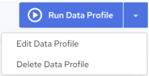

## View Profile Details

To view profile details

1. Click the Data Quality link at the top of the page.

    The Data Profiles page (see [Data Profiles Page](../DataQuality/Data_Profiles_Page.md)) displays the available profiles.

2. Click the desired Profile.

    The Profile Details page is displayed.

3. You can view and edit the profile details from this page.

    The following information is displayed for a profile that has not been executed:

| Properties | Editable | Description |
| --- | --- | --- |
| Profile name | Yes | The profile name. Hover over the name and a pencil icon appears. Click the name or click the pencil icon to edit it. Clickto save your changes and click to clear and close the edit box. |
| Description | Yes | The description text. Hover over the description text and a pencil icon appears. Click the description text or click the pencil icon to edit it. Clickto save your changes and click to clear and close the edit box. |
| Recent Job | No | Name of the recent job that was run. Since the profile has not been executed, “No Jobs Found” is displayed here. |
| Start Time | No | The start time of the job. Since the profile has not been executed, “NA” is displayed here. |
| Source | No | Data source for the profile. See [Creating a Data Profile](../DataQuality/Creating_a_Data_Profile.md). |
| Profiling | No | Specifies the number of rules defined and fields mapped for the data profile. See [Creating a Data Profile](../DataQuality/Creating_a_Data_Profile.md). |
| Scheduling | Yes | Displays the run schedule associated with the profile. Possible values are:•On Demand – Unscheduled; the profile must be run manually. See [Run a Profile Manually](../DataQuality/Run_a_Profile_Manually.md).•Interval – Scheduled to run every x hours and x minutes.•Daily – Scheduled to run every x days at a specified time.•Weekly – Scheduled to run every week at a specified time on a specific day.•Monthly – Scheduled to run every month on a specific day every x months at a specified time.•Custom – Scheduled to run as per the specified schedule frequency.•Custom CRON Expression – Specify a cron expression using the Quartz Scheduler to schedule the job run. If necessary, please reference a [quick cron expression tutorial](https://www.quartz-scheduler.org/documentation/quartz-2.3.0/tutorials/crontrigger.html) provided by Quartz.Click  to change the run schedule. See [Edit Profile Schedule](../DataQuality/Edit_Profile_Schedule.md).**Note:**The first time a profile is scheduled to execute an associated configuration is created. Thereafter, if a profile is edited, the associated configuration is not updated. To update the configuration, you must recreate and schedule the profile. |
| Owner | Yes | Displays the profile owner’s email ID. The default owner is the creator. |
| Change Log | No | Provides the last modified by and date and created by and date for the profile. |

    The following additional information is displayed for a profile that has an execution history:

| Properties | Editable | Description |
| --- | --- | --- |
| Recent Job | No | Name of any recent job that was run. |
| Start Time | No | The start time of the job. |
| Total Records Processed | No | The total number of records that were processed by the Data Profile. |
| Execution Time | No | Total execution time for executing the Data Profile. |
| Pass | No | The number and percentage of records that adhered to the profiling rules. You can also hover the pass (green) bars of the donut chart to view the pass record count. |
| Fail | No | The number and percentage of records that do not adhere to the profiling rules. You can also hover the fail (red) bars of the donut chart to view the fail record count. |
| Historical Jobs | No | This is another graphical representation of all profile jobs that were run during the past 15 days. |
| Pass Target | No | Pass Target that is configured for the profile. See [Creating a Data Profile](../DataQuality/Creating_a_Data_Profile.md). |
| Fail Target | No | Fail Target that is configured for the profile. See [Creating a Data Profile](../DataQuality/Creating_a_Data_Profile.md). |

    Profile Details page options and actions:

| Options | Description |
| --- | --- |
|  | A Run Data Profile button is displayed on the page. If clicked, the current Data Profile is executed immediately.The down arrow control next to the Run Data Profile button will expose a set of execution options for the current profile. You can choose from the following actions:•Edit Data Profile – Click this option to edit the current Data Profile. See [Edit a Profile](../DataQuality/Edit_a_Profile.md).•Delete Data Profile – Click this option to delete the current Data Profile. See [Delete a Profile](../DataQuality/Delete_a_Profile.md). |
