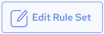

## View Rule Set Details

To view rule set details

1. Click the Data Quality link at the top of the page and then click Rule Sets.

    The Rule Sets page displays the available rule sets.

2. Click the desired rule set.

    The Rule Set Details page is displayed.

3. You can view and edit the rule set details from this page.

    The following information is displayed:

| Properties | Editable | Description |
| --- | --- | --- |
| Rule set name | Yes | The rule set name. Hover over the name and a pencil icon appears. Click the name or click the pencil icon to edit it. Clickto save your changes and click to clear and close the edit box. |
| Rule set Description | Yes | The description text. Hover over the description text and a pencil icon appears. Click the description text or click the pencil icon to edit it. Clickto save your changes and click to clear and close the edit box. |
| Rules | No | The number of rules in the rule set. |
| Owner | No | The rule set owner’s email ID. The default owner is the creator. |
| Change Log | No | Displays the created date, last modified date, and the email addresses of the respective users. |

    Rule Set Details page options and actions:

| Options | Description |
| --- | --- |
|  | Click this to edit the rule set. See [Edit a Rule Set](../DataQuality/Edit_a_Rule_Set.md). |
