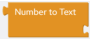
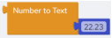

## Convert Blocks

This section describes the Convert blocks. The Convert blocks allow you to perform conversion operations.

### Number to Text Block

| Block Category | Convert |
| --- | --- |
| Block |  |
| Description | Converts number to text values that can be used as input in other blocks. |
| Inputs | A number value. |
| Returned Value | A string value. |
| Examples | The following example returns "22.230000".Script:`NumberToText(22.23)` |

### Text to Number Block

| Block Category | Convert |
| --- | --- |
| Block |  |
| Description | Converts text to number values that can be used as input in other blocks. |
| Inputs | A string value. |
| Returned Value | A number value. |
| Examples | The following example returns 22.23:Script:`TextToNumber("22.23")` |
