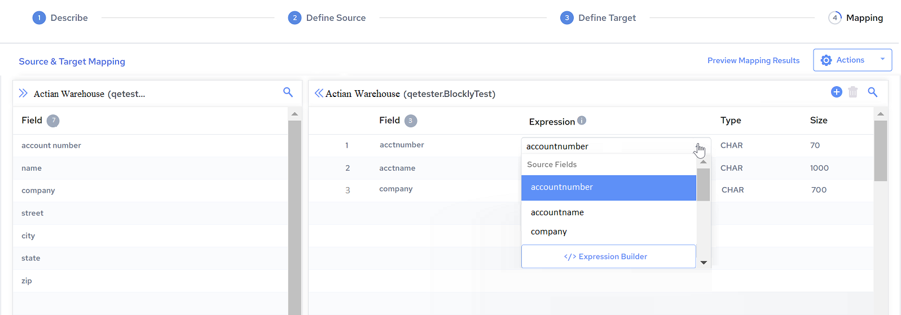
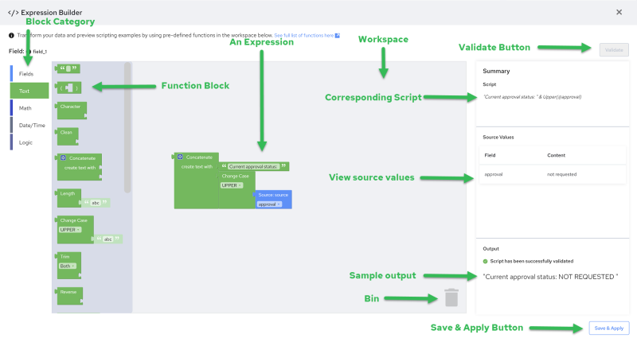

## Create an Expression

To create a new expression:

1. When creating or editing an integration, on the Mapping page, select Expression Builder from the Expression drop down menu of the desired Field.

    The Expression Builder user interface is displayed.

2. Select a block category.

    You can select from Field, Text, Math, Date/Time, and Logic. The corresponding function blocks for the selected category are displayed.

3. Drag and drop one or more function blocks into the workspace and modify it to build an expression.

!!! note "Note"

    - Remember that you are only building an expression for one specific field at a time.
    - The blocks may dynamically change their shape in response to user action and other factors.
    - Each block has a different shape which provides some visual indication on which blocks can be used together.
    - Each block represents a function. Each function may or may not have a parameter.
    - The result of these connected blocks is an expression. You can join a number of blocks together to build a complex expression.
    - A corresponding script for your expression is displayed in the Summary field.

4. Click Validate.

    When you validate the expression, you get a response saying that either the expression was valid or invalid and if the expression is valid, a preview of the data is displayed in the Output field.

!!! note "Note"

    You must validate successfully before Save & Apply is enabled.

5. Click Save & Apply.

    The expression is saved and you are returned back to the Mapping page.

    On the Mapping page, the expression script is displayed inside the Expression cell, for the Field for which you added the expression.

!!! note "Note"

    You can create a new, or edit an existing expression, only from the Expression Builder page, and not from the Mapping page.
