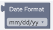
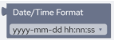
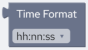
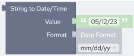
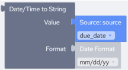
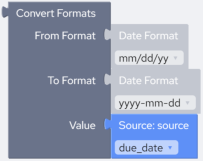
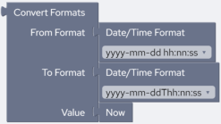
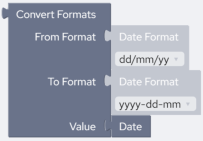

## Date and Time Blocks

This section describes the Date and Time blocks. The Date and Time blocks allow you to perform string operations on date and time strings, and expressions that return date and time.

### Date Format Block

| Block Category | Date/Time |
| --- | --- |
| Block Name | Date Format |
| Description | Returns a String of formatting characters that specifies a date format. |
| Script | “format” |
| Inputs | format – A string that represents the format of the datetime value:–mm/dd/yy–mm/dd/yyyy–mmddyy–mmddyyyy–dd/mm/yy–dd/mm/yyyy–ddmmyy–ddmmyyyy–yyyymmdd–yyyyddmm–yyyy-mm-dd–yy-mm-dd–yyyy-dd-mm–yy-dd-mm |
| Returned Value | String representing date format. |
| Examples | This example returns “mm/dd/yy” date format.Script:`“mm/dd/yy”` |

### DateTime Format Block

| Block Category | Date/Time |
| --- | --- |
| Block Name | Date/Time Format |
| Description | Returns a string of formatting characters that specifies a datetime format. |
| Script | “format” |
| Inputs | You can select from: • yyyy-mm-dd hh:nn:ss • yyyy-dd-mm hh:nn:ss • yyyy-mm-ddThh:nn:ss |
| Returned Value | String representing datetime format. |
| Examples | The following example returns “yyyy-mm-dd hh:nn:ss” datetime format:Script:`“yyyy-mm-dd hh:nn:ss”` |

### Time Format Block

| Block Category | Date/Time |
| --- | --- |
| Block Name | Time Format |
| Description | Returns a string of formatting characters that specifies a time format. |
| Script | “format” |
| Inputs | You can select from: • hh:nn:ss • hh:nn:ss AM/PM • hh:nn • hh:nn AM/PM • hhnnss • hhnn |
| Returned Value | String representing a time format. |
| Example | The following example returns “hh:nn:ss” time format.Script:`“hh:nn:ss”` |

### String to Date Time Block

| Block Category | Date/Time |
| --- | --- |
| Block Name | String to Date/Time |
| Description | Converts a String representation of a datetime, date or time into a datetime value. |
| Script | ToDatetime(“datetime”,“format”) |
| Inputs | datetime – A string that represents a datetime value.format – A string that represents the format of the datetime value: • mm/dd/yy • mm/dd/yyyy • mmddyy • mmddyyyy • dd/mm/yy • dd/mm/yyyy • ddmmyy • ddmmyyyy • yyyymmdd • yyyyddmm • yyyy-mm-dd • yy-mm-dd • yyyy-dd-mm • yy-dd-mm |
| Returned Value | A datetime value. |
| Examples | The following example converts a string datetime (“05/12/23”) into a real datetime value in the specified date format (“mm/dd/yy”).Script:`ToDatetime("05/12/23","mm/dd/yy")` |

### Date Time to String Block

| Block Category | Date/Time |
| --- | --- |
| Block Name | Date/Time to String |
| Description | Converts a datetime, date or time into a string value. |
| Script | FromDatetime(datetime,“format”) |
| Inputs | datetime – A datetime value.format – A string that represents the format of the datetime value: • mm/dd/yy • mm/dd/yyyy • mmddyy • mmddyyyy • dd/mm/yy • dd/mm/yyyy • ddmmyy • ddmmyyyy • yyyymmdd • yyyyddmm • yyyy-mm-dd • yy-mm-dd • yyyy-dd-mm • yy-dd-mm |
| Returned Value | A string that represents a datetime value. |
| Example | The following example formats the datetime from source field @due_date into a string datetime of the specified format (“mm/dd/yy”).Script:`FromDatetime(@due_date,"mm/dd/yy")` |

### Convert Formats Block

| Block Category | Date/Time |
| --- | --- |
| Block Name | Convert Formats |
| Description | Converts a date from one string format to another. |
| Script | DateConvert(fromFormat,toFormat,value) |
| Inputs | fromFormat – Original format of the source date string. This should be same as the format of the value parameter.toFormat – Desired format of the output date string.value – The date to be converted. |
| Returned Value | A date string in the specified date format. |
| Examples | The following example converts a date from source field “due_date” from “mm/dd/yy” to “yyyymmdd” format:Script:`DateConvert("mm/dd/yy","yyyy/mm/dd",@due_date)` |

### Now Block

| Block Category | Date/Time |
| --- | --- |
| Block Name | Now |
| Description | Returns the current system date and time as per your local time zone settings. |
| Script | Now() |
| Inputs | None |
| Returned Value | The current system date and time. |
| Remarks | Now returns a date containing a date and time that are stored internally as a double-precision number. This number represents a date and time from January 1, 100 through December 31, 9999, where January 1, 1900 is 2. Numbers to the left of the decimal point represent the date; numbers to the right represent the time.**Note:**Since date and time are stored internally as a double-precision number, you may have to adjust the output field size on the mapping page. |
| Example | This example returns the current system datetime of your local machine after converting it from its current format, “yyyy-mm-dd hh:nn:ss” into “yyy-mm-ddThh:nn:ss”:Script:`DateConvert("yyyy-mm-dd hh:nn:ss","yyyy-mm-ddThh:nn:ss",Now())` |

### Time Block

| Block Category | Date/Time |
| --- | --- |
| Block Name | Time |
| Description | Returns the current system time as per your local time zone settings. |
| Script | Time() |
| Inputs | None |
| Returned Value | An eight-character string in the form of hh:mm:ss, where hh is the hour (00 - 23), mm is the minute (00 - 59), and ss is the second (00 - 59). A 24-hour clock is used; therefore, 6:00 P.M. displays as 18:00:00. |
| Example | This example returns the current system time of your local machine:Script:`Time()` |

### Date Block

| Block Category | Date/Time |
| --- | --- |
| Block Name | Date |
| Description | Returns the current system date as per your local time zone settings. |
| Script | Date() |
| Inputs | None |
| Returned Value | The Date function returns the date as a formatted string, formatted based on the current locale settings for the machine. |
| Example | This example returns the current system date of your local machine after converting it from its current format, “dd/mm/yy” into “yyy-dd-mm”:Script:`DateConvert("dd/mm/yy","yyyy-dd-mm",Date())` |
