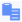

## Download Log File

You can view a specific run result detail and download the log file from the Run History page.

To download a log file

1. Click Integrations, Run History.

    The Run History page is displayed with a list of detailed history of each DataConnect, DataFlow or Link Integration that has been run. The default page size is set to 25. Page size and navigation controls are located at the bottom of the page. If your integration is not listed on the first page, use the search box to locate it.

2. In the Run History table, click  for the record for which to download the log file.

    The Run History page is displayed. The following details are displayed:

| Column Name | Description |
| --- | --- |
| Job Status | Status of the job: • Sequenced – Job has been sequenced for execution and will be queued in order relative to other jobs for this jobconfig. • Queued – Job has been queued for execution by the next available worker. • Canceled – Job was canceled prior to being acquired by a worker (during the Sequenced or Queued state). No log file will be produced. • Initializing – Job has been acquired by a worker and is being prepared for execution. • Running – Job is currently executing on a worker. • Finished – Job has successfully completed. A log file is available (or soon will be). • Error – Job encountered an exception during execution. Depending on integration and artifact design, the job may or may not have completed. A log file is available (or soon will be). • Failed – Job failed or was manually stopped by user command or exception at some point during initialization or execution. A log file may or may not be available. |
| Started | The date and time the job was started.The time displayed here is specific to your time zone. |
| End | The date and time the job ended. |
| Duration | Execution time. |
| Run by | Displays the initials and user id of the person who executed the job. |
| Raw View | The content of the log file is displayed here. |

3. Click Download Log file to download the log file on your computer.

    You can view and edit the log file in any text editor.

!!! note "Note"

    You can click  to copy the log content to clipboard for pasting into a text editor for analysis.
