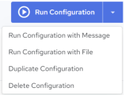
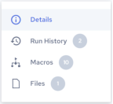

## Edit Configuration Details

To edit configuration details

1. Click Integrations, Manage, Configurations.

    The Configurations page displays the available configurations.

2. Click the configuration name that you want to edit.

    The Configuration Details page is displayed.

3. You can view and edit the following information from this page:

| Properties | Editable | Description |
| --- | --- | --- |
| Configuration name | Yes | The configuration name. Hover over the configuration name and a pencil icon appears. Click the name or click the pencil icon to edit the configuration name. Clickto save your changes. |
| Description | Yes | The description text. Hover over the description text and a pencil icon appears. Click the description text or click the pencil icon to edit the description. Clickto save your changes. |
| Base Template | No | Template the configuration is associated with. If the configuration does not have an association with a Template, this field will display “Not Set”. See [Edit Template Details](../Integrations/Edit_Template_Details.md). |
| Status | Yes | You can toggle this property between Active and Inactive. You can run the configuration only if it is set to Active. See [Set a Configuration to Active or Inactive](../Integrations/Set_a_Configuration_to_Active_or_Inactive.md). |
| Run Location | Yes | This property specifies which engine to use when executing the associated configuration. Clicking the edit icon will expose a list of available options. To use one of the cloud-based engines provided by Actian, select the default option. To learn more about remote engines, see [Managing Agents and Devices](../Integrations/Managing_Agents_and_Devices.md). |
| Package Uploaded | Yes | Displays the package or packages that were uploaded into the configuration. Clicking on the package name or clicking the edit icon opens the Upload Packages and Files dialog to let you upload more packages into the configuration. |
| Entry Point | Yes | Specifies the entry point where the executed job will begin. The entry point must be a master Run Time Config (.rtc) file in your project. The (.rtc) file can be a master process.rtc or map.rtc file. |
| Artifact Override | Yes | You can toggle this property between ON and OFF.When set to ON the package process steps will be overridden by the artifacts added under Files (see [Managing Files](../Integrations/Managing_Files.md)). The artifact must have the same name as in the package. |
| Job Timeout | Yes | Jobs run from this configuration will time out if they do not finish within the time that is set in minutes. If the timeout is set to 0, the timeout will be ignored. |
| Scheduling | Yes | This property displays the schedule for the configuration. Possible values are: • On Demand – Unscheduled; the configuration must be run manually. • Interval – Scheduled to run every x hours and x minutes. • Daily – Scheduled to run every x days at a specified time. • Weekly – Scheduled to run every week at a specified time on a specific day. • Monthly – Scheduled to run every month on a specific day every x months at a specified time. • Custom – Scheduled to run as per the specified schedule frequency. • Custom CRON Expression – Specify a cron expression using the Quartz Scheduler to schedule the job run. If necessary, please reference a [quick cron expression tutorial](https://www.quartz-scheduler.org/documentation/quartz-2.3.0/tutorials/crontrigger.html) provided by Quartz. |
| Log Level | Yes | Specifies the types of messages that will be included in the job’s log file. Possible settings include: • Inherit From Template • SEVERE – Logs errors that can cause the process execution to terminate if Break after first error is set • WARNING – Logs messages about data truncation in a field, field name changes, loss of precision, or other issues • INFO – Logs messages such as “Execution initialization...,” “Execution successful,” whether the process execution was terminated, and so on. • DEBUG – All messages generated as a result of a TraceOn action and some other messages are logged at this level. In this case, the record number, first five fields of each record, and all the events are recorded. |
| Owner | Yes | Displays the first two characters of the configuration owner name. The default owner is the creator, but ownership can be transferred to another user at anytime. Clicking the owner ID or edit icon will expose a list of available users. Select the desired user ID to transfer ownership of configuration. |
| Change Log | No | Displays the created date and modified dates for the configuration. |

    Configuration Details page options and actions:

| Options and Actions | Description |
| --- | --- |
|  | Click Run Configuration to execute the configuration immediately.The down arrow control next to the Run Configuration button will expose a set of execution options for the selected configurations. You can choose from the following actions: • Run Configuration with Message – Click this option to run the associated configuration after entering a message. See [Run Configuration with a Message](../Integrations/Run_Configuration_with_a_Message.md). • Run Configuration with File – Click this option to run the associated configuration after uploading a file. See [Run Configuration with a File](../Integrations/Run_Configuration_with_a_File.md). • Duplicate Configuration – Click this option to duplicate the current configuration for editing and reuse. See [Duplicate a Configuration](../Integrations/Duplicate_a_Configuration.md). • Delete Configuration – Click this option to delete the current configurations. See [Delete a Configuration](../Integrations/Delete_a_Configuration.md). |
|  | • Details – Displays the Configuration Details page. See [Edit Configuration Details](../Integrations/Edit_Configuration_Details.md). • Run History – Displays the Configuration Jobs page. See [View Configuration Jobs](../Integrations/View_Configuration_Jobs.md). • Macros – Displays the Configuration Macros page. See [Edit Configuration Macros](../Integrations/Manage_Configuration_Macros.md). • Files – Displays the Configuration Files page. See [View Configuration Files](../Integrations/Manage_Configuration_Files.md). |
