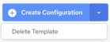
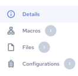

## Edit Template Details

To edit template details

1. Click Integrations, Manage, Templates.

    The Templates page is displayed, listing available integration templates. See [View Templates](../Integrations/View_Templates.md).

2. Click the template name you want to edit.

    The Template Details page is displayed.

You can edit the following information:

| Properties | Editable | Description |
| --- | --- | --- |
| Name | Yes | The template name. Hover over the template name and a pencil icon appears. Click the name or click the pencil icon to edit the template name. Clickto save your changes. |
| Description | Yes | The description text. Hover over the description text and a pencil icon appears. Click the description text or click the pencil icon to edit the description. Clickto save your changes. |
| Package Uploaded | Yes | Displays the package file for the integration. Click the edit icon to open the Upload Packages & Files dialog from where you can drag and drop or click BROWSE FILES to add the package file. You can also select an previously uploaded package file. |
| Status | Yes | You can toggle this property between Active and Inactive. You can use the template only if it is set to Active. |
| Entry Point | Yes | Displays the entry point where the execution job will begin. If the entry point is not defined, “Not Set” is displayed. Clicking the edit icon will expose a list of available entry points to select from. |
| Run Location | Yes | This property specifies which engine to use when executing the associated configuration. Clicking the edit icon will expose a list of available options. To use one of the cloud-based engines provided by Actian, select the default option. To learn more about remote engines, see [Managing Agents and Devices](../Integrations/Managing_Agents_and_Devices.md). |
| Log Level | Yes | Specifies the types of messages that will be included in job log files:•SEVERE – Logs errors that can cause the process execution to terminate if Break after first error is set.•WARNING – Logs messages about data truncation in a field, field name changes, loss of precision, or other issues.•INFO – Logs messages such as “Execution initialization...,” “Execution successful,” whether the process execution was terminated, and so on.•DEBUG – All messages generated as a result of a TraceOn action and some other messages are logged at this level. In this case, the record number, first five fields of each record, and all the events are recorded. |
| Owner | No | Displays the first two characters of the template owner name. The default owner is the creator, but ownership can be transferred to another user at anytime. Clicking the owner ID or edit icon will expose a list of available users. Select the desired user ID to transfer ownership of template. |
| Change Log | No | This property provides the created date and modified dates for the template. |

The Template Details page actions:

| Actions | Description |
| --- | --- |
|  | Click Create Configuration to create a configuration. See [Create a Configuration from Template](../Integrations/Manage_Template_Macros.md).The down arrow control next to the Create Configuration button will expose a set of execution options for the template. You can choose from the following actions:•Delete Template – Click this option to delete the current Template.**Caution!**The delete action cannot be undone. |
|  | •Details – Displays the Template Details page. See [Edit Template Details](../Integrations/Edit_Template_Details.md).•Macros – Displays the Template Macros page. See [Edit Template Macros](../Integrations/Manage_Template_Macros.md).•Files – Displays the Template Files page. See [View Template Files](../Integrations/Manage_Template_Files.md).•Configurations – Displays the Template Jobs page. See [View Template Configurations](../Integrations/Manage_Template_Configurations.md). |
