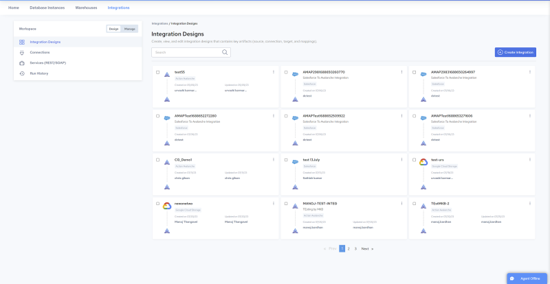
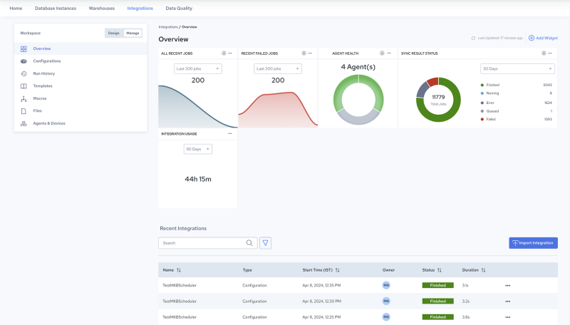

# Getting Started

This topic introduces the Integrations console, describes key concepts, and explains the general workflow to create and execute an integration.

Integrations has two main environments: [Design](../Integrations/Design.md) and [Manage](../Integrations/Manage.md). Typically, you build and test your integrations, and refine details for transforming your data in the Design environment. Then you create and manage configurations, and monitor their execution in the Manage environment.

The following figure illustrates the pages that open by default in each environment: [Integration Designs Page](../Integrations/Integration_Designs_Page.md), and [Overview Page](../Integrations/Overview_Page.md).

| [Design](../Integrations/Design.md) Environment | [Manage](../Integrations/Manage.md) Environment |
| --- | --- |
|  |  |
| Integration Designs PageBuild IntegrationsSet Data Transformation Rules | Overview PageCreate ConfigurationsMonitor Job Execution |
