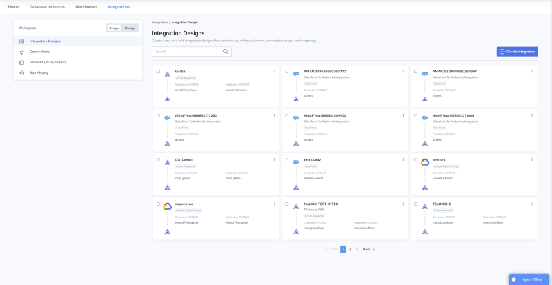

## Integration Designs Page

The following figure illustrates the Integrations Designs page which opens by default in the Design environment. All your Integrations are displayed on the Integrations Designs page.

To summarize, users can do the following in the Integration Designs page:

    - Create, view, edit, duplicate, execute, and delete integrations:

    Navigate to Design, Integration Designs. See [Creating Integrations](../Integrations/Creating_Integrations.md) and [Managing Integrations](../Integrations/Managing_Integrations.md).

    - Create, view, edit, test, and delete connections:

    Navigate to Design, Connections. See [Connections](../Integrations/Connections.md) and [Source and Target Connections](../Integrations/Source_and_Target_Connections.md).

    - Create, view, manage, and delete services:

    Navigate to Design, Services. See [Services (REST/SOAP)](../Integrations/Services_(REST_2fSOAP).md).

    - Create, edit, include/exclude, delete and composite endpoints:

    Navigate to Design, Services (REST/SOAP), and click a service. See [Endpoints](../Integrations/Endpoints.md).

    - View and manage integration execution results:

    Navigate to Design, Run History. See [View Integration Run History](../Integrations/View_Integration_Run_History.md).
