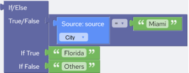
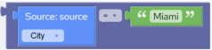
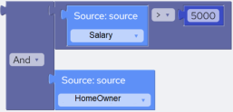
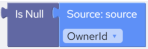
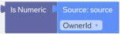

## Logic Blocks

This section describes the Logic blocks. The Logic blocks allow you to embed logic capabilities to your expressions.

### IF/Else Block

| Block Category | Logic |
| --- | --- |
| Block Name | If/Else |
| Description | Returns a value based on whether an expression evaluates to TRUE or FALSE. |
| Script | IIf(expression,if_true,if_false) |
| Inputs | expression – Expression you want to evaluate.if_true – Value or expression to be returned if expression evaluates to TRUE (-1).if_false – Value or expression to be returned if expression evaluates to FALSE (0). |
| Returned Value | A value or the result of an expression. |
| Examples | In the following example if city in field “City” is “Miami” then insert “Florida” else insert “Others”:Script:`If(@City == "Miami","Florida","Others")` |

### Comparison Operators Block

| Block Category | Logic |
| --- | --- |
| Block |  |
| Description | Comparison operators compare the contents in a field to either the contents in another field or a constant. The operands may be numeric or string values. If both operands are numeric, then a numeric comparison is performed. If either of the operands is a string value, then a string comparison is performed. |
| Script | operand1 == operand2operand1 <> operand2operand1 < operand2operand1 <= operand2operand1 > operand2operand1 >= operand2 |
| Inputs | Operand1 – A number or a string.Operand2 – A number or a string.Comparison operator – You can select from:•= (Equals operator)•≠ (Not equals operator)•< (Less than operator)•≤ (Less than or equal to operator)•> (Greater than operator)•≥ (Greater than or equal to operator) |
| Returned Value | Returns a Boolean value based upon whether the comparison is TRUE (-1) or FALSE (0). |
| Examples | The following example returns TRUE if “City” in “field1” is “Miami”:Script:`@City == "Miami"` |

### Logical Operator Block

| Block Category | Logic |
| --- | --- |
| Block |  |
| Description | The “And” operator determines the logical conjunction of the two operands by treating nonzero values as a value of TRUE and zero values as FALSE.The “Or” operator determines the logical disjunction of the two operands. If either or both operands evaluate to TRUE (nonzero), then the result is TRUE. |
| Script | operand1 And operand2operand1 Or operand2 |
| Inputs | Operand1 – A number or a string.Operand2 – A number or a string.Comparison operator – You can select from:•And (And operator)•Or (Or operator) |
| Returned Value | Returns a Boolean value based on whether the “And” or “Or” operation evaluates to TRUE (-1) or FALSE (0). |
| Examples | The following example evaluates to TRUE if the contents of source field “Salary” are greater than 5000 and “HomeOwner” a Boolean field, is FALSE:Script:`@Salary > 5000 And Not @HomeOwner` |

### Is Null Block

| Block Category | Logic |
| --- | --- |
| Block Name | Is Null |
| Description | Returns TRUE if the argument contains a null value, otherwise, returns FALSE. |
| Script | IsNull(parameter) |
| Inputs | Any expression or value. |
| Returned Value | Returns a Boolean value. (-1) for TRUE and (0) for FALSE. |
| Examples | The following example examines the source field “OwnerId” and determines if it is null:`IsNull(@OwnerId)` |

### Is Numeric Block

| Block Category | Logic |
| --- | --- |
| Block Name | Is Numeric |
| Description | Returns TRUE if the argument can be converted to numeric data type, otherwise, returns FALSE. |
| Script | IsNumeric(parameter) |
| Inputs | Any expression or value. |
| Returned Value | Returns a Boolean value. (-1) for TRUE and (0) for FALSE. |
| Examples | The following example examines the source field “OwnerId” and determines if it is numeric:`IsNumeric(@OwnerId)` |
