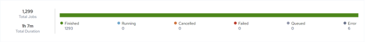

## Manage Configuration Run History

The Run History page displays the execution history of each configuration that has been run.

To display run history

Click Integrations, Manage, Run History. The Run History page is displayed with a list of execution history.

The default page size is set to 25. Page size and navigation controls are located at the bottom of the page. If your configuration is not listed on the first page, use the search box to locate it.

The upper portion of the page features a bar chart which presents the summary status of all executed jobs. 

The lower portion of the page presents a sortable list of all executed jobs with the following information:

| Column Name | Description |
| --- | --- |
| Start Time | The date and time the job was started.The time displayed here is specific to your time zone. |
| Name | The integration or configuration name. Clicking on the name displays the Configuration Details or Edit Integration page. See [Edit Configuration Details](../Integrations/Edit_Configuration_Details.md) and [Edit Integration](../Integrations/Edit_Integration.md). |
| Type | The type of Job that was run. For example configuration or integration. |
| Owner | Displays the first two characters of the Job owner (creator) name. Clicking on the initials displays the username of the owner. |
| Status | Status of the job:•Waiting – Job has been created but needs additional information or a trigger event prior to being queued for execution.•Queued – Job has been queued for execution by the next available worker.•Canceled – Job was canceled prior to being acquired by a worker (during the Waiting or Queued state). No log file will be produced.•Initializing – Job has been acquired by a worker and is being prepared for execution.•Running – Job is currently executing on a worker.•Finished – Job has successfully completed. A log file is available (or soon will be).•Error – Job encountered an exception during execution. Depending on configuration and artifact design, the job may or may not have completed. A log file is available (or soon will be).•Failed – Job failed or was manually stopped by user command or exception at some point during initialization or execution. A log file may or may not be available. |
| Duration | Execution time. |
| Server | Where the job was executed. |
| Log | Click  for a specific record in the Run History table. The Run History:<configuration_name> page is displayed from where you can view and download the log file. See [Download Log File](../Integrations/Download_Log_File_2.md). |
