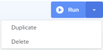

## Manage Template Configurations

You can create configurations which are associated with specific templates. These configurations are created from the Template Details page (see [Create a Configuration from Template](../Integrations/Manage_Template_Macros.md)) and are listed on the Template Configurations page (see [View Template Configurations](../Integrations/Manage_Template_Configurations.md)).

See Also

- [Managing Configurations](../Integrations/Managing_Configurations.md)

### View Template Configurations

To view configurations associated with a template

1. Click Integrations, Manage, Templates.

    The Templates page is displayed, listing all available templates. See [View Templates](../Integrations/View_Templates.md).

2. Click the template name for which to view the configurations.

    The Template Details page is displayed. See [Edit Template Details](../Integrations/Edit_Template_Details.md).

3. Click Configurations.

    The Template Configurations page is displayed, listing all configurations associated with the template.

The following details are displayed:

| Properties | Description |
| --- | --- |
| Configuration | Name of the configuration file. Clicking on the configuration name displays the Configuration Details page. See [Edit Configuration Details](../Integrations/Edit_Configuration_Details.md). |
| Next Job | Time the configuration is next set to run. Possible values are:•On Demand – Unscheduled; the configuration must be run manually. See [Run a Configuration Manually](../Integrations/Run_a_Configuration_Manually.md).•Interval – Scheduled to run every x hours and x minutes.•Daily – Scheduled to run every x days at a specified time.•Weekly – Scheduled to run every week at a specified time on a specific day.•Monthly – Scheduled to run every month on a specific day every x months at a specified time.•Custom – Scheduled to run as per the specified schedule frequency.•Custom CRON Expression – Specify a cron expression using the Quartz Scheduler to schedule the job run. If necessary, please reference a [quick cron expression tutorial](https://www.quartz-scheduler.org/documentation/quartz-2.3.0/tutorials/crontrigger.html) provided by Quartz.See [Edit Configuration Schedule](../Integrations/Edit_Configuration_Schedule.md). |
| Owner | Displays the first two characters of the configuration owner (creator) name. Clicking on the owner icon displays the username of the owner. |
| Active | Whether the configuration is active (set to run on demand or by schedule) or inactive (set not to run on demand or by schedule). |

The Template Configurations page options and actions:

| Options and Actions | Description |
| --- | --- |
|  | Click this icon and specify the value that you want to search. The values in each column will be evaluated during the search. Contents will be filtered based on the search string.Click  to close the search box. |
|  | Click the down arrow and select how many records to display on the page. The default page size is set to 25. |
|  | Use these options to Navigate from one page to another. |
|  | •Run – Runs the configuration and takes you to the Integration Manager page from where you can view the status and execution logs of your Job.•Duplicate – Click Duplicate to create a copy of the associated configuration. The new configuration is created with “-Copy” appended to the name. It appears in the configurations table. You can click the new configuration name to open the Configuration Details page from where you can edit it. See [Edit Configuration Details](../Integrations/Edit_Configuration_Details.md).•Delete – Click Delete to delete the associated configuration.**Caution!**The delete action cannot be undone. |
| Create Configuration | See [Create a Configuration from Template](../Integrations/Manage_Template_Macros.md). |
