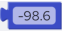
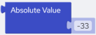
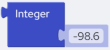
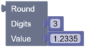

## Math Blocks

This section describes the Math blocks. The Math blocks allow you to perform mathematical operations on numbers and numeric expressions.

### Number Block

| Block Category | Math |
| --- | --- |
| Block |  |
| Description | Allows you to specify integers and fractional values that can be used as input in other blocks. |
| Inputs | An integer or a fractional value. |
| Returned Value | An integer or a fractional value. |
| Examples | The following example returns -98.6.Script:`-98.6` |

### Arithmetic Operation Block

| Block Category | Math |
| --- | --- |
| Block |  |
| Description | Allows you to perform simple Arithmetic Operations on two numbers or numeric expressions. You can select from addition, subtraction, multiplication, division, and exponent operators. |
| Script | operand1 + operand2operand1 - operand2operand1 * operand2operand1 / operand2operand1 ^ operand2 |
| Inputs | Operand1 – A number or a numeric expression.Operand2 – A number or a numeric expression.Arithmetic operator – You can select from:•+ (Addition operator)•- (Subtraction operator)•× (Multiplication operator)•÷ (Division operator)•^ (Exponent operator) |
| Returned Value | Returns the result of the arithmetic operation. |
| Examples | The following example adds “5” to the value of field “Field1”:Script:`@Field1 + 5` |

### Absolute Value Block

| Block Category | Math |
| --- | --- |
| Block Name | Absolute Value |
| Description | Returns the absolute value of a number. |
| Script | Abs(parameter) |
| Inputs | A number or a numeric expression. |
| Returned Value | Returns the unsigned magnitude of a number. Returns a double value, if the argument is a floating point value. If the argument is not a floating point value, then the return value is an integer, and in that case is constrained by the bounds below:•Lower bounds: -2147483648•Upper bounds: 2147483647 |
| Examples | Each of the following blocks return the absolute value 33:Script:`Abs(33)`Script:`Abs(-33)` |

### Hexadecimal Block

| Block Category | Math |
| --- | --- |
| Block Name | Hexadecimal |
| Description | Converts a number into a hexadecimal string. |
| Script | Hex(parameter) |
| Inputs | A number or an expression. |
| Returned Value | A string representing the hexadecimal value of a number. Null is returned for a null argument. Zero (0) is returned for an empty argument. For any other number up to eight octal characters are returned. |
| Examples | The following example converts “10” to its hexadecimal value “a”:Script:`Hex(10)` |

### Integer Block

| Block Category | Math |
| --- | --- |
| Block Name | Integer |
| Description | Returns the integer part of a number or a numeric expression. |
| Script | Int(parameter) |
| Inputs | A number or a numeric expression. |
| Returned Value | Rounds a number down to the nearest integer. The data type of the returned value is the same as that of the argument. |
| Examples | The following example converts -98.6 to -99:Script:`Int(-98.6)` |

### Round Block

| Block Category | Math |
| --- | --- |
| Block Name | Round |
| Description | Rounds a number to a specified number of decimal places. |
| Returned Value | A number rounded to a specified number of decimal places. |
| Script | Round(value, digits) |
| Inputs | •value (req– number of digits to which you want to round off the decimal places. If omitted, integers are returned. |
| Example | In the following example returns 1.234:`Round(1.2335,3)` |
