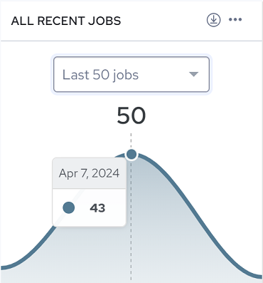
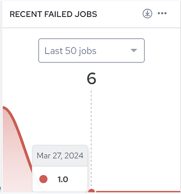
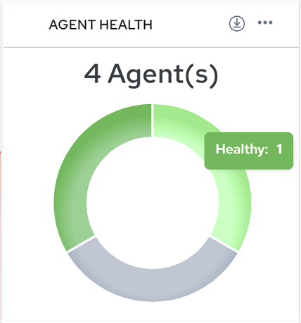
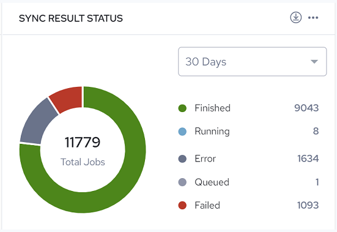

## Overview Page

The Overview page provides a dashboard of data visualization charts you can use to monitor the general health and performance of your integrations, configurations and agents. This page also includes [Recent Integrations](../Integrations/Overview_Page.md), which provides a list of your configurations and tools to manage them.

| Charts | Description |
| --- | --- |
|  | The ALL RECENT JOBS chart traces jobs that executed for the selected number of jobs (Last 50 jobs, Last 100 jobs or Last 200 jobs). Mouse over the chart to see the number of jobs executed on a particular date. |
|  | The RECENT FAILED JOBS chart traces jobs that failed to execute for the selected number of jobs (Last 50 jobs, Last 100 jobs or Last 200 jobs). Mouse over the chart to see the number of jobs that failed on a particular date. |
|  | The AGENT HEALTH chart represents the health status of agents a user has installed. In the adjacent figure, the user has four agents installed. Mouse over the chart to see the number of agents per status indicated.Agent status can be: • Healthy: (Green) The agent is connected and ready to receive jobs. • Warning*: (Yellow) The Agent has not reported its status in over 3 hours and may require attention. • Error*: (Red) The Agent has not reported its status in over 6 hours. • Updating: (Turquoise) The Agent is currently processing an Update Command, such as Update Worker or Update Engine. • Offline*: (Grey) The Agent is offline or the local service is stopped. This status is typically reported just prior to a shutdown. • Expired: (Dark Grey) The Agent has expired.*You can verify whether the agent is running, and also start the agent service, by opening Windows Services. |
|  | The SYNC RESULTS STATUS chart represents run results status for configuration jobs executed during the selected time period (30, 60 or 90 days).Sync result status can be: • Finished: Job has successfully completed. A log file is available (or soon will be). • Running: Job is currently executing on a worker. • Canceled: Job was canceled prior to being acquired by a worker (during the Waiting or Queued state). No log file will be produced. • Error: Job encountered an exception during execution. Depending on configuration and artifact design, the job may or may not have completed. A log file is available (or soon will be). • Queued: Job has been queued for execution by the next available worker. • Failed: Job failed or was manually stopped by user command or exception at some point during initialization or execution. A log file may or may not be available. |

You can also perform the following actions:

- Click  to download the chart in SVG or PNG format, or download the data in CSV format (which you can open in Excel). Drag and drop charts to reorder.
- Click , Settings to change or reorder the charts shown in Dashboard Settings.

- Click , Remove to remove a chart.
- Add charts from the Available charts list by clicking . Drag and drop charts to reorder. Settings are persisted the next time you log in.

Recent Integrations

The Recent Integrations list provides a list of all your configurations and management tools.

You can:

- Click  to import a configuration. This option opens the Import Configuration page where you can select an existing file from your local system, or select a file from the Integrations File repository. Accepted file formats are .djar, .rtc, .process, .ip.xml, and .tf.xml.
- Click  next to a configuration, and then select Run, View Configuration, View Log, or Delete.

- Click  to filter the configuration list by Failed, Finished, Queued, Error, Running, Canceled, or Sequenced.
