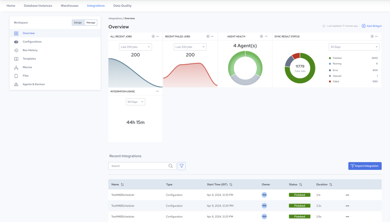

## Overview of the Management Environment

After you save and schedule an integration in the Design environment, an associated configuration is automatically created for your integration. For more information about configurations, see [Managing Configurations](../Integrations/Managing_Configurations.md).

The configuration contains properties and preferences related to execution. Configurations can be viewed and edited by navigating to Manage, Configuration.

You can also manage templates, macros, files, and agents in the Manage environment.

The following figure illustrates the Overview page, which opens by default in the Manage environment. The Overview page provides a dashboard of data visualization you can use to monitor the general health and performance of your integrations, configurations and agents.

From the Overview page, you can navigate to details about execution results, configurations, and logs. For details about the performance data shown, see [Overview Page](../Integrations/Overview_Page.md) (below).

The following is a partial list of what users can do in Manage (for a complete description, see [Managing Configurations](../Integrations/Managing_Configurations.md)):

- Create, execute, schedule, delete and duplicate a configuration, mark a configuration active or inactive, open and view configuration details, and edit any of the properties:

    Navigate to Manage, Configurations. See [Edit Configuration Details](../Integrations/Edit_Configuration_Details.md).

- View run history, and inspect the log file:

    Navigate to Manage, Run History. See [View Configuration Jobs](../Integrations/View_Configuration_Jobs.md).

- View, create, manage, and edit templates for your configurations:

    Navigate to Manage, Templates. See [Creating Templates](../Integrations/Creating_Templates.md) and [Managing Templates](../Integrations/Managing_Templates.md).

- Upload, create, edit and manage macros for your configurations:

    Navigate to Manage, Macros. See [Creating Macros](../Integrations/Creating_Macros.md) and [Managing Macros](../Integrations/Managing_Macros.md).

- Upload and manage files for your configurations:

    Navigate to Manage, Files. See [Managing Files](../Integrations/Managing_Files.md).

- Download and install agents for your configurations, and monitor the health of registered agents:

    Navigate to Manage, Agents & Devices. See [Managing Agents and Devices](../Integrations/Managing_Agents_and_Devices.md).
