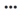

## Run Configuration with a Message

Run configuration with message allows you to pass a message object/body into a DataConnect job at runtime. The message object has a default name of “msg1” (you can also specify your own name) and the body (msg1.body) contents are specified within the Run with Message dialog. There must be a reference to “msg1” within your DataConnect djar to use the Run Configuration with Message feature.

There are two ways you can run a configuration with message:

- From the Configurations page. See [View Configurations](../Integrations/View_Configurations.md).
- From the Configuration Details page. See [Edit Configuration Details](../Integrations/Edit_Configuration_Details.md).

An integration is executed when you run an associated configuration. When completed, runtime metrics will be available for review. See [View Configuration Jobs](../Integrations/View_Configuration_Jobs.md).

To run a configuration with DJMessage

1. Click Integrations, Manage, Configurations.

    The Configurations page displays the available configurations.

2. Do one of the following:

    - For the configuration that you want to run, click the  icon next to the configuration record and select Run with Message. Enter a valid DJMessage value in the dialog that is displayed and then click Run.

    - Click the configuration name and go to the Configuration Details page, review the displayed information and make changes if required, then click the down arrow icon on the Run Configuration button and select Run with Message. Enter a valid DJMessage value in the dialog that is displayed and then click Run.

    The associated integration is executed and you are navigated to the Run History page. From this page you can track the execution status of your Configuration Job. See [View Configuration Jobs](../Integrations/View_Configuration_Jobs.md).

!!! note "Note"

    The Configuration must be in the Active state to run. See [Set a Configuration to Active or Inactive](../Integrations/Set_a_Configuration_to_Active_or_Inactive.md).
