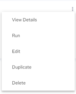
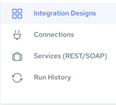

## Search Integrations

To search integrations

1. Click the Integrations link at the top of the page.

    The Integration Designs page displays the available integrations.

2. Enter an integration name in the Search box and click  to search it.

    You can also perform the following actions:

| Options | Description |
| --- | --- |
|  | Click this icon to search for specific text within the integrations listing. Contents will be filtered based on the search string.Click  to clear the search box. |
|  | Click this icon and select a connector to filter the list of integrations by connector. |
|  | Click this icon and select Nameor Date to sort the list of integrations by one of those fields. |

3. Click the check box to select the desired integration. A toolbar is displayed on the top right of the page. You can perform the following actions from the toolbar:

| Actions | Description |
| --- | --- |
|  | Run the selected integration. See also [Run an Integration Manually](../Integrations/Run_an_Integration_Manually.md). |
|  | Edit the selected integration. See [Edit Integration](../Integrations/Edit_Integration.md). |
|  | Make a copy of the selected integration, usually for editing. See [Duplicate Integration](../Integrations/Duplicate_Integration.md). |
|  | Delete the selected integration. See [Delete Integration](../Integrations/Delete_Integration.md). |

    Integration page options and actions:

| Options | Description |
| --- | --- |
|  | Click the  icon that is displayed for an integration. A set of execution options is displayed. You can choose from the following actions: • View Details - Opens the Integration Details page. See [Edit Integration](../Integrations/Edit_Integration.md). • Run - Executes the current integration. • Edit - Takes you to the Edit Integration page. See [Edit Integration](../Integrations/Edit_Integration.md). • Duplicate - Creates a copy of the current integration. See [Duplicate Integration](../Integrations/Duplicate_Integration.md). • Delete - Deletes the current integration. See [Delete Integration](../Integrations/Delete_Integration.md). |
|  | Create an Integration. See [Creating Integrations](../Integrations/Creating_Integrations.md). |
|  | • Integration Designs - Displays the Integration Designs page. • Connections - Displays the Connections page. See [View Connection](../Integrations/View_Connection.md). • Services (REST/SOAP) - Displays the Services (REST/SOAP) page. See [Services (REST/SOAP)](../Integrations/Services_(REST_2fSOAP).md). • Run History - Displays the Run History page. See [View Integration Run History](../Integrations/View_Integration_Run_History.md). |

!!! warning "Important"

    **IMPORTANT!**When using an Agent to run an integration with Actian Warehouse as the target, make sure the IP address of the host machine where the Agent is installed is added to the Warehouse's allowed IP list. Without this, the integration will not run. See [Update Allow List IP Addresses](../User/UpdateAllowListIPs.md).
