## Text Blocks

This section describes the Text blocks. The Text blocks allow you to perform string operations on numbers, strings, and string expressions.

### String Block

| Block Category | String |
| --- | --- |
| Description | Wraps the argument in double quotes. Mainly used to specify string values that can be used as input in other blocks. |
| Script | “” |
| Inputs | A letter, word, or line of text. |
| Returned Value | A string. |
| Examples | The following example returns “California”: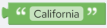Script:`"California"` |

### Parenthesis Block

| Block Category | Text |
| --- | --- |
| Description | Wraps the argument in parenthesis. Mainly useful for math operations. |
| Script | () |
| Inputs | Any type. |
| Returned Value | The argument wrapped in parenthesis. |
| Examples | The following is a simple mathematical example that uses parenthesis block: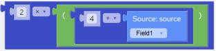Script:`2*(4+@Field1)` |

### Character Block

| Block Category | Text |
| --- | --- |
| Block Name | Character |
| Description | Returns a string representing the ANSI character corresponding to the ASCII code (0-255) that is supplied as an integer parameter. |
| Script | Char(parameter) |
| Inputs | Any valid integer that corresponds to the ASCII code (0-255). |
| Returned Value | A string representing the ANSI character corresponding to the integer parameter. |
| Examples | The following example returns the string “A”: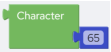Script:`Char(65)` |

### Clean Block

| Block Category | Text |
| --- | --- |
| Block Name | Clean |
| Description | Removes all non-printable characters from a string. |
| Script | Clean(parameter) |
| Inputs | A valid string or a string expression. |
| Returned Value | The specified string with all non-printable characters removed. |
| Examples | The following example returns a string after removing all non-printable characters from the source field: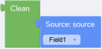Script:`Clean(@Field1)` |

### Concatenate Block

| Block Category | Text |
| --- | --- |
| Block Name | Concatenate |
| Description | Creates a single string by joining two or more individual strings. |
| Script | (For two strings)operand1 & operand2 |
| Inputs | (For two strings)operand1 – A string value.operand2 – A string value. |
| Returned Value | A string which is a result of concatenation of two or more individual strings. |
| Remarks | 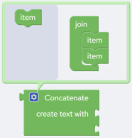The default number of strings that you can concatenate is two. To increase the number of strings do the following:1.Click the  icon to open the configuration box.2.Drag and drop the Item block to increase the number of items that you can join.This will allow you to concatenate more than two strings at a time.3.Click the  icon again to close the configuration box. |
| Examples | The following example returns a string (full_name) after concatenating two string fields “first_name” and “second_name”: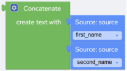Script:`@first_name & @second_name` |

### Length Block

| Block Category | Text |
| --- | --- |
| Block Name | Length |
| Description | Returns the number of characters (including spaces) in the provided String. |
| Script | Len(parameter) |
| Inputs | A string. |
| Returned Value | An Integer that represents the count of characters in the argument string. |
| Examples | The following example returns “10”.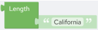Script:`Len("California")` |

### Change Case Block

| Block Category | Text |
| --- | --- |
| Block Name | Change Case |
| Description | Converts the input string to UPPER, lower, or Title case based on the option that you select from the drop-down: • UPPER – Converts the input string to UPPER case. • lower – Converts the input string to lower case. • Title – Converts the input string to Title case. |
| Script | Upper(parameter)Lower(parameter)Proper(parameter) |
| Inputs | A string. |
| Returned Value | An UPPER, lower, or Title case string. |
| Examples | The following example returns “CALIFORNIA”.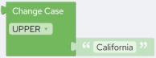Script:`Upper("California")`The following example returns “california”.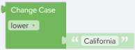Script:`Lower("California")`The following example returns “California”.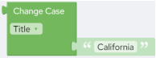Script:`Proper("California")` |

### Trim Block

| Block Category | Text |
| --- | --- |
| Block Name | Trim |
| Description | Removes spaces from the beginning, end or both sides of a string, based on the option that you select from the drop-down: • Both – Removes spaces from both sides of the string. • Left – Removes spaces from the beginning of the string. • Right – Removes spaces from the end of the string. |
| Script | Trim(parameter)TrimLeft(parameter)TrimRight(parameter) |
| Inputs | A string. |
| Returned Value | The specified string with spaces removed from the beginning, end or both sides of a string, based on the selected trim option (Left, Right, Both). |
| Examples | The following example returns “Test String” after removing the leading and trailing spaces from the string: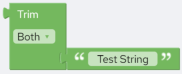Script:`Trim(" Test String ")` |

### Reverse Block

| Block Category | Text |
| --- | --- |
| Block Name | Reverse |
| Description | Returns the reverse of a string. |
| Script | Reverse(parameter) |
| Inputs | A String or a string expression. |
| Returned Value | The reverse of the string that is specified as the parameter. |
| Examples | The following expression returns “gnirts” (“string” reversed):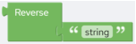Script:`Reverse("string")` |

### Character Count Block

| Block Category | Text |
| --- | --- |
| Block Name | Character Count |
| Description | Counts the occurrences of a particular character in a string. |
| Script | CharCount(character, string) |
| Inputs | character - The character to look for and count. This is case-sensitive. Hence, if the specified character is in lower case, then the count will be of lowercase character.string - The string where to search. |
| Returned Value | An integer that represents the number of occurrences of a character in a string. |
| Examples | This example returns the number of spaces in the first source field. The name "John Thompson Reynolds" would return 2.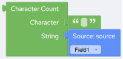Script:`CharCount(" ",@Field1)` |

### Extract Characters Block

| Block Category | Text |
| --- | --- |
| Block Name | Extract Characters |
| Description | Extracts characters of a specified type from a string. |
| Script | Extract(string, charType) |
| Inputs | string – The string to extract from.charType – The type of character that you want to extract. You can select from “Alphabetic”, “Numeric” and “Alphanumeric”. |
| Returned Value | charType is “Alphabetic” - All alphabetic characters from the specified string.charType is “Numeric” - All numeric characters from the specified string.charType is “Alphanumeric” - All alphanumeric characters from the specified string. |
| Examples | This example returns “Thisisexample”, “437”, and “Thisisexample437” when you select “Alphabetical”, “Numeric”, and “Alphanumeric” respectively: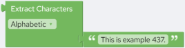Script:`Extract("This is example 437.","a") Returns: Thisisexample``Extract("This is example 437.","n") Returns: 437``Extract("This is example 437.","an") Returns: Thisisexample437` |

### Replace All Block

| Block Category | Text |
| --- | --- |
| Block Name | Replace All |
| Description | Replaces every occurrence of a specific “String” with the “Replacement” string in the specified search string. |
| Script | Replace(string, replacement, match) |
| Inputs | string – The string where to search.replacement – The replacement string.match – The matching pastern (the string to be searched). |
| Returned Value | A string. |
| Remarks | Replace All recognizes all special characters in the “match” parameter, but they must be preceded by the escape character backslash “\”. For example if you want to find and replace parentheses specify “\(”. |
| Examples | The following example replaces every occurrence of "Fri." with "Friday" in the “field1” field: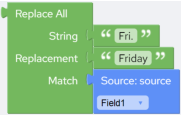Script:`Replace(@Field1,"Friday","Fri.")` |

### Left Block

| Block Category | Text |
| --- | --- |
| Block Name | Left |
| Description | Extracts the specified number of characters from the beginning of a given string. |
| Script | Left(string,length) |
| Inputs | string – The string to extract from.length– The number of characters to extract. Must be a positive number. |
| Returned Value | Returns a string. |
| Examples | The following example returns four characters from “Field1” starting from the beginning. For example if “Field1” is “44060-1930” then the returned value is “4406”.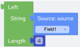Script:`Left(@Field1,4)` |

### Right Block

| Block Category | Text |
| --- | --- |
| Block Name | Right |
| Description | Extracts the specified number of characters from the end of a given string. |
| Script | Right(string,length) |
| Inputs | string –The string to extract from.length – The number of characters to extract. Must be a positive number. |
| Returned Value | Returns a string. |
| Examples | The following example returns four characters from “Field1” starting from the end. For example if “Field1” is “44060-1930” then the returned value is “1930”.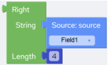Script:`Right(@Field1,4)` |

### Mid Block

| Block Category | Text |
| --- | --- |
| Block Name | Mid |
| Description | Extracts the specified number of characters from a given string, starting from a specific position. |
| Script | Mid(string,start,length) |
| Inputs | string – The string to extract from.start – The start position. The first position in the string is 1.length – The number of characters to extract. Must be a positive number. |
| Returned Value | Returns a string. |
| Examples | The following example returns four characters from “Field1” starting from seventh position. For example if “Field1” is “44060-1930” then the returned value is “1930”.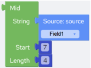Script:`Mid(@Field1,7,4)` |
