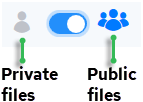

## Upload Files

You can upload private or public files for later use with Templates and Configurations.

This topic includes:

- [To upload private files](../Integrations/Upload_Files.md)
- [To upload public files (administrators only)](../Integrations/Upload_Files.md)

To upload private files

1. Click Integrations, Manage, Files.

    The Private Files page is displayed.

2. Click the Upload Files button.

    The Upload Files dialog is displayed.

3. Drag and drop the files onto the box, or click Browse Files to select files from the file browser.

    The selected file(s) are listed in the dialog.

4. To delete a file from the list, check the box next to the file name, then click the Delete File button that appears.
5. To add more files, click the Upload Files button.

6. When finished uploading files, click DONE.

    The uploaded files are listed on the Private Files page.

To upload public files (administrators only)

1. Click Integrations, Manage, Files.

    The Private Files page is displayed.

- To display public files, click the files control:

    The Public Files page is displayed.

2. Click the Upload Files button.

    The Upload Files dialog is displayed.

3. Drag and drop the files onto the box or click Browse Files to select files from the file browser.

    The selected file(s) are listed.

4. To delete a file from the list, check the box next to the file name, then click the Delete File button that appears.
5. To add more files, click the Upload Files button.

6. When you are finished uploading files, click DONE.

    The uploaded files are listed on the Public Files page.
