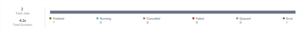
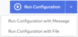

## View Configuration Jobs

The Run History menu option on the Configuration Details page displays the execution history of the current configuration.

The default page size is set to 25. Page size and navigation controls are located at the bottom of the page.

To view Run History of a specific configuration

1. Click Integrations, Manage, Configurations.

    The Configurations page is displayed, listing all available templates. See [View Configurations](../Integrations/View_Configurations.md).

2. Click the Configuration name for which to view the details.

    The Configuration Details page is displayed. See [Edit Configuration Details](../Integrations/Edit_Configuration_Details.md).

3. Click Run History.

    The Configuration Jobs page is displayed.

The upper portion of the page features a bar chart which presents the summary status of all executed jobs.

The lower portion of the page presents a sortable list of all executed jobs with the following information:

| Properties | Description |
| --- | --- |
| Start Time | The date and time the job was started.The time displayed here is specific to your time zone. |
| Job ID | The job id assigned by the system. |
| Status | Status of the job:•Waiting – Job has been created but needs additional information or a trigger event prior to being queued for execution.•Queued – Job has been queued for execution by the next available worker.•Canceled – Job was canceled prior to being acquired by a worker (during the Waiting or Queued state). No log file will be produced.•Initializing – Job has been acquired by a worker and is being prepared for execution.•Running – Job is currently executing on a worker.•Finished – Job has successfully completed. A log file is available (or soon will be).•Error – Job encountered an exception during execution. Depending on configuration and artifact design, the job may or may not have completed. A log file is available (or soon will be).•Failed – Job failed or was manually stopped by user command or exception at some point during initialization or execution. A log file may or may not be available. |
| Duration | Execution time. |
| Server | Where the job was executed. |
| Destination |  |
| Log | Click  for a specific record in the Configuration Jobs table. The Run History:<configuration_name> page is displayed from where you can view the run result details and download the log file. See [Download Log File](../Integrations/Download_Log_File_2.md). |

The Configuration Jobs page options and actions:

| Options and Actions | Description |
| --- | --- |
|  | Click this icon and specify the value that you want to search. The values in each column will be evaluated during the search. Contents will be filtered based on the search string.Click  to close the search box. |
|  | Click the down arrow and select how many records to display on the page. The default page size is set to 25. |
|  | Use these options to Navigate from one page to another. |
|  | •Run Configuration– See [Run a Configuration Manually](../Integrations/Run_a_Configuration_Manually.md)•Run Configuration with Message – See [Run Configuration with a Message](../Integrations/Run_Configuration_with_a_Message.md).•Run Configuration with File – See Run Configuration with a File. |
