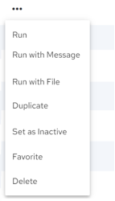

## View Configurations

To view configurations

1. Click Integrations, Manage, Configurations.

    The Configurations page displays the available configurations.

2. Click one of the following tabs to reorganize the configuration list:

    - All – Displays all configurations.

    - Recent – Displays recently executed, edited, or created configurations.

    - Favorites – Displays configurations that were set as favorites. See [Set a Configuration as a Favorite](../Integrations/Set_a_Configuration_as_a_Favorite.md).

**Note:**The configurations are sorted in alphabetical order in each view.

    The following information is displayed:

| Column Name | Description |
| --- | --- |
| Configuration | Displays the name of the configuration. Clicking the Configuration header sorts the list alphabetically in ascending or descending order.Clicking a configuration name displays the Configuration Details page which provides various properties related to the Configuration. See [Edit Configuration Details](../Integrations/Edit_Configuration_Details.md). |
| Template Used | Displays the template that the configuration is based on. If the configuration is not based on a template, Not Set is displayed. Clicking the Template Used header sorts the list alphabetically in ascending or descending order.Clicking the template name displays the Template Details page which provides various properties related to the Template. See [Edit Template Details](../Integrations/Edit_Template_Details.md). |
| Next Job | The next job column provides some insight in terms of when a configuration will run. For example “On Demand” will be displayed for a configuration that must be run manually and “Every 6 hours” will be displayed for a configuration that is scheduled to run after every six hours.See [Run a Configuration Manually](../Integrations/Run_a_Configuration_Manually.md) and [Edit Configuration Schedule](../Integrations/Edit_Configuration_Schedule.md). |
| Owner | Displays the first two characters of the configuration owner (creator) name. Clicking on the owner icon displays the username of the owner. |
| Active | Whether the configuration is active (set to run on demand or by schedule) or inactive (set not to run on demand or by schedule) |

    Configuration page options and actions:

| Options and Actions | Description |
| --- | --- |
|  | Click this icon to search for specific text within the configuration listing. Contents will be filtered based on the search string.Click  to clear the search box. |
|  | Click this icon and then select one or more of the following options to list configurations by the selected one or more filters: • TemplateNotSet - Lists configuration for which template is not set. • OnDemand - Lists unscheduled configurations. • Active - Lists active configurations. • Inactive - Lists inactive configurations. |
|  | Click the down arrow and select how many records to display on the page. |
|  | Use these options to Navigate from one page to another. |
|  | Select one or more configurations by clicking the check box that is displayed before the configuration name to perform the following actions from the toolbar which displays on the top right of the page: • Run – Click this option to execute the selected configurations. Running a configuration takes you to the Run History page. See [View Configuration Jobs](../Integrations/View_Configuration_Jobs.md) and [Run a Configuration Manually](../Integrations/Run_a_Configuration_Manually.md). • Active – Click this option to set the selected configurations to Active. See [Set a Configuration to Active or Inactive](../Integrations/Set_a_Configuration_to_Active_or_Inactive.md). • Inactive – Click this option to set the selected configurations to Inactive. See [Set a Configuration to Active or Inactive](../Integrations/Set_a_Configuration_to_Active_or_Inactive.md). • Favorite – Click this option to set the associated configuration to Favorite. See [Set a Configuration as a Favorite](../Integrations/Set_a_Configuration_as_a_Favorite.md). • Delete – Click this option to delete the selected configurations. See [Delete a Configuration](../Integrations/Delete_a_Configuration.md). |
|  | Each configuration has its own corresponding context menu (refer second image) displayed within the table view.Click  next to the configuration record will expose a set of execution options for the selected configurations. You can choose from the following actions: • Run – Click this option to execute the selected configuration. Running a configuration takes you to the Run History page. See [View Configuration Jobs](../Integrations/View_Configuration_Jobs.md) and [Run a Configuration Manually](../Integrations/Run_a_Configuration_Manually.md). • Run with Message – Click this option to run the associated configuration after entering a message. See [Run Configuration with a Message](../Integrations/Run_Configuration_with_a_Message.md). • Run with File – Click this option to run the associated configuration after uploading a file. See [Run Configuration with a File](../Integrations/Run_Configuration_with_a_File.md). • Duplicate – Click this option to duplicate the associated configuration, usually for editing. See [Duplicate a Configuration](../Integrations/Duplicate_a_Configuration.md). • Set as Active – Click this option to set the selected configurations to Active. See [Set a Configuration to Active or Inactive](../Integrations/Set_a_Configuration_to_Active_or_Inactive.md). • Set as Inactive – Click this option to set the selected configurations to Inactive. See [Set a Configuration to Active or Inactive](../Integrations/Set_a_Configuration_to_Active_or_Inactive.md). • Favorite – Click this option to set the associated configuration to Favorite. See [Set a Configuration as a Favorite](../Integrations/Set_a_Configuration_as_a_Favorite.md). • Delete – Click this option to delete the selected configurations. See [Delete a Configuration](../Integrations/Delete_a_Configuration.md). |
| Import Integration | Click this to import an integration. See [Import Integration](../Integrations/Import_Integration.md). |
